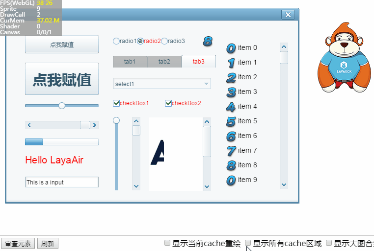

# DebugPanel工具

### 1、启用DebugPanel调试面板

DebugPanel调试面板是基于Div的调试窗口，启动调试面板的`DebugPanel.init()`方法位于`laya.debug.DebugPanel`类中，可以在初始化舞台方法`Laya.init()`后的任意代码中增加使用，例如下面代码所示：

```java
package
{
	import laya.debug.DebugPanel;
	import laya.display.Sprite;
	
	public class Main
	{
		public function Main()
		{
			//初始化舞台
			Laya.init(1334,750);    
			//调用DebugPanel调试面板
			DebugPanel.init();
			//设置舞台背景色
			Laya.stage.bgColor  = "#ffffff";
			
			var Img:Sprite = new Sprite(); 			 
			//添加到舞台
			Laya.stage.addChild(Img);   
			Img.loadImage("res/img/monkey1.png",200); 	
		}
	}
}
```

运行效果如图1所示

 <br /> (图1)


### 2、刷新显示对象节点树

默认状态下，显示对象节点树中只有`DebugInfoLayer`节点，而这个节点开发者不用管（用于引擎开发者）。产品页面中的对象节点需要刷新才能显示出来，点击`调试面板`上的`刷新`按钮，会显示出页面上的全部节点树结构。如动图2所示。

 <br /> (动图2)


### 3、查看节点对象的属性

点击节点树上的节点，可以在右侧查看选中的节点对象属性，如图3所示。

 <br /> (图3)

**Tips**： 通过查看或修改调试面板中的节点对象属性值，可以加速问题的判断与调试。


### 4、审查页面元素

除了从节点树中，点击节点对象来查看属性外。通过先点击`审查元素`按钮，然后点击页面中的目标内容，即可以在调试面板的右侧区域直接查看该节点的的对象属性。效果如动图4所示。

 <br /> (动图4)


### 5、修改调试面板中的节点对象属性

为了避免每次调试都在代码中修改，再次编译运行的复杂调试流程。可以直接在DebugPanel调试面板中修改属性值。然后移出属性值输入框即可查看修改效果。操作与效果如动图5所示。

 <br /> (动图5)


### 6、节点可见控制

在调试面板中选中节点后，可以通过**取消**该节点的`可见勾选状态`，让该节点在**页面中不可见**。再次点击`勾选`可见，会重新显示出来，效果如动图6所示。

 <br /> (动图6)


### 7、节点红色边框显示控制

在调试面板`可见`控制的右侧是`显示边框`控制， 当勾选后，该节点在页面中为**红色边框**的高亮显示。效果如图7所示。

 <br /> (图7)

**Tips**：*当节点的cacheAs属性设置生效后，显示边框勾选也不会显示红色边框。*


### 8、将节点对象打印到控制台 

点击DebugPanel调试面板的`打印到控制台`按钮，可以将选中的节点对象输出到浏览器的控制台(*Console*)，方便在控制台中进一步调试操作。效果如图8所示。

 <br /> (图8)


### 9、在控制台中查看enable链与size链

通过enable链与size链按钮，可以将节点对象的enable相关的属性或size相关的属性输出到控制台中。如图9所示。

 <br /> (图9)


### 10、显示与切换大图合集

在webgl模式下，为优化性能，小于`512*512`的资源引擎都会自动合并到大图合集里（包括图片与文本信息）。LayaAir引擎默认的上限是6个大图合集，通过查看大图合集的数量和内容可以进行针对性的优化。

勾选`显示大图合集`后，可以查看当前的大图合集，左上解会出现红色的`图集当前数/图集总数`，共两个数值。取消勾选再选中，可以`切换`到下一个大图合集。如动图10所示。

 <br /> (动图10)

**Tips**：

单个大图合集的总宽高为`2048*2048`。


### 11、显示当前cache重绘区域与所有cache区域

设置cache可以优化性能，但是cache设置不合理也会降低性能。比如cache区域频繁重绘时，会降低性能。

通过`显示当前cache重绘`与`显示所有cache区域`可以统计查看cache的状态。

**绿色为当前cache区**，区域色框会停留显示3秒。效果如动图11所示。

 <br /> (动图11)


**所有cache区域为紫色边框**，区域色框显示完立即消失，停留在最后一个cache区域。效果如动图12所示。

 <br /> (动图12)


 

