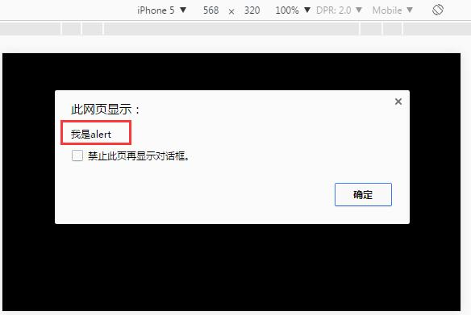

# **AS3与JS混合编码**

　　AS3与JS交互是一种常见的需求，flash插件提供了一个简单的接口函数`ExternalInterface.call`和`ExternalInterface.addCallback`与JS交互。但是发布HTML5，这个flash的接口就不能用了。

　　作为支持AS3语言编写HTML5的引擎，LayaAir可以通过`Browser.windows`和`__JS__`方法来和JS交互，并且LayaAir引擎的AS编译器还支持特有的宏编译，帮助AS3开发者实现更加复杂的AS3与JS混合编码。

### 1. 初识AS3与浏览器交互

　　假设我们创建了一个名为JSDemo.as的启动类文件，在AS3代码中实现JS的原生alert弹窗效果。示例代码如下：

**方式一：**

```java
package 
{
	import laya.utils.Browser;
	public class JSDemo {
		
		public function JSDemo() 
		{
			//初始化引擎
			Laya.init(0, 0);
			//运行JS alert
			Browser.window.alert('我是alert');			
		}		
	}
}
```

**方式二：**

```java
package 
{
	public class JSDemo
	{
		public function JSDemo()
		{
			//初始化引擎
			Laya.init(0, 0);
			//运行JS alert
			__JS__('alert("我是alert")');
		}
	}
}
```

　　以上两种方式从运行的结果上看，是完全一致的，如图1所示。

 <br />
（图1）

　　那两种方式的区别在哪里呢？

　　`Browser.window`这是对浏览器window的引用，浏览器的全局函数都是挂载在`window`上，因此可以用Browser.window.alert唤起弹窗的函数。所有window上所有的函数和属性均可以通过这种方式进行。

　　`	__JS__`是LayaCompiler编译器提供的一个宏编译函数，　`	__JS__()`函数内的代码将不被编译，会直译成js代码。


### 2. AS3与浏览器交互进阶

　LayaAir引擎与浏览器的交互远不止于alert那么简单，下面通过示例代码进一步了解AS与浏览器的交互。

**方式一：**

```java
package 
{
	import laya.utils.Browser;

	public class JSDemo
	{
		public function JSDemo()
		{
			//初始化引擎
			Laya.init(0, 0);
	
			var Height:int = Browser.window.innerHeight;
			var width:int = Browser.window.innerWidth;
			Browser.window.console.log("Console Log：浏览器高："+ Height + " 浏览器宽：" + width);
		}
	}
}
```

**方式二：**

```java
package 
{

	public class JSDemo
	{
		public function JSDemo()
		{
			//初始化引擎
			Laya.init(0, 0);
			
			var BrowserInfo:String = __JS__('"Console Log：浏览器高：" + window.innerHeight + " 浏览器宽："+ window.innerWidth');
			trace(BrowserInfo);
		}
	}
}
```

　　以上两种方式从运行的结果上看，是完全一致的，如图2所示。
 <br />
（图2）

　　以上两种方式相对而言，Browser.window会受限于浏览器window，而`__JS__`方式会更加灵活强大，在后面的内容里，将重点以`__JS__`方法深入了解AS3与JS的混合编码。


### 3.  AS3与JS混合编码

　　


