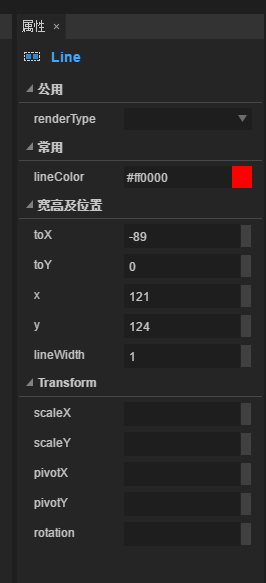

# 绘制直线与折线


### 一、绘制直线

​        在API中搜索laya.display.Graphics类可以查看到该API的各种矢量绘图方法。其中drawLine();用于绘制矢量直线。该方法的详细说明如下图所示：

​	<br/>
​	（图1）

下面我们用LayaAir引擎画一条直线，示例代码如下：

```java
package
{
    import laya.display.Sprite;
    import laya.display.Stage;
    import laya.webgl.WebGL;
     
    public class Sprite_DrawShapes
    {
        private var sp:Sprite;
         
        public function Sprite_DrawShapes()
        {
            Laya.init(500, 300, WebGL);
            drawSomething();
        }
 
        private function drawSomething():void
        {
            sp = new Sprite();
            Laya.stage.addChild(sp);
            //画直线
            sp.graphics.drawLine(10, 58, 146, 58, "#ff0000", 3);
             
        }
    }
}
```

发布后如下图所示，我们画了一条红色的直线。

​	<br/>
​	（图2）


### 二、绘制折线

那么如何绘制折线呢？直接使用drawLines();方法即可。该方法与drawLine比较像，编码时千万不要漏掉了末尾的“s”。drawLines的参数详细说明如下图所示：

​	<br/>
​	（图3）

下面我们用LayaAir引擎画一条折线，示例代码如下：


代码运行

```javascript
package
{
    import laya.display.Sprite;
    import laya.display.Stage;
    import laya.webgl.WebGL;
     
    public class Sprite_DrawShapes
    {
        private var sp:Sprite;
         
        public function Sprite_DrawShapes()
        {
            Laya.init(500, 300, WebGL);
            drawSomething();
        }
 
        private function drawSomething():void
        {
            sp = new Sprite();
            Laya.stage.addChild(sp);
            //画折线
            sp.graphics.drawLines(20, 88, [0, 0, 39, -50, 78, 0, 120, -50], "#ff0000", 3);
         
             
        }
    }
}
```

效果：

​	<br/>
​	（图4）

通过代码，我们可以看出，画折线与画直线的参数区别是从第三位开始，第三位参数是Array类型的折线点集合，其中的“0，0”是折点A的起始坐标。“39，-50”是折点B的起始坐标。“78, 0”是折点C的起始坐标，“120, -50”是终点D的坐标。但是这里需要大家理解和注意的是，第三位参数中所有的坐标都是相对坐标，都会受到第一位和第二位参数的“20，88”而影响。一旦“20，88”产生改变，整体折线都会受到影响。

大家可以在实际编码的过程中，通过手动调整参数去感受区别。


### 三、用LayaAirIDE拖动控件绘制直线

**步骤一：**打开我们的LayaAirIDE，点击设计模式，新建一个View页面

​	<br/>
​   	（图5）  

**步骤二：**将组件中的曲线组件拖动到View页面上，就会自动生成默认的直线

​	<br/>
​   	（图6）  

**步骤三：**修改（添加/减少）Line组件属性中的数值，改变直线的长度、宽度、颜色等等。

​   	<br/>
​   	（图7）  

​   	<br/>
​   	（图8）  


### 四、用LayaAirIDE拖动控件绘制折线

**步骤一：**打开我们的LayaAirIDE，点击设计模式，新建一个View页面

​	<br/>
​   	（图9）  

**步骤二：**将组件中的曲线组件拖动到View页面上，就会自动生成默认的折线

​	<br/>
​   	（图10）  

**步骤三：**修改（添加/减少）Lines组件属性中的数值，改变折线的角度、颜色、宽度，或者添加新的折现。

​   	<br/>
​   	（图11）  

​   	<br/>
​   	（图12）  

到此我们通过LayaAirIDE中的组件绘制直线和折线就完成了。