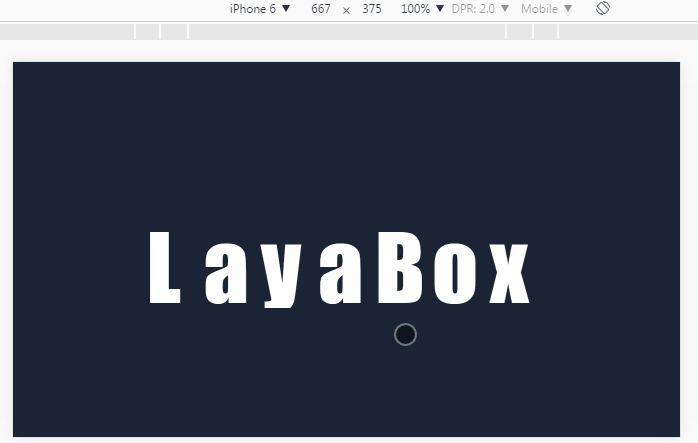
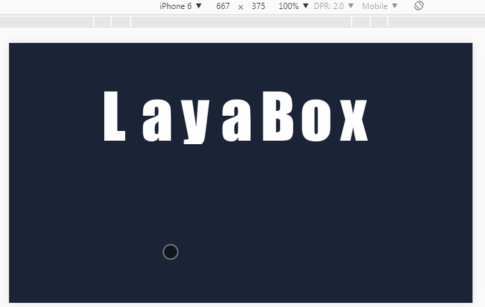

# 缓动动画

### 1. 缓动动画概述

游戏开发中缓动动画比较常见，它是提升游戏UI体验的重要因素之一，例如对话框弹出、关闭，按钮的动效出现与消失，道具飞入背包等，我们可以直接使用LayaAir引擎提供的Tween缓动类与Ease类来快捷实现。

`Tween` 缓动类用以实现目标对象属性的缓动，例如目标对象的x或y轴的缓动距离等目标值设置，以及缓动开始、停止、清理等设置。更多Tween的API

`Ease`类定义了大量的缓动函数，以便实现 `Tween` 动画的具体缓动效果。LayaAir引擎的Tween类与Ease类结合使用，能基本满足游戏开发的缓动效果需求。点击链接可直接查看API： [https://layaair.ldc.layabox.com/api/?category=Core&class=laya.utils.Tween](https://layaair.ldc.layabox.com/api/?category=Core&class=laya.utils.Tween)

`Ease`类的API中对缓动函数进行了基础的介绍，点击链接可直接查看API：[https://layaair.ldc.layabox.com/api/?category=Core&class=laya.utils.Ease](https://layaair.ldc.layabox.com/api/?category=Core&class=laya.utils.Ease)

`Ease`类的API中的各个缓动函数效果可以查看演示DEMO，链接：[https://layaair.ldc.layabox.com/demo/?Tween_EaseFunctionsDemo](https://layaair.ldc.layabox.com/demo/?Tween_EaseFunctionsDemo)


### 2.缓动类的常用API介绍

#### 2.1 Tween缓动类的常用方法from()与to()

缓动类Tween提供了较多的方法，而我们常用的是两种，分别为`from()`与`to()`方法，这两个方法的参数设置完全一样，但效果有所不同，from是从缓动目标点向初始位置产生运动（*从缓动目标位置来*），to是从初始位置向缓动目标的位置产生运动（`到缓动目标位置去`），后面会结合实例详细说明，开发者可以先了解一下这两个方法的基础说明，如图1所示。

 

(图1)

#### 2.2 常用参数说明

`to()`和`from()`这两种方法都支持静态方法，因此我们不需要去实例化Tween类就可以使用。

通过查看图1的API说明，`to()`和`from()`它们的参数理解起来都较简单，这里我们重点强调一下props、duration、ease、complete、delay参数。

##### props  

props 是目标对象需要改变，从而产生缓动效果的属性。对象的公共属性都可以进行设置，比如最常用的x、y位置属性，及alpha透明属性，以及旋转、轴心、大小等其他属性。

##### duration

duration是执行缓动效果花费的时间，单位是豪秒，时间越多，缓动效果越慢。

##### ease

ease   为缓动类型，它可以使用Ease类下定义的各种函数来改变动画的变化过程，LayaAir引擎提供了非常多的缓动方法供开发者们选择使用。开发者可以查看API或者在官网的引擎示例中切换缓动函数并观察缓动效果，链接地址：[https://layaair.ldc.layabox.com/demo/?Tween_EaseFunctionsDemo](https://layaair.ldc.layabox.com/demo/?Tween_EaseFunctionsDemo)

##### complete

complete  为缓动完成后回调方法。比如按钮出现的缓动，在缓动过程中我们不能让用户点击，这时就可以用到缓动完成回调，在回调函数中再加入按钮监听。

##### delay

delay是延迟执行的时间，稍后会通过实例中的延迟执行制作出文本缓动的波动效果。


### 3. 缓动实例

#### 3.1 Tween.from()的实例

下列代码中，我们先通过Tween.from()方法，实现“LayaBox”字符的文本缓动动画。

创建TweenDemo.as 文档类，代码编写如下：

```java
package 
{
	import laya.display.Text;
	import laya.utils.Tween;
	import laya.utils.Ease;
	import laya.webgl.WebGL;
	
	public class TweenDemo
	{
		
		public function TweenDemo() 
		{
			// 初始化舞台
			Laya.init(1334,750, WebGL);

			//背景颜色
			Laya.stage.bgColor = "#1b2436";
			
			//创建缓动文本
			createTween();
		}
		
		//创建缓动文本
		private function createTween():void 
		{	
			
			//"LayaBox"字符串总宽度
			var w:int = 800;
			
			//文本创建时的起始x位置
			var offsetX:int = Laya.stage.width - w >> 1;

			//显示的字符串
			var demoString:String = "LayaBox";
			
			var letterText:Text;
			
			//根据"LayaBox"字符串长度创建单个字符，并对每个单独字符使用缓动动画
			for (var i:int = 0, len:int = demoString.length; i < len; ++i)
			{
				//从"LayaBox"字符串中逐个提出单个字符创建文本
				letterText = createLetter(demoString.charAt(i));
				letterText.x = w / len * i + offsetX;
				
				//文本的初始y属性
				letterText.y = 300;

				//对象letterText属性y从缓动目标的100向初始的y属性300运动，每次执行缓动效果需要3000毫秒，缓类型采用elasticOut函数方式，延迟间隔i*100毫秒执行。
				Tween.from(letterText, { y : 100 }, 3000, Ease.elasticOut, null, i * 1000);
			}
		}
		
		
		//创建单个字符文本，并加载到舞台
		private function createLetter(char:String):Text
		{
			var letter:Text = new Text();
			letter.text = char;
			letter.color = "#FFFFFF";
			letter.font = "Impact";
			letter.fontSize = 180;
			Laya.stage.addChild(letter);			
			return letter;
		}
	}
}
```

运行效果如动图2所示

<br/>（动图2）

结合实例代码，然后通过图2的运动效果，我们可以看出，文本"Layabox"在初始位置（*y轴300*）出现之后，瞬间消失，然后从缓动方法Tween.from设置的目标`{ y : 100 }`（*y轴100*）向初始位置发生运动（从上到下的缓动效果）。

由于这个方法是先在初始位置显示，再瞬间消失从缓动的目标位置向初始位置运动。会产生一个视觉差，感觉更像反弹效果。所以我们继续了解Tween.to的效果，开发者可以根据需要选择到底使用哪种缓动方法。

#### 3.2 Tween.to()的实例

我们可以继续采用上面的实例，只是将Tween.from改变为Tween.to，先看一下运行效果。

```java
//文本的初始y属性
letterText.y = 300;
//Tween.from(letterText, { y : 100 }, 3000, Ease.elasticOut, null, i * 1000);//注释本行改为将Tween.from改变为Tween.to
Tween.to(letterText, { y : 100 }, 3000, Ease.elasticOut, null, i * 1000);
```

运行效果如动图3所示

<br/>（动图3）

结合代码，我们看动图3的效果， Tween.to()会更加的直观。初始属性y在300，缓动方法的属性中y在100（`{ y : 100 }`），所以动图3是从下向上产生缓动运动效果（说的直白一些就是弹起的缓动效果）。

#### 3.3 理解Props参数

无论Tween.from还是Tween.to，第二个参数Props（属性）可以影响缓动效果的运动轨迹等。

由于Tween.from与Tween.to的缓动效果本来就是相反的，所以Tween.from有一种向下落的感觉，而图3的Tween.to有一种向上弹起的感觉。

如果我们将初始y的属性值 与缓动目标的y属性值对调一下，再来看看，用Tween.to实现的落下效果与Tween.from有什么不同。

继续延续之前的示例，修改代码如下。

```java
//文本的初始y属性
letterText.y = 100;
//Tween.from(letterText, { y : 100 }, 3000, Ease.elasticOut, null, i * 1000);//注释本行改为将Tween.from改变为Tween.to
Tween.to(letterText, { y : 300 }, 3000, Ease.elasticOut, null, i * 1000);
```

运行效果如动图4所示

<br/>（动图4）

由于动图4中，是初始y属性在100，Tween.to的效果是从初始属性向缓动目标的属性进行运动。所以缓动目标的y属性在300时，就会产生出从初始y轴的100向y轴300进行运动，也就是落下的效果。与Tween.from实现落下效果会有明显的不同。所以开发者在运用时要注意两者的效果区别。

#### 3.4 理解缓动持续时间（*duration*）与延迟执行（*delay*）参数

继续沿用前面的示例，我们将第三个参数duration修改为1000毫秒，将第六个参数delay修改为100毫秒，效果如动图5所示。无论是缓动的速度还是下落间隔的速度都会产生较明显的变化。因此可以看出，通过持续时间或延迟时间的调整也可以实现不同的动画效果目标。这里不再深入，开发者可以自行调节体验。

<br/>（动图5）

动图5效果所修改代码如下：

```java
//文本的初始y属性
letterText.y = 100;
//Tween.from(letterText, { y : 100 }, 3000, Ease.elasticOut, null, i * 1000);//注释本行改为将Tween.from改变为Tween.to
Tween.to(letterText, { y : 300 }, 1000, Ease.elasticOut, null, i * 100);
```

#### 3.5 理解ease参数

第四个参数ease对应`laya.utils.Ease`类的各个方法，在官网的引擎示例中，针对这些方法都有演示效果。开发者可以点击链接（[https://layaair.ldc.layabox.com/demo/?Tween_EaseFunctionsDemo](https://layaair.ldc.layabox.com/demo/?Tween_EaseFunctionsDemo)）可以逐个查看，然后替换本例中的效果进行体验。

本节中我们改为`Ease.bounceIn`效果，如动图6所示。

<br/>（动图6）

动图6效果所修改代码如下：

```java
//文本的初始y属性
letterText.y = 100;
//Tween.from(letterText, { y : 100 }, 3000, Ease.elasticOut, null, i * 1000);//注释本行改为将Tween.from改变为Tween.to
Tween.to(letterText, { y : 300 }, 1000, Ease.bounceIn, null, i * 100);
```


#### 3.6 理解完成回调（*complete*）参数

第五个参数complete用于执行完缓动效果后的回调。我们继续沿用之前的示例，在缓动结束后，增加一个让字体颜色变红的回调方法。

使用示例：

```java
Tween.to(letterText, { y : 300 }, 1000, Ease.bounceIn, Handler.create(this,changeColor,[letterText]), i * 100);
```

由于需要增加新的引用，这次贴出全部的示例代码。

TweenDemo.as：

```java
package 
{
	import laya.display.Text;
	import laya.utils.Ease;
	import laya.utils.Handler;
	import laya.utils.Tween;
	import laya.webgl.WebGL;
	
	public class TweenDemo
	{
		
		public function TweenDemo() 
		{
			// 初始化舞台
			Laya.init(1334,750, WebGL);

			//背景颜色
			Laya.stage.bgColor = "#1b2436";
			
			//创建缓动文本
			createTween();
		}
		
		/**
		 * 创建缓动文本
		 */	
		private function createTween():void 
		{	
			
			//"LayaBox"字符串总宽度
			var w:int = 800;
			
			//文本创建时的起始x位置
			var offsetX:int = Laya.stage.width - w >> 1;

			//显示的字符串
			var demoString:String = "LayaBox";
			
			var letterText:Text;
			
			//根据"LayaBox"字符串长度创建单个字符，并对每个单独字符使用缓动动画
			for (var i:int = 0, len:int = demoString.length; i < len; ++i)
			{
				//从"LayaBox"字符串中逐个提出单个字符创建文本
				letterText = createLetter(demoString.charAt(i));
				letterText.x = w / len * i + offsetX;
				
				//文本的初始y属性
				letterText.y = 100;

				/**
				* 对象letterText属性y从100缓动到300的位置
				* 用1000毫秒完成缓动效果
				* 缓动类型采用bounceIn
				* 单个字符的缓动效果结束后，使用changeColor回调函数将字符改变为红色
				* 延迟间隔i*100毫秒执行
				*/
				Tween.to(letterText, { y : 300 }, 1000, Ease.bounceIn, Handler.create(this,changeColor,[letterText]), i * 100);
			}
		}
				
		/**
		 * 缓动完成后的回调方法
		 * @param txt  缓动对象
		 */		
		private function changeColor(txt:Text):void
		{
			//将文本字体改变成红色
			txt.color="#FF0000";			
		}		
		
		/**
		 * 创建单个字符文本，并加载到舞台
		 */		
		private function createLetter(char:String):Text
		{
			var letter:Text = new Text();
			letter.text = char;
			letter.color = "#FFFFFF";
			letter.font = "Impact";
			letter.fontSize = 180;
			Laya.stage.addChild(letter);			
			return letter;
		}
	}
}
```

代码运行效果如动图7所示

 


#### 3.7 通过Props参数实现过程回调

complete（*完成回调*）参数，不仅可以在第五个参数中实现，也可以在第二个参数Props中实现。但是，为了代码更加清晰易读，我们并不建议将完成回调放在Props中实现。

这里我们只介绍一下在Props中实现update更新回调。也就是说如果我们想在缓动过程中就执行回调方法，那第五个参数中是不可能实现的，因为第五个参数一定是缓动结束后才执行。所以，我们继续沿用之前的示例，在Props参数里增加一个字体颜色的更新回调。

使用示例：

```java

/**
* 对象letterText属性y从100缓动到300的位置，每一帧都通过回调方法更新颜色
* 用1000毫秒完成缓动效果
* 缓动类型采用bounceIn
* 单个字符的缓动效果结束后，使用changeColor回调函数将字符改变为红色
* 延迟间隔i*100毫秒执行
*/

Tween.to(letterText, { y : 300, update: new Handler(this, updateColor,[letterText])}, 1000, Ease.bounceIn, Handler.create(this,changeColor,[letterText]), i * 100);
```

全部的示例代码，TweenDemo.as：

```java
package 
{
	import laya.d3.math.Rand;
	import laya.display.Text;
	import laya.utils.Ease;
	import laya.utils.Handler;
	import laya.utils.Tween;
	import laya.webgl.WebGL;
	
	public class TweenDemo
	{
		public function TweenDemo() 
		{
			// 初始化舞台
			Laya.init(1334,750, WebGL);

			//背景颜色
			Laya.stage.bgColor = "#1b2436";
			
			//创建缓动文本
			createTween();
		}
		
		/**
		 * 创建缓动文本
		 */	
		private function createTween():void 
		{	
			
			//"LayaBox"字符串总宽度
			var w:int = 800;
			
			//文本创建时的起始x位置
			var offsetX:int = Laya.stage.width - w >> 1;

			//显示的字符串
			var demoString:String = "LayaBox";
			
			var letterText:Text;
			
			//根据"LayaBox"字符串长度创建单个字符，并对每个单独字符使用缓动动画
			for (var i:int = 0, len:int = demoString.length; i < len; ++i)
			{
				//从"LayaBox"字符串中逐个提出单个字符创建文本
				letterText = createLetter(demoString.charAt(i));
				letterText.x = w / len * i + offsetX;
				
				//文本的初始y属性
				letterText.y = 100;

				/**
				 * 对象letterText属性y从100缓动到300的位置，每一帧都通过回调方法更新颜色
				 * 用1000毫秒完成缓动效果
				 * 缓动类型采用bounceIn
				 * 单个字符的缓动效果结束后，使用changeColor回调函数将字符改变为红色
				 * 延迟间隔i*100毫秒执行
				 */
			
				Tween.to(letterText, { y : 300, update: new Handler(this, updateColor,[letterText])}, 1000, Ease.bounceIn, Handler.create(this,changeColor,[letterText]), i * 100);
			}
		}
		
		/**
		 * 缓动进行时的回调更新方法
		 * @param txt  缓动对象
		 */			
		private function updateColor(txt:Text):void
		{
			
			var c:int = parseInt(Math.random()*3);
			switch(c)
			{
				case 0:
				{
					txt.color="#EEE000";
					break;
				}
				case 1:	
				{
					txt.color="#FFFFFF";
					break;
				}
				case 2:	
				{
					txt.color="#FF0000";
					break;
				}
				default:
				{					
					txt.color="#EEE000";
					break;
				}
			}
		}		
		
		/**
		 * 缓动完成后的回调方法
		 * @param txt  缓动对象
		 */		
		private function changeColor(txt:Text):void
		{
			//将文本字体改变成红色
			txt.color="#FF0000";
		}		
		
		/**
		 * 创建单个字符文本，并加载到舞台
		 */		
		private function createLetter(char:String):Text
		{
			var letter:Text = new Text();
			letter.text = char;
			letter.color = "#FFFFFF";
			letter.font = "Impact";
			letter.fontSize = 180;
			Laya.stage.addChild(letter);			
			return letter;
		}
	}
}
```

代码运行时，由于update回调是每一帧都在执行，所以在缓动的过程中，有一种闪光字的效果。如动图8所示。

 

（动图8）

