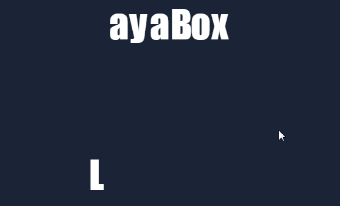
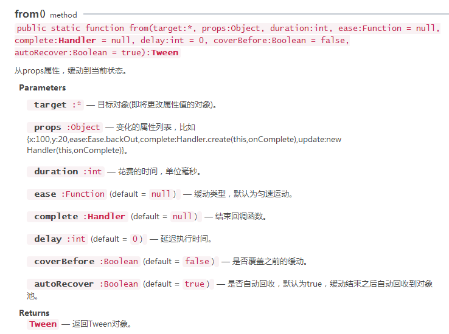
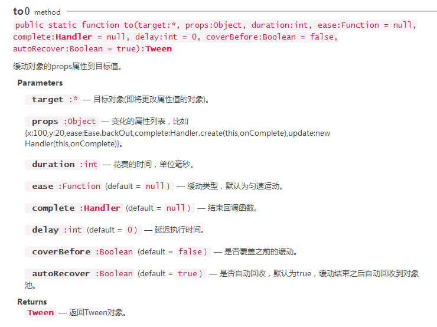

# 缓动动画运用

## 1. 缓动动画概述

游戏开发中缓动动画用得比较常见，它是提升游戏UI体验的重要因素之一，例如对话框弹出、关闭，按钮的动效出现与消失，道具飞入背包等，我们可以自己去开发较好效果的缓动动画，也可以直接使用LayaAir引擎提供的Tween缓动类。

LayaAir引擎Tween类与Ease类的结合使用能基本满足游戏开发所需。Ease提供了大量的缓动函数给我们选择，可以在引擎示例—缓动—缓动函数演示中选择切换函数并观察效果，链接地址为：http://layaair.ldc.layabox.com/demo/?Tween_EaseFunctionsDemo。

以下为缓动演示效果，我们将以它为例逐步分析缓动的用法。

<br/>（图1）


## 2.缓动类Tween的使用

### 2.1 缓动方法

缓动类Tween提供了较多的方法，而我们常用的是两种，分别为to()与from()方法。并且两种方法都支持静态方法，因此我们不需要去实例化Tween类就可以使用。

静态方法比实例方法多设置了一个参数，其他完全一样。因此我们只看静态方法的API（图2）（图3）

<br/>（图2）


<br/>（图3）

查看上述API，to()和from()两个方法参数设置完全一样，只是目的是相反，一个是到什么地方去，一个是从什么地方来。它们的参数理解起来都较简单，但我们需重点强调一下props、complete与ease参数。

**props**  是目标对象需要最终改变完成的属性。对象的公共属性都可以进行设置，最常用的是位置x、y属性，及alpha透明属性，当然，根据开发者的需求，比如旋转、轴心、大小及其他公共属性都可以进行改变。

**ease**   为缓动类型，它可以使用Ease类下定义的各种函数来改变动画的变化过程，LayaAir引擎提供了近40种方法供开发者们选择。可以在官网引擎示例—缓动—缓动函数演示中选择切换函数并观察效果，链接地址为：http://layaair.ldc.layabox.com/demo/?Tween_EaseFunctionsDemo。

**complete**  为缓动完成后回调方法。比如按钮出现的缓动，在缓动过程中我们不能让用户点击，这时就可以用到缓动完成回调，在回调函数中再加入按钮监听。


缓动类的其他方法我们用得较少，开发者可以查看API自行研究。请参考 [http://layaair.ldc.layabox.com/api/index.html?category=&class=laya.utils.Tween](http://layaair.ldc.layabox.com/api/index.html?category=&class=laya.utils.Tween)。


### 2.2 缓动实例

下列代码中，我们使用了Tween.to()方法，让显示“LayaBox”字符的文本产生了缓动动画。

```java
package 
{
	import laya.display.Stage;
	import laya.display.Text;
	import laya.events.Event;
	import laya.utils.Browser;
	import laya.utils.Ease;
	import laya.utils.Handler;
	import laya.utils.Tween;
	import laya.webgl.WebGL;
	
	public class TweenTest
	{
		
		public function TweenTest() 
		{
			// 不支持WebGL时自动切换至Canvas
			Laya.init(1280,720, WebGL);
			//画布垂直居中对齐
			Laya.stage.alignV = Stage.ALIGN_MIDDLE;
			//画布水平居中对齐
			Laya.stage.alignH = Stage.ALIGN_CENTER;
			//等比缩放
			Laya.stage.scaleMode = Stage.SCALE_SHOWALL;
			//背景颜色
			Laya.stage.bgColor = "#1b2436";
			
			//创建缓动文本
			createTween();
		}
		
		//创建缓动文本
		private function createTween():void 
		{

			//文本创建时的起始x位置
			var offsetX:int = Laya.stage.width - w >> 1;
			//文字缓动目标y座标位置
			var endY:int = Laya.stage.height / 2 - 50;
			//显示的字符串
			var demoString:String = "LayaBox";
          	//"LayaBox"字符串总宽度
			var w:int = 400;
			
			//根据"LayaBox"字符串长度创建单个字符，并对每个单独字符使用缓动动画
			for (var i:int = 0, len:int = demoString.length; i < len; ++i)
			{
				//从"LayaBox"字符串中逐个提出单个字符创建文本
				var letterText:Text = createLetter(demoString.charAt(i));
				letterText.x = w / len * i + offsetX;
				
				//每个单独字符缓动到y座标位置为endY的地方，1秒完成动画，
                //缓类型为elasticOut函数方式，间隔i*1000毫秒执行。
				Tween.to(letterText, { y : endY, alpha : 1 }, 1000, Ease.elasticOut, null, i * 1000);
			}
		}

		
		//创建单个字符文本，并加载到舞台
		private function createLetter(char:String):Text
		{
			var letter:Text = new Text();
			letter.text = char;
			letter.color = "#FFFFFF";
			letter.font = "Impact";
			letter.fontSize = 110;			
			Laya.stage.addChild(letter);			
			return letter;
		}
	}
}
```

在上列代码中，我们使用了`Tween.to(letterText, { y : endY }, 1000, Ease.elasticOut, null, i * 500);`方法，意思是从由目前状态，变到属性参数设置的状态，并让字符依次每隔`i*1`秒产生一次缓动，移动到y座标为endY的地方。


### 2.3 缓动完成回调

在Tween.to()方法参数中，缓动完成回调方法可以写在方法参数中两个位置，一种是放在complete参数位置，不让它为null；一种是在props属性当中加入“complete”属性，参考如下

方法1：

`Twenn.to(letterText,{y : endY, alpha : 1}, 1000, Ease.elasticOut, Handler.create(this,complete),i * 1000);`

方法2：

`Tween.to(letterText, { y : endY, alpha : 1 , complete:Handler.create(this,complete)}, 1000, Ease.elasticOut, null, i * 1000);`

我们修改之前代码，加入字符缓动回调完成方法，字符移动完成后，改变字体颜色为红色。

```java
package 
{
	import laya.display.Stage;
	import laya.display.Text;
	import laya.events.Event;
	import laya.utils.Browser;
	import laya.utils.Ease;
	import laya.utils.Handler;
	import laya.utils.Tween;
	import laya.webgl.WebGL;
	
	public class TweenTest
	{
		public function TweenTest() 
		{
			// 不支持WebGL时自动切换至Canvas
			Laya.init(1280,720, WebGL);
			//画布垂直居中对齐
			Laya.stage.alignV = Stage.ALIGN_MIDDLE;
			//画布水平居中对齐
			Laya.stage.alignH = Stage.ALIGN_CENTER;
			//等比缩放
			Laya.stage.scaleMode = Stage.SCALE_SHOWALL;
			//背景颜色
			Laya.stage.bgColor = "#1b2436";
			
			//创建缓动文本
			createTween();
		}
		
		//创建缓动文本
		private function createTween():void 
		{
			//文本创建时的起始x位置
			var offsetX:int = Laya.stage.width - w >> 1;
			//文字缓动目标y座标位置
			var endY:int = Laya.stage.height / 2 - 50;
			//显示的字符串
			var demoString:String = "LayaBox";
          	//"LayaBox"字符串总宽度
			var w:int = 400;
			
			//根据"LayaBox"字符串长度创建单个字符，并对每个单独字符使用缓动动画
			for (var i:int = 0, len:int = demoString.length; i < len; ++i)
			{
				//从"LayaBox"字符串中逐个提出单个字符创建文本
				var letterText:Text = createLetter(demoString.charAt(i));
				letterText.x = w / len * i + offsetX;
				
				//每个单独字符缓动到y座标位置为endY的地方，1秒完成动画，
				//缓类型为elasticOut函数方式，间隔i*1000毫秒执行
//				Tween.to(letterText, { y : endY, alpha : 1 }, 1000, Ease.elasticOut, null, i * 1000);

				//加入缓动完成的回调方法，并把缓动对象以参数形式传递给回调方法
				Tween.to(letterText, { y : endY, alpha : 1 }, 1000, Ease.elasticOut, 	 									 Handler.create(this,complete,[letterText]), i * 1000);
			}
		}
		
		/**
		 * 缓动完成后方法
		 * @param txt  缓动对象
		 */		
		private function complete(txt:Text):void
		{
			//字符文本字体改变成红色
			txt.color="#FF0000";
		}
		
		//创建单个字符文本，并加载到舞台
		private function createLetter(char:String):Text
		{
			var letter:Text = new Text();
			letter.text = char;
			letter.color = "#FFFFFF";
			letter.font = "Impact";
			letter.fontSize = 110;			
			Laya.stage.addChild(letter);			
			return letter;
		}
	}
}
```

编译运行代码，我们可以看到效果如下，缓动完成回调成功。

br/>（图8）