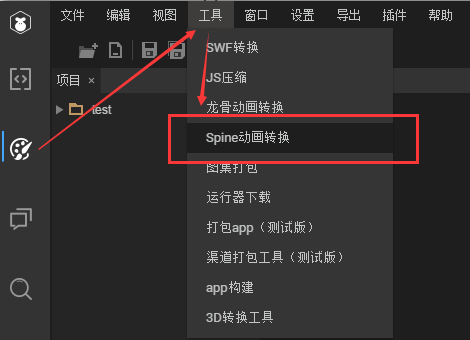

# LayaAir引擎播放Spine骨骼动画

> 本篇采用LayaAirIDE 1.7.6版本截图说明，如有差异，请下载最新稳定版本的LayaAirIDE，并以最新版本为准。

Spine骨骼动画，是游戏中经常使用的骨骼动画之一，通过LayaAirIDE自带的转换工具，可以将Spine骨骼动画格式转换为LayaAir引擎支持的骨骼动画格式。


### 1、原版Spine骨骼动画导出时的注意事项

原版Spine骨骼动画在导出时，有几个事项需要注意，否则无法完成转换。

#### 1.1 仅支持导出为JSON格式的转换

Spine骨骼动画支持JSON与二进制两种数据导出方式，需要注意的是LayaAirIDE的Spine转换工具只支持JSON格式的转换。请导出时选择JSON格式导出。

#### 1.2 导出时必须创建图集

LayaAirIDE的Spine转换工具只支持图集模式的Spine骨骼动画转换，因此，在使用Spine骨骼动画编辑工具导出时，必须勾选`创建图集`，如图1所示。

 

(图1) Spine 骨骼动画编辑工具的导出界面

#### 1.3 在图集打包的设置项里，不能勾选旋转选项

在Spine骨骼动画编辑工具的创建图集右侧，点击`设置`按钮进入图集打包设置（Pack Settings）界面。要确认区域设置里的`旋转`选项处于未勾选状态。勾选`旋转`选项后，LayaAirIDE转换Spine工具，无法转换成功。

 

(图2) Spine 骨骼动画导出的图集打包设置界面

#### 1.4 要注意导出的Spine版本

LayaAirIDE并非所有Spine版本都支持转换。支持的版本号在Spine转换工具面板中有显示。截止到本篇文档时，Spine从3.4.0.2版本开始，已支持到3.6.16版本。后续LayaAirIDE会不定期进行Spine版本支持的更新，开发者可关注转换工具面板上的版本号支持状态的改变。

#### 1.5  转换整个导出的目录

 

(图3)


### 2、将Spine动画转换为LayaAir引擎识别的格式

第一步：在LayaAirIDE的`设计模式`中，依次点击菜单栏的 `工具` --> `Spine动画转换` ，如图3所示，即可打开`Spine格式转换`工具。

 

(图3)

在打开的`Spine格式转换`工具面板中，顶部Spine后面的括号内是支持转换的spine版本号，如图2所示，当前支持将Spine 3.4.0.2和3.6.16版本以及两个版本之间的Spine骨骼动画转换为LayaAir引擎支持的格式。


 

(图4)

Tips:


第二步：在`Spine格式转换`工具面板中，将要转换的文件夹拖动到输入框中


第三步：点击确定进行转换


第四步：转换后生成的问题，播放时只需要.png .sk的文件就可以了


### 二、Spine动画的应用

使用Skeleton类进行Spine动画文件的播放

代码示例：

```java
package  
{
    import laya.ani.bone.Skeleton;
    import laya.webgl.WebGL;

    public class SpineSample 
    {
         
        public function SpineSample() 
        {
            WebGL.enable();
            Laya.init(1000, 900);
            test();
        }
        private function test():void
        {
            var skeleton:Skeleton;
            skeleton = new Skeleton();
            skeleton.url = "res/spine/vine/vine.sk";
            skeleton.pos(300, 300);
            Laya.stage.addChild(skeleton);
        }
         
    }
 
}
```