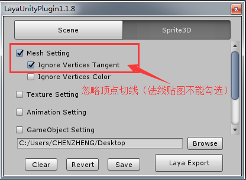

## LayaAir3D之材质光色与贴图

### 材质光色与贴图属性

标准材质属性与灯光光色属性有一定的类似，体现在漫反射、高光、环境色等属性上，但材质包括得更全，更方便调整物体美术效果，主要包括了反射率、漫反射颜色与漫反射贴图、高光色与高光贴图、环境色与环境贴图、反射颜色与反射贴图、法线凹凸贴图。下面我们对这些属性进行详细的介绍。


#### 反射率

反射率(albedo)主要反映的是材质的明亮程度与颜色，数值越高，材质越明亮。

反射率的值是一个四维向量，查看下列代码，向量中四个元素分别代表着红、绿、蓝、透明alpha。

透明alpha效果为百分比，0为全透明，1为不透明，如果需要设置为半透明或全透明显示，只调整反射率还不行，还需要设置材质的渲染模式为混合类型才能达到目的（图1）。

修改“快速开启3D之旅”课程中的代码如下可得到图1效果：

```java
	//创建标准材质
	var material:StandardMaterial = new StandardMaterial();
	//创建漫反射二维纹理贴图
	material.diffuseTexture = Texture2D.load("res/layabox.png"); 	

	//只有设置了渲染模式为透明混合类型才能达到透明效果
	//设置材质蓝色染色及30%半透明
	material.albedo=new Vector4(1,1,2,0.3);
	//渲染模式(也可设置数值，5-13等为混合类型，可观察其效果变化)
	material.renderMode=StandardMaterial.RENDERMODE_DEPTHREAD_TRANSPARENTDOUBLEFACE;;
	//为box模型赋材质
	box.meshRender.material = material;
```

<br>（图1）反射率染色与透明  


#### 漫反射颜色与漫反射贴图

漫反射颜色(diffuseColor )是指材质的单一自身颜色，美术行业内可以称它为物体的固有色。而漫反射贴图( diffuseTexture)是指材质的2D固有纹理图片，比如木头材质需要使用木头纹理图片，砖墙材质需要使用砖墙纹理图片。

游戏中使用最多的就是漫反射贴图，游戏美术贴图绘制中工作量最大的也是漫反射贴图，它能基本反映物体的基本质感。

漫反射颜色与贴图在LayaAir 3D引擎中也可以混合使用，它们会有融合效果，漫反射颜色会对模型的光照面进行染色（背光面不会产生变化），它类似于灯光的漫反射光源色，产生更整体的色调（图2）。

修改“快速开启3D之旅”课程中的代码如下，创建了蓝色的漫反射颜色，受光面偏蓝了，见（图2）效果：

```java
	//添加方向光（灯光色会与材质色融合，因此改灯光色为黑白灰色，且不能曝光过度）
	var directionLight:DirectionLight = scene.addChild(new DirectionLight()) as DirectionLight;
	directionLight.ambientColor = new Vector3(0.5, 0.5, 0.5);
	directionLight.specularColor = new Vector3(0, 0, 0);
	directionLight.diffuseColor = new Vector3(1, 1, 1);
	directionLight.direction = new Vector3(0.5, -1, 0);	

	//创建标准材质
	var material:StandardMaterial = new StandardMaterial();
	//创建漫反射颜色
	material.diffuseColor=new Vector3(.5,.5,2);
	//创建漫反射二维纹理贴图
	material.diffuseTexture = Texture2D.load("res/layabox.png");
	//为box模型赋材质
	box.meshRender.material = material;
```

<br>（图2）漫反射颜色与贴图混合


#### 高光色与高光贴图

高光色（specularColor )与灯光高光色一样，是指模型物体转角处，或正对着光源处产生的高光颜色。

模型上的高光色受灯光与材质高光色同时影响，如果无灯光或灯光的高光色为黑色，那么即使材质上设置了高光色与高光贴图，模型上的高光同样不会出现。

高光贴图（specularTexture)是一张2D纹理图片，图片中的像素颜色代表着相应模型处的高光颜色和亮度，像素颜色越亮，在像素处的模型高光越亮。

当然，高光色与高光贴图可以同时使用，效果可能会更好，开发者们可以反复测试，调节出需要的效果。

修改“快速开启3D之旅”课程中的代码，在场景中加载一辆卡车，可观察一下使用了高光色、高光贴图，并与默认只使用灯光高光进行一下对比，代码如下

```java
......
  //创建平行光 -------------------
  var light:DirectionLight = scene.addChild(new DirectionLight()) as DirectionLight;
//修改灯光方向
light.direction = new Vector3(0.3, -1, 0);
//设置高光色为白色
light.specularColor=new Vector3(1,1,1);

//加载导出的卡车模型
role3D=Sprite3D.load("LayaScene_truck/truck.lh");
//模型与材质加载完成事件监听
role3D.on(Event.HIERARCHY_LOADED,this,onLoadComplete);
scene.addChild(role3D);

/** 模型与材质加载完成后回调***/		
private function onLoadComplete():void
{
  //获取模型
  var meshSprite3D:MeshSprite3D=role3D.getChildAt(0).getChildAt(0) as MeshSprite3D;
  //从模型上获取共享材质
  var sharedMaterial:StandardMaterial=meshSprite3D.meshRender.sharedMaterial;
  //修改材质的高光颜色，让高光处偏红
  sharedMaterial.specularColor=new Vector4(1,0,0,1);
  //加载高光贴图（与漫反射一致，也可单独制作高光贴图）
  sharedMaterial.specularTexture=sharedMaterial.diffuseTexture;
  //sharedMaterial.specularTexture=Texture2D.load("LayaScene_truck/Assets/texture/t0200.png");
}	
```
编译上述代码，（图3）中使用了材质高光色与高光贴图，效果更好。（图4）中只使用了灯光的默认白色高光色，效果一般。

<br>（图3）

<br>（图4）


#### 环境色与环境贴图

环境色(ambient)与灯光环境色一样，是对材质进行颜色融合染色，使材质趋于某种颜色色调，同时还能对材质进行提亮，模拟灯箱发光效果。

环境贴图( ambientTexture)也是一张2D纹理图片，在LayaAir引擎中暂时取消了环境贴图对模型的影响，后续版本会增加自发光贴图用于替换，目前请暂时用环境色处理模型 。

修改“快速开启3D之旅”课程中的代码如下可得到（图6）效果：

```java
//添加方向光（灯光色会与材质色融合，因此改灯光色为黑白灰色，且不能曝光过度）
var directionLight:DirectionLight = scene.addChild(new DirectionLight()) as DirectionLight;
directionLight.ambientColor = new Vector3(0.5, 0.5, 0.5);
directionLight.specularColor = new Vector3(0, 0, 0);
directionLight.diffuseColor = new Vector3(1, 1, 1);
directionLight.direction = new Vector3(0.5, -1, 0);	

//创建标准材质
var material:StandardMaterial = new StandardMaterial();
//创建漫反射二维纹理贴图
material.diffuseTexture = Texture2D.load("res/layabox.png");
//设置环境色，提亮模型
material.ambientColor =new Vector3(2,2,2);
//为box模型赋材质
box.meshRender.material = material;
```

<br>（图5）固定灯光下，材质未使用环境颜色

<br>（图6）固定灯光下，材质使用环境颜色提亮


#### 反射颜色与反射贴图 

反射颜色(reflectColor)类似于环境颜色，会对材质整体进行颜色融合染色。

反射贴图( reflectTexture)我们一般是采用一套盒子纹理贴图TextureCube，它会对模型进行整体包裹，模拟周边环境反映在模型上的效果。

反射贴图显示效果同时也与反射率albedo、渲染模式renderMode相关。

渲染模式必须改为双面不透明才能显示反射贴图（StandardMaterial.RENDERMODE_OPAQUEDOUBLEFACE）。

反射率albedo数值越高，反射贴图效果越小，漫反射贴图效果越强，可根据实际的模型材质效果调节，比如水面、镜面、金属面可调节不同的反射率达到需求。

 修改“快速开启3D之旅”课程中的代码如下，为了更好的观察反射效果，使用球形模型。运行后可得到（图7）效果：

```java
//添加方向光
var directionLight:DirectionLight = scene.addChild(new DirectionLight()) as DirectionLight;
directionLight.ambientColor = new Vector3(0.5, 0.5, 0.5);
directionLight.specularColor = new Vector3(0.5, 0.5, 0.5);//为球体增加高光
directionLight.diffuseColor = new Vector3(1, 1, 1);
directionLight.direction = new Vector3(0.5, -1, 0);	

//添加自定义模型
var sphere:MeshSprite3D = scene.addChild(new MeshSprite3D(new SphereMesh())) as MeshSprite3D;
sphere.transform.rotate(new Vector3(0,45,0),false,false);

//创建标准材质
var material:StandardMaterial = new StandardMaterial();
//创建漫反射二维纹理贴图
material.diffuseTexture = Texture2D.load("res/layabox.png");

//降低反射率，加强反射贴图反射
material.albedo=new Vector4(0.2,0.2,0.2,0);
//设置渲染模式为双面不透明(否者无法显示反射贴图)
material.renderMode=StandardMaterial.RENDERMODE_OPAQUEDOUBLEFACE;
//创建反射贴图，用立方体全视角贴图进行赋值（类似于360全景包裹）
material.reflectTexture = TextureCube.load("skyBox/skyCube.ltc");

//为球型模型赋材质
sphere.meshRender.material = material;
```

<br>（图7）反射贴图


#### 法线凹凸贴图

法线凹凸贴图(normalTexture)在3D中有着非常重要的作用，模型表现的精细程度主要受法线贴图影响，它能模拟高精度、高面数模型的细节，大大提升游戏画面品质。当然，如果使用法线贴图，对硬件的性能要求随之提高。

法线贴图为美术设计师提供，他们靠两种方法制作，一种是在3D制作软件中模型高模烘焙出低模使用的法线贴图，工作量巨大；一种是用漫反射贴图通过一些工具转化成法线贴图，工作量小，但效果比烘焙方法稍差。法线贴图效果如（图8）所示，它是用漫反射贴图转化而成。

<br>（图8） 


如果需要使用法线贴图在开发过程中需注意以下问题：

1．法线贴图对模型数据有一定的要求，如果模型上没有切线信息将无法产生法线凹凸的效果。例如LayaAir 3D引擎中自带的各种Mesh网格类型BoxMesh、SphereMesh、CylinderMesh等是没有切线信息的，即使使用了法线贴图也不会在视图中显示出凹凸。

2．如果需要使用法线贴图，且模型是通过LayaAir的unity插件中导出，在Mesh Setting网格设置时需要注意不能勾选“忽略切线”选项，如（图9）。

<br>（图9）

3．如果需要使用法线贴图，游戏场景中必须使用灯光，否则模型上也不会产生凹凸效果。


我们从unity3D中创建一个Cube模型（unity中创建的模型带切线信息），并赋上漫反射贴图与法线贴图后用LayaAir导出插件导出数据并使用，法线贴图也会自动加载到模型上。修改“快速开启3D之旅”课程中的代码如下，编译运行后见（图10）凹凸效果。

```java
......
//添加方向光
var directionLight:DirectionLight = scene.addChild(new DirectionLight()) as DirectionLight;
directionLight.ambientColor = new Vector3(0.5, 0.5, 0.5);
directionLight.specularColor = new Vector3(0.5, 0.5, 0.5);//为球体增加高光
directionLight.diffuseColor = new Vector3(1, 1, 1);
directionLight.direction = new Vector3(0.5, -1, 0);	

//创建unity中导出的模型
var box:Sprite3D=Sprite3D.load("layaScene_box/box.lh");
//模型与材质加载完成事件监听
box.on(Event.HIERARCHY_LOADED,this,onLoadComplete);
//也可以代码加载法线贴图

//加载到场景中
scene.addChild(box);
/** 模型与材质加载完成后回调***/		
private function onLoadComplete(role3D:Sprite3D):void
{
  //也可以代码加载法线贴图
  //从模型中获取meshSprite3D对像
  //var meshSprite3D:MeshSprite3D=box.getChildAt(0) as MeshSprite3D;
  //获取模型的材质实例
  //var material:StandardMaterial=meshSprite3D.meshRender.material as StandardMaterial;
  //为材质添加法线贴图
  //material.normalTexture=Texture2D.load("layaScene_box/Assets/texture/layabox_normal.png");
}
			
```

<br>（图10）法线贴图


### 导出的材质文件.lmat修改

经过对材质光色与贴图属性的了解，我们了解了怎么通过代码修改物体的材质属性与贴图，灵活的去控制需要达到的效果。

不过目前美术上的效果基本都是通过unity编辑器去实现，然后导出数据进行使用。因为目前LayaAir 3D引擎正在完善中，又因H5游戏引擎的特点，不能完全包括unity中所有材质类型与属性，因此在unity中的效果与在实际游戏中的效果会有所差别。

未来的版本中，我们将用插件的方式在unity中创建专用的LayaAir标准材质供开发者们使用，这样可以使在unity中制作的美术效果与游戏的效果完全一致，方便开发者们使用。

那么在等待的这个期间，我们怎么去修改并达到一些美术效果呢？在unity中每一个材质在导出时都会生成.lmat格式文件，我们可以修改材质.lmat文件方式进行调整美术效果。

例如我们通过下例代码，加载一个场景，然后先通过光照设置达到夜晚效果（图11）。

```java
......	
  //添加3D场景
  var scene:Scene = Scene.load("LayaScene_loveScene/loveScene.ls");
Laya.stage.addChild(scene);

//创建摄像机(横纵比，近距裁剪，远距裁剪)
var camera:Camera = new Camera( 0, 0.1, 1000);
//加载到场景
scene.addChild(camera);
//移动摄像机位置
camera.transform.position=new Vector3(-8, 4, 20);
//旋转摄像机角度
camera.transform.rotate(new Vector3( -8, -25, 0), true, false);
//设置摄像机视野范围（角度） 
camera.fieldOfView=35;
//加入摄像机移动控制脚本
camera.addComponent(CameraMoveScript);

//创建平行光 -------------------
var light:DirectionLight = scene.addChild(new DirectionLight()) as DirectionLight;
//修改灯光方向
light.direction = new Vector3(0.3, -1, 0);
//设置为无高光
light.specularColor=new Vector3(0,0,0);
//设置环境光偏暗蓝
light.ambientColor=new Vector3(0.2,0.2,1);
//设置漫反射光偏暗
light.diffuseColor=new Vector3(0.5,0.5,0.5);
```
<br>（图11）

根据上图所示，如果需要把“Love”形模型变为灯箱的亮度，通过代码修改相对麻烦，相对简单的方式是修改它所对应的材质文件.lmat，打开材质文件观察，可以发现材质文件中存储的就是各种光色属性与贴图（图12），我们修改盖材质的环境光颜色为"1.5,1.2,1.2"，刷新网页文件就可以看到效果，模型变亮了达到灯箱的效果（图13）。

<br>（图12）

<br>（图13）

通过以上的方法可以调节场景中的各种材质属性，使之达到美术所需效果。当然，我们更期待后续的unity中LayaAir专属材质，直接在unity中编辑与游戏中一致的最终效果。

