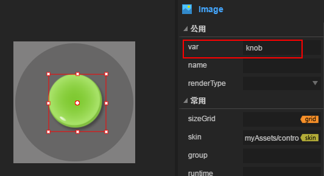

## 3D角色控制与碰撞检测


### 需求分析

本章课程主要向初学者们讲解3D引擎的综合运用，包括了3D场景的处理与加载，角色碰撞检测与动画的控制切换等，向开发者们展示一个类似于RPG游戏关卡的最基础的开发示例。

基本需求为：

1、通过摇杆控制器控制角色在场景中来回走动，摇杆控制器松开后，角色停止移动并待机。
2、可通过攻击按钮切换为角色攻击动画，一直按下按钮可不停攻击，点击一次按钮至少播放一次完整的攻击动画，结束后播放之前的动画，攻击按钮优先级大于摇杆，如摇杆还在按下状态，攻击停止后播放移动动画并位移 。
3、场景中需要有阻挡，某些地方角色无法行走，当角色行走至阻挡区时停止移动。
4、克隆一个相同的角色，两个角色被同时控制，如其中一个遇到阻挡停止后，另一角色不会受到影响。

参考效果如下图1

<br>（图1）


### 需用的引擎技术方案分析

1、摇杆：采用2D引擎鼠标监听方式，2D引擎鼠标事件支持多点触摸，适应手机多点的复杂操作。

2、角色控制：LayaAir3D引擎支持组件式开发模型，因此角色控制我们采用脚本组件方式，有效的把控制与显示分开。

3、场景：在文档编写时，3D引擎的高级地型正在完善中，因此场景中的阻挡暂时采用行走区碰撞器与射线检测方式判断。

​      美术可以在3D场景中制作一个角色可行走区的单独模型，如图2，导出使用时，不进行渲染，但在代码中需为它添加网格碰撞器，由角色前行位置产生一条射线与碰撞器进行碰撞检测，如果无碰撞信息，则角色无法行走，有碰撞信息角色可以行走。当然，也可以反过来，不可行走区域制作一个模型。 

​     当高级地型功能完善后，将出技术文档详细介绍，并推荐开发者们使用高级地型，性能上更佳。

<br>（图2）


### 摇杆控制器与攻击按钮

加载进度页面与“技术文档—3D角色切换与动画”示例中界面与代码基本一致，在此不多作说明。

摇杆控制器与攻击按钮界面通用于2D、3D游戏，开发者们可以参考使用。在LayaAir IDE中创建两个界面，取名为Rocker.ui、Attack.ui，Rocker.ui是由触摸点图片与背景图构成，Attack.ui是由一个攻击按钮构成，它里面还可加入其它技能按钮进行扩展。界面如下图3、图4。

<br>（图3）

<br>（图4）


IDE发布导出资源后，在项目ui文件夹中会产生RockerUI.as、AttackUI.as类，我们建立view文件夹并创建RockerView、AttackView类继承它，在里面编写摇杆控制、攻击逻辑代码，示例如下：

```java
package view
{
	import laya.display.Sprite;
	import laya.events.Event;
	import laya.maths.Point;
	import laya.maths.Rectangle;
	import laya.utils.Browser;	
	import ui.RockerUI;	
	/**
	 * 摇杆控制器
	 */	
	public class RockerView extends RockerUI
	{
		/***触摸区域****/
		private var touchRect:Sprite;
		/***控制器中心点****/
		private var originPiont:Point;
		/***摇杆与中心点的x轴距离****/
		private var deltaX:Number;
		/***摇杆与中心点的y轴距离****/
		private var deltaY:Number;
		
		/***当前多点触摸id****/
		private var curTouchId:int=0;
		/***手指（鼠标）是否按下****/
		private var isDown:Boolean=false;
		
		/***摇杆的角度****/
		public var angle:int=-1;		
		/***摇杆的弧度****/
		public var radians:int=-1;
		/***是否左手遥控****/
		public var isleftControl:Boolean=true;		
		/**
		 * 摇杆控制器
		 * @param touchSp  触摸区域
		 */		
		public function RockerView(touchSp:Sprite)
		{
			touchRect = touchSp;
			//鼠标按下事件监听
			touchRect.on(Event.MOUSE_DOWN, this, onMouseDown);
			//鼠标抬起事件监听
			touchRect.on(Event.MOUSE_UP,this,onMouseUp);
			//鼠标是否移出屏幕事件监听
//			touchRect.on(Event.MOUSE_OUT,this,onBlur);
			
			//控制器中心点位置初始化
			originPiont=new Point(this.width/2,this.height/2);
			//默认为控制器不显示
			this.visible=false;
		}		
		/**
		 *鼠标按下事件回调 
		 * @param e 按下事件
		 */
		private function onMouseDown(e:Event):void 
		{
			//左右手遥控
			if(isleftControl)
			{
				//如果按下时是右边屏幕位置或已经按下鼠标，则返回
				if(e.stageX>Laya.stage.width/2 || isDown) return;
			}else
			{
				//如果按下时是左边屏幕位置或已经按下鼠标，则返回
				if(e.stageX<Laya.stage.width/2 || isDown) return;
			}

			//记录当前按下id
			curTouchId=e.touchId;
			//已按下
			isDown=true;
			
			//更新摇杆到屏幕按下位置
			this.pos(Laya.stage.mouseX-(this.width/2),Laya.stage.mouseY-(this.height/2));
			//初始化摇杆控制点位置
			this.knob.pos(this.width/2,this.height/2);
			//按下后显示摇杆
			this.visible=true;
			
			//摇杆移动控制事件监听
			touchRect.on(Event.MOUSE_MOVE,this,onMove)
		}		
		/**
		 *鼠标抬起事件回调 
		 * @param e 抬起事件
		 */		
		private function onMouseUp(e:Event):void
		{
			//如果不是上次的点击id，返回（避免多点抬起，以第一次按下id为准）
			if(e.touchId!=curTouchId) return;
			isDown=false;
			this.visible=false;
			//移除摇杆移动事件监听
			touchRect.off(Event.MOUSE_MOVE,this,onMove);
			//修改摇杆角度与弧度为-1（代表无角度）
			radians=angle=-1;
		}
		/**
		 * 鼠标移动事件回调 
		 * @param e 移动事件
		 */		
		private function onMove(e:Event):void
		{
			//如果不是上次的点击id，返回（避免多点移动，以第一次按下后的移动为准）
			if(e.touchId!=curTouchId) return;
			
			//将移动时的鼠标屏幕坐标转化为摇杆局部坐标
			var locationPos:Point = this.globalToLocal(new Point(Laya.stage.mouseX,Laya.stage.mouseY),false);
			//更新摇杆控制点位置
			this.knob.pos(locationPos.x,locationPos.y);
			
			//更新控制点与摇杆中心点位置距离
			deltaX = locationPos.x - originPiont.x;
			deltaY = locationPos.y - originPiont.y;
			
			//计算控制点在摇杆中的角度
			var dx:Number=deltaX*deltaX;
			var dy:Number=deltaY*deltaY;
			angle = Math.atan2(deltaX, deltaY) * 180 / Math.PI;
			if (angle < 0) angle += 360;
			//对角度取整
			angle=Math.round(angle) ;
			//计算控制点在摇杆中的弧度
			radians= Math.PI / 180 * angle;
			
			//强制控制点与中心距离不超过80像素
			if (dx + dy >= 80 * 80)
			{
				//控制点在半径为80像素的位置（根据弧度变化）
				var x:int = Math.floor(Math.sin(radians) * 80 + originPiont.x);
				var y:int = Math.floor(Math.cos(radians) * 80 + originPiont.y);
				this.knob.pos(x, y);
			}else
			{
				//不超过80像素取原坐标
				this.knob.pos(locationPos.x, locationPos.y);
			}
		}
	}
}
```

```java
package view
{
	import laya.events.Event;	
	import ui.attackUI;
	
	public class attackView extends attackUI
	{
		/****是否按下攻击按钮****/
		public var isAttack:Boolean=false;
		/****按下时的多点触摸ID****/
		private var touchId:int;
		
		public function attackView()
		{
			//按钮按下与抬起事件监听
			this.btn_attack.on(Event.MOUSE_DOWN,this,onAttack);
			this.stage.on(Event.MOUSE_UP,this,onUp);
		}	
      	/****抬起攻击按钮事件回调****/
		private function onUp(e:Event):void
		{
			//如果抬起时的ID与按下时的相同     则为不攻击
			if(e.touchId==touchId) isAttack=false;
		}		
		/****按下攻击按钮事件回调****/
		private function onAttack(e:Event):void
		{
			//获取按下时的id
			touchId=e.touchId;
			//获取事件传参值
			isAttack=true;
		}
	}
}
```


### 示例主类

示例主类中基本没有控制方面的逻辑，同样是创建场景、摄像机、角色。示例中将不使用灯光，用光照贴图即可，建议开发者们如场景中没有动态光，可不添加灯光，性能上会高很多，角色阴影可以使用透明贴图模型片。

场景上需从场景模型中获取行走区域模型moveArea，可以设置它为不渲染，代码为`moveArea.meshRender.enable=false`，并给它加上网格碰撞器MeshCollider，网格碰撞器检测较为精确，与模型本身一致，镂空的区域将不会被检测到。当然，性能上开销将较大。

摇杆、攻击按钮及摄像机移动量设置为静态，以方便角色控制脚本使用和控制。

主类全部代码如下：

```java
package
{
	import laya.d3.component.Script;
	import laya.d3.component.physics.MeshCollider;
	import laya.d3.core.Camera;
	import laya.d3.core.MeshSprite3D;
	import laya.d3.core.Sprite3D;
	import laya.d3.core.scene.Scene;
	import laya.d3.math.Vector3;
	import laya.display.Stage;
	import laya.events.Event;
	import laya.utils.Handler;
	import laya.webgl.WebGL;	
	import view.ProgressView;
	import view.RockerView;
	import view.attackView;
	
	 /**3D角色控制与碰撞检测示例****/
	public class Example_roleControl 
	{
		/***3D场景***/
		private var scene:Scene;
		/***3D角色***/
		private var role:Sprite3D;
		/****3D摄像机***/
		public var camera:Camera;		
		/**摇杆控制器****/	
		public static var rocker:RockerView;
		/**攻击按钮控制器****/
		public static var attack:attackView;
		/**摄像机移动向量****/
		public static var cameraTranslate:Vector3=new Vector3();		
		
		public function Example_roleControl() 
		{
			//初始化引擎
			Laya3D.init(1334, 750 ,true);
			//画布垂直居中对齐
			Laya.stage.alignV = Stage.ALIGN_MIDDLE;
			//画布水平居中对齐
			Laya.stage.alignH = Stage.ALIGN_CENTER;
			//等比缩放
			Laya.stage.scaleMode = Stage.SCALE_FIXED_AUTO;
			//自动横屏，游戏的水平方向始终与浏览器屏幕较短边保持垂直
			Laya.stage.screenMode = "horizontal";		
			//加载2D资源
			Laya.loader.load("res/atlas/myAssets.atlas",Handler.create(this,on2DComplete));
		}		
		/**
		 * 加载2D资源完成回调
		 */	
		private function on2DComplete():void
		{
			//实例化摇杆控制器
			rocker=new RockerView(Laya.stage);
			Laya.stage.addChild(rocker);			
			//实例化攻击按钮
			attack=new attackView();
			Laya.stage.addChild(attack);			
			//实例化加载进度页面
			var progress:ProgressView=new ProgressView();
			Laya.stage.addChild(progress);			
			//加载3D资源
			Laya.loader.create([{url:"LayaScene_scene03/scene03.ls"},
							    {url:"LayaScene_girl/girl.lh"}
							   ],Handler.create(this,on3DComplete));
		}
		/**
		 * 加载3D资源完成回调
		 */		
		private function on3DComplete():void
		{
			//创建3D场景
			createScene();
			//创建3D摄像机
			createCamera();
			//创建3D角色
			createRole();
			//游戏帧循环
			Laya.timer.frameLoop(1,this,onFrameLoop);
		}
		/**
		 * 创建3D场景
		 */		
		private function createScene():void
		{
			//实例化场景
			scene=Laya.loader.getRes("LayaScene_scene03/scene03.ls");;
			Laya.stage.addChild(scene);
			//将场景层级调至最低（UI界面后面）
			Laya.stage.setChildIndex(scene,0);
			//获取场景模型中的角色移动碰撞区模型
			var moveArea:MeshSprite3D=scene.getChildAt(0).getChildByName("MoveArea") as MeshSprite3D;
			//设置为不渲染
			moveArea.meshRender.enable=false;
			//加载网格碰撞器组件
			moveArea.addComponent(MeshCollider);
		}		
		/**
		 * 创建3D摄像机
		 */	
		private function createCamera():void
		{
			//实例化摄像机
			camera=new Camera();
			//移动摄像机位置
			camera.transform.translate(new Vector3(0, 4.5, 12));
			//设置摄像机视野范围（角度） 
			camera.fieldOfView=25;			
			scene.addChild(camera);
		}		
		/**
		 * 创建3D角色
		 */	
		private function createRole():void
		{
			//实例化角色
			role=Laya.loader.getRes("LayaScene_girl/girl.lh");
			scene.addChild(role);
			//角色位置
			role.transform.position=new Vector3(0,0,1);
			//加入角色控制器脚本
			role.addComponent(RoleControlScript);			
			//摄像机对准角色模型附近位置
			camera.transform.lookAt(new Vector3(0,0.5,1),new Vector3(0,0,0));			
			//克隆一个角色（克隆包括子对象、组件、脚本等。注：用此方法克隆Sprite3D继承类会有问题）
			var role1:Sprite3D=Sprite3D.instantiate(role);
			scene.addChild(role1);
          	//角色位置
			role.transform.position=new Vector3(-1,0,1);
		}		
		/**
		 * 游戏帧循环
		 */		
		private function onFrameLoop():void
		{
			//摄像机位置改变（数据为角色控制脚本修改）
			camera.transform.translate(cameraTranslate,false);
		}
	}
}
```


### 角色控制脚本组件

组件功能比较强大，而脚本继承于组件。其中重要属性与方法请查阅“技术文档—LayaAir3D之脚本组件”

脚本组件式开发模式为我们提供了另一套思维方式，与继承不同的是它更灵活多变，随时可以添加移除、组合组件，以达到我们所需效果，并且还能达到控制与显示可彻底分离。开发者们可以多多偿试此种方法。

在本例中角色控制我们使用了脚本组件式的方法，在脚本中，我们主要执行以下功能。

1、获取脚本所属角色动画组件，以供控制动画用，在覆写组件_start()方法中获取动画组件。

2、 角色动画，行走、待机、攻击方法分离，角色动画完成事件监听。

3、角色碰撞检测，在脚本更新方法_update()中，角色位置射线与行走区碰撞检测，判断角色是否被阻挡。

4、角色更新，在脚本更新方法_update()中，获取摇杆角度、攻击按钮并根据其属性控制角色动画切换。

5、摄像机跟随角色移动的位移量进行同步位移更新。

脚本全部代码如下：

```java
package 
{
	import laya.d3.component.Animator;
	import laya.d3.component.Script;
	import laya.d3.core.Camera;
	import laya.d3.core.PhasorSpriter3D;
	import laya.d3.core.Sprite3D;
	import laya.d3.core.render.RenderState;
	import laya.d3.core.scene.Scene;
	import laya.d3.math.Ray;
	import laya.d3.math.Vector3;
	import laya.d3.math.Vector4;
	import laya.d3.utils.Physics;
	import laya.d3.utils.RaycastHit;
	import laya.events.Event;
	import laya.webgl.WebGLContext;
	
	import view.RockerView;
	import view.attackView;
	
	/**
	 *角色控制器脚本组件（角色3D对象角度切换、状态动画切换、行走区域检测等）
	 */	
	public class RoleControlScript extends Script
	{
		/****角色模型***/
		public var roleModel:Sprite3D;
		/****角色动画组件***/
		public var roleAni:Animator;		
		/****角色当前动作***/
		public var currentAction:String="stand";
		/****角色动画是否完成***/
		public var aniComplete:Boolean=true;
		/****角色移动速度***/
		public var speed:Number=0.04;		
		/****3D摄像机***/
		public var camera:Camera;
		/**摇杆控制器****/	
		private var rocker:RockerView;
		/**攻击按钮控制器****/
		private var attack:attackView;		
		/**摇杆上一帧的角度****/
		private var lastAngle:int=0;
		/**检测移动区碰撞器的射线****/
		private var ray:Ray=new Ray(new Vector3(0,0,0),new Vector3(0,-2,0));
		/**碰撞检测信息****/
		private var outHitInfo:RaycastHit=new RaycastHit(); 
		
		public function RoleControlScript()
		{			
		}		
		/**
		 * 覆写3D组件方法，指3D对象加载组件时执行
		 * @param owner 此组件所属的3D对象
		 */		
		override public function _load(owner:Sprite3D):void 
		{
			//获取控制器UI
			rocker=Example_roleControl.rocker;
			attack=Example_roleControl.attack;
		}		
		/**
		 * 覆写加载组件的3D对象实例化完成后，第一次更新时执行
		 */		
		override public function _start(state:RenderState):void 
		{
			//获取被绑定脚本的模型,需等待角色实例化完成
			//获取有动画组件的内层模型（.lh资源导出时会在角色外包裹一层sprite3D）
			roleModel=owner.getChildByName("girl1") as Sprite3D;
			//模型缩放
			roleModel.transform.localScale=new Vector3(0.8,0.8,0.8);			
			//获取角色动画组件
			roleAni=roleModel.getComponentByType(Animator) as Animator;
			//动画完成事件监听
			roleAni.on(Event.COMPLETE,this,onComplete);
		}		
		/**
		 * 覆写3D组件更新方法（相当于帧循环）
		 * @param state 渲染状态
		 */		
		override public function _update(state:RenderState):void 
		{
			//如果是攻击状态播放击球动画（优先播放击球动画）
			if(attack.isAttack)
			{
				if(currentAction!="play")
				{
					play();
					//摄像机移动向量
					Example_roleControl.cameraTranslate=new Vector3(0,0,0);
				}
			}
			//上次击球动画如果未结束，不执行以下代码
			if(!aniComplete) return;

			//如果摇杆有方向角度
			if(rocker.angle!=-1)
			{
				//摇杆控制角色旋转方向（本帧摇杆的角度-上一帧的角度=本帧应当旋转的角度）
				roleModel.transform.rotate(new Vector3(0,rocker.angle-lastAngle,0),false,false);
				
				//通过弧度和速度计算角色在x、z轴上移动的量
				var speedX:Number =Math.sin(rocker.radians)*speed;  
				var speedZ:Number =Math.cos(rocker.radians)*speed;
				//记录角色本帧的角度
				lastAngle=rocker.angle;
				
				//行走区域碰撞检测，如未与行走区域模型碰撞，则不移动
				//射线原点
				var rayOrigin:Vector3=new Vector3(0,0,0);
				//根据角色位置计算射线原点
				Vector3.add(owner.transform.position,new Vector3(speedX,2,speedZ),rayOrigin);
				//射线原点位置更新
				ray.origin=rayOrigin;
				
				//物理射线与碰撞器相交检测
				Physics.rayCast(ray,outHitInfo,5);
				//如果未有碰撞则返回
				if(outHitInfo.distance<0)  	speedX=speedZ=0;
				
				//更新角色位置
				owner.transform.translate(new Vector3(speedX,0,speedZ),false);

				//播放行走动画
				if(currentAction!="go") go();				
			}else 
			{
				//如果摇杆未有角度则播放待机动画
				if(currentAction!="stand") stand();
			}
			
			//摄像机移动向量
            //注：因为克隆需求，所以提供移动向量给主类，由主类控制摄像机更新。
            //如果只有单一主角，可以直接在脚本中控制摄像机移动。
			Example_roleControl.cameraTranslate=new Vector3(speedX,0,speedZ);
		}		
		/**
		 * 动画播放完成回调
		 */		
		private function onComplete():void
		{
          	//角色动画完成
			aniComplete=true;
          	//如果结束的动画剪辑名为play,则播放站立待机动画
			if(roleAni.currentPlayClip.name=="play")	stand();
		}		
		/**
		 * 角色行走动画
		 */	
		public function go():void
		{
			roleAni.play("go",1.4);
			currentAction="go";
		}		
		/**
		 * 角色待机动画
		 */	
		public function stand():void
		{
			roleAni.play("stand"); 
			currentAction="stand";
		}		
		/**
		 * 角色击球动画
		 */	
		public function play():void
		{
			roleAni.play("play");
			currentAction="play";
			aniComplete=false;
		}
	}
}
```

如果角色有行走go、站立stand、攻击play动画，当脚本加入到此对象上后，就可以像主角一样被控制了。这就是脚本的灵活之处

编译运行代码，可得出图1演示效果。