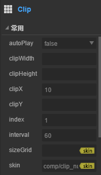

# Clip 组件参考


##  一、通过LayaAirIDE创建Clip组件

###1.1 创建Clip
​        Clip 组件可用于显示位图切片动画。Clip 可以将一张图片，按横向分隔数量 clipX、竖向分隔数量 clipY，或横向分割每个切片的宽度 clipWidth、竖向分割每个切片的高度 clipHeight，从左向右，从上到下，分割组合为一个切片动画。

​        Clip 组件可以用来播放切片动画，和显示切片动画的某一帧图片。
​        点击资源面板里的 Tab 组件，拖放到页面编辑区，即可添加 Tab 组件到页面上。
Tab 的脚本接口参考 [Tab API](http://layaair.ldc.layabox.com/api/index.html?category=Core&class=laya.ui.Tab)

​        Clip 组件的资源示例：

​        <br/>
​    （图1）

 

​        设置 clipX 属性的值为10后的显示效果：

​        <br/>
​    （图2）

​        设置 index 属性的值为 1后的显示效果：

​        <br/>
​    （图3）

###  1.2 Clip 组件的常用属性

​        <br/>
​    （图4）

 

| **属性**     | **功能说明**            |
| ---------- | ------------------- |
| autoPlay   | 布尔值，表示是否自动播放当前切片动画。 |
| clipWidth  | 横向分割图片资源时，每个切片的宽度。  |
| clipHeight | 纵向分割图片资源时，每个切片的高度。  |
| clipX      | 横向分割图片资源时，等宽切割的份数。  |
| clipY      | 纵向分割图片资源时，等高切割的份数。  |
| index      | 切片动画当前显示动画帧索引。      |
| interval   | 切片动画的播放时间间隔。        |
| sizeGrid   | 图像资源的有效网格数据（九宫格数据）。 |
| skin       | 选项卡按钮图像资源。          |

##  二、通过代码创建Clip组件

 	在我们进行书写代码的时候，免不了通过代码控制UI，在代码中导入`laya.ui.Clip`的包，创建UI Clip,并通过代码设定Clip相关的属性。

**示例代码：**

```javascript
package
{
	import laya.display.Stage;
	import laya.ui.Button;
	import laya.ui.Clip;
	import laya.ui.Image;
	import laya.utils.Handler;
	import laya.webgl.WebGL;
	
	public class UI_Clip
	{
		private var buttonSkin:String = "../../../../res/ui/button-7.png";
		private var clipSkin:String = "../../../../res/ui/num0-9.png";
		private var bgSkin:String = "../../../../res/ui/coutDown.png";
		
		private var counter:Clip;
		private var currFrame:int;
		private var controller:Button;
		
		public function UI_Clip()
		{
			// 不支持WebGL时自动切换至Canvas
			Laya.init(800, 600, WebGL);

			Laya.stage.alignV = Stage.ALIGN_MIDDLE;
			Laya.stage.alignH = Stage.ALIGN_CENTER;

			Laya.stage.scaleMode = Stage.SCALE_SHOWALL;
			Laya.stage.bgColor = "#232628";
			
			Laya.loader.load([buttonSkin, clipSkin, bgSkin], laya.utils.Handler.create(this,onSkinLoaded));
		}
		
		private function onSkinLoaded(e:*=null):void
		{
			showBg();
			createTimerAnimation();
			showTotalSeconds();
			createController();
		}
		
		private function showBg():void 
		{
			var bg:Image = new Image(bgSkin);
			bg.size(224, 302);
			bg.pos(Laya.stage.width - bg.width >> 1, Laya.stage.height -bg.height >> 1);
			Laya.stage.addChild(bg);
		}
		
		private function createTimerAnimation():void
		{
			counter = new Clip(clipSkin, 10, 1);
			counter.autoPlay = true;
			counter.interval = 1000;
			
			counter.x = (Laya.stage.width - counter.width) / 2 - 35;
			counter.y = (Laya.stage.height - counter.height) / 2 - 40;
			
			Laya.stage.addChild(counter);
		}
		
		private function showTotalSeconds():void 
		{
			var clip:Clip = new Clip(clipSkin, 10, 1);
			clip.index = clip.clipX - 1;
			clip.pos(counter.x + 60, counter.y);
			Laya.stage.addChild(clip);
		}
		
		private function createController():void 
		{
			controller = new Button(buttonSkin, "暂停");
			controller.labelBold = true;
			controller.labelColors = "#FFFFFF,#FFFFFF,#FFFFFF,#FFFFFF";
			controller.size(84, 30);
			
			controller.on('click', this, onClipSwitchState);
			
			controller.x = (Laya.stage.width - controller.width) / 2;
			controller.y = (Laya.stage.height - controller.height) / 2 + 110;
			Laya.stage.addChild(controller);
		}
		
		private function onClipSwitchState(e:*=null):void 
		{
			if (counter.isPlaying)
			{
				counter.stop();
				currFrame = counter.index;
				controller.label = "播放";
			}
			else
			{
				counter.play();
				counter.index = currFrame;
				controller.label = "暂停";
			}
		}	
	}
}
```

**代码控制Clip生成切片的核心代码：**

```java
private function createTimerAnimation():void
		{
			counter = new Clip(clipSkin, 10, 1);
			counter.autoPlay = true;
			counter.interval = 1000;
			
			counter.x = (Laya.stage.width - counter.width) / 2 - 35;
			counter.y = (Laya.stage.height - counter.height) / 2 - 40;
			
			Laya.stage.addChild(counter);
		}
```

**通过给Button设置监听事件 暂停/继续 计时器：**

```javascript
private function createController():void 
		{
			controller = new Button(buttonSkin, "暂停");
			controller.labelBold = true;
			controller.labelColors = "#FFFFFF,#FFFFFF,#FFFFFF,#FFFFFF";
			controller.size(84, 30);
			
			controller.on('click', this, onClipSwitchState);
			
			controller.x = (Laya.stage.width - controller.width) / 2;
			controller.y = (Laya.stage.height - controller.height) / 2 + 110;
			Laya.stage.addChild(controller);
		}
		
		private function onClipSwitchState(e:*=null):void 
		{
			if (counter.isPlaying)
			{
				counter.stop();
				currFrame = counter.index;
				controller.label = "播放";
			}
			else
			{
				counter.play();
				counter.index = currFrame;
				controller.label = "暂停";
			}
		}	
```

**运行结果:**
​	<br/>
​	(图5)通过代码创建计时器

​	Clip的其他属性也可以通过代码来设置，上述示例演示了如何通过计时器获取每一秒更新clip.clipX切片，通过每秒更新数字实现计时器的功能，有兴趣的读者可以自己通过代码设置Clip，创建出符合自己项目中需要的Clip。

 