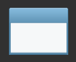

# Image 组件参考


## 一、通过LayaAirIDE创建Image组件

###        1.1 创建image

​	Image 是 UI 里最常见的显示图像的组件，用来显示位图图像。可以同设置 Image 组件的 skin 属性来改变 Image 组件呈现的图像。Image 组件支持九宫格数据设定，用于实现图像放大后图像显示不失真的效果。

​        点击资源面板里的 Image 组件，拖放到页面编辑区，即可添加 Image组件到页面上。单击选中 Image ，可以在属性面板里设置 Image 的常用属性的值。
​        Image 组件的脚本接口请参考 [Image API](http://layaair.ldc.layabox.com/api/index.html?category=Core&class=laya.ui.Image)。

​        **Image 组件的资源示例：**

​        <br/>
​    （图1）

​         **Image 组件拖放到编辑区后显示效果：**

​        <br/>
​    （图2）

### 1.2 Image 组件的常用属性

​        <br/>
​    （图3）

| **属性**   | **功能说明**            |
| -------- | ------------------- |
| sizeGrid | 位图的有效缩放网格数据（九宫格数据）。 |
| skin     | 位图的资源。              |

 

​        添加 Image 组件之后，可以通过从资源面板中拖拽图片资源到 Image 的 skin 属性框，来修改 Image 组件的显示资源图像。

## 二、通过代码创建Image组件

​	在我们进行书写代码的时候，免不了通过代码控制UI，在代码中导入`laya.ui.Image`的包，创建UI Image,并通过代码设定Image相关的属性。

**示例代码：**

```javascript
package
 {
	import laya.display.Stage;
	import laya.ui.Image;
	import laya.webgl.WebGL;
	
	public class UI_Image
	{
		public function UI_Image()
		{
			// 不支持WebGL时自动切换至Canvas
			Laya.init(550, 400, WebGL);

			Laya.stage.alignV = Stage.ALIGN_MIDDLE;
			Laya.stage.alignH = Stage.ALIGN_CENTER;

			Laya.stage.scaleMode = Stage.SCALE_SHOWALL;
			Laya.stage.bgColor = "#232628";

			setup();			
		}

		private function setup():void
		{
			var dialog:Image = new Image("res/ui/dialog (3).png");
			dialog.pos(165, 62.5);
			Laya.stage.addChild(dialog);
		}
	}
 }
```

**运行结果:**
​	<br/>
​	(图5)通过代码创建Image

​	Image的其他属性也可以通过代码来设置，上述示例演示了如何通过代码创建不同皮肤（样式）的Image，

有兴趣的读者可以自己通过代码设置Image，创建出符合自己需要的图片。