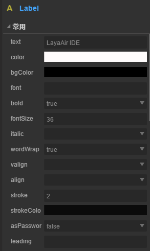

# Label 组件参考


## 一、通过LayaAirIDE创建Label组件

###     1.1 创建Label

​        Label 组件用来显示一段文字，文字可以是系统字体或者 BMFont 字体。

​        点击资源面板里的 Label 组件，拖放到页面编辑区，即可添加 Label 组件到页面上。
​        Label 组件的脚本接口请参考 [Label API](http://layaair.ldc.layabox.com/api/index.html?category=Core&class=laya.ui.Label)。

​        Label 组件的资源示例：

​        <br/>
​    （图1）

​        Label组件拖放到编辑区后，设置 text 属性的值为 LayaAir IDE 后的显示效果如下：

​        <br/>
​    （图2）

 

 

###  1.2 Label 属性

​        <br/>
​    （图）

 

| **属性**      | 功能说明                             |
| ----------- | -------------------------------- |
| text        | 文本内容字符串。                         |
| align       | 文本的水平对齐方式。可选值有left、center、right。 |
| valign      | 文本的垂直对齐方式。可选值有top、middle、bottom。 |
| color       | 文本的颜色值。默认为黑色。                    |
| bgColor     | 文本背景颜色。                          |
| font        | 文本的字体名称。                         |
| fontSize    | 文本的字体大小。                         |
| bold        | 文本是否为粗体字显示。                      |
| italic      | 文本是否显示为斜体。                       |
| wordWrap    | 文本是否换行。                          |
| stroke      | 文本的描边宽度。                         |
| strokeColor | 文本的描边颜色。                         |
| asPassword  | 文本是否显示为密码样式。                     |
| leading     | 文本的垂直行间距。                        |
| padding     | 文本的边距。                           |

 

## 二、通过代码创建Label组件

 	在我们进行书写代码的时候，免不了通过代码控制UI，在代码中导入`laya.ui.Label`的包，创建UI Label,并通过代码设定Label相关的属性。

**示例代码：**

```javascript
package 
{
	import laya.display.Stage;
	import laya.ui.Label;
	import laya.webgl.WebGL;
	
	public class UI_Label
	{
		public function UI_Label()
		{
			// 不支持WebGL时自动切换至Canvas
			Laya.init(800, 600, WebGL);

			Laya.stage.alignV = Stage.ALIGN_MIDDLE;
			Laya.stage.alignH = Stage.ALIGN_CENTER;

			Laya.stage.scaleMode = Stage.SCALE_SHOWALL;
			Laya.stage.bgColor = "#232628";

			setup();			
		}

		private function setup():void
		{
			createLabel("#FFFFFF", null).pos(30, 50);
			createLabel("#00FFFF", null).pos(290, 50);
			createLabel("#FFFF00", "#FFFFFF").pos(30, 100);
			createLabel("#000000", "#FFFFFF").pos(290, 100);
			createLabel("#FFFFFF", "#00FFFF").pos(30, 150);
			createLabel("#0080FF", "#00FFFF").pos(290, 150);
		}
		
		private function createLabel(color:String, strokeColor:String):Label
		{
			const STROKE_WIDTH:int = 4;
			
			var label:Label = new Label();
			label.font = "Microsoft YaHei";
			label.text = "SAMPLE DEMO";
			label.fontSize = 30;
			label.color = color;
			
			if (strokeColor)
			{
				label.stroke = STROKE_WIDTH;
				label.strokeColor = strokeColor;
			}
			
			Laya.stage.addChild(label);
			
			return label;
		}
	}
}
```

**运行结果:**
​	<br/>
​	(图5)通过代码创建Label

​	Label的其他属性也可以通过代码来设置，上述示例演示了如何通过代码创建不同皮肤（样式）的Label，

有兴趣的读者可以自己通过代码设置Label，创建出符合自己需要的文字效果。

​	更多的文字效果可以去查看2D基础篇中的文本部分。

 	