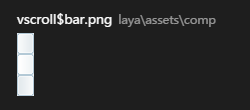
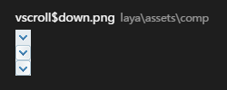

# VScrollBar 组件参考


## 一、通过LayaAirIDE创建VScrollBar 组件

### 1.1 创建VScrollBar 

 

​        VScrollBar 组件是一个垂直方向滚动条组件。
​        当数据太多以至于显示区域无法容纳时，最终用户可以使用 VScrollBar 组件控制所显示的数据部分。
​        滚动条由四部分组成：一个轨道图、一个滑块按钮和两个箭头按钮。
​        点击选择资源面板里的 VScrollBar 组件，拖放到页面编辑区，即可添加 VScrollBar 组件到页面上。
​        VScrollBar 组件的脚本接口请参考 [VScrollBar API](http://layaair.ldc.layabox.com/api/index.html?category=Core&class=laya.ui.VScrollBar)。
​        VScrollBar 组件的图像资源示例：

​        <br/>
​    （图1）

​        <br/>
​    （图2）
​        <br/>
​    （图3）

​        <br/>
​    （图4）

 

​        VScrollBar 拖放到编辑器区后，显示效果：

​        <br/>
​    （图5）

​        设置 VScrollBar 的属性 max 的值为 10、属性 min 的值为0、属性 value 的值为3后，显示效果如下：

​        <br/>
​    （图6）

​        在程序中运行时，可以拖动滑块或点击箭头按钮控制进度条的值：

​        <br/>
​    （图7）

​        设置 VScrollBar 的属性 showButtons 的值为 false时的显示效果：

​        <br/>
​    （图8）

​        在程序里运行时的效果：

​        <br/>
​    （图9）

### 1.2 VScrollBar 组件常用属性

​        <br/>
​    （图10）

 

| **属性**            | **功能说明**                            |
| ----------------- | ----------------------------------- |
| skin              | 滚动条的图像资源地址。                         |
| sizeGrid          | 滚动条轨道图资源的有效缩放网格数据（九宫格数据）。           |
| value             | 表示当前滚动位置的数字。                        |
| min               | 表示最低滚动位置的数字。                        |
| max               | 表示最高滚动位置的数字。                        |
| scrollSize        | 表示按下滚动条轨道时页面滚动的增量。                  |
| mouseWheelEnable  | 一个布尔值，指定是否滑轮滚动，默认值为true。            |
| touchScrollEnable | 一个布尔值，指定是否开启触摸，默认值为true。            |
| autoHide          | 一个布尔值，指定是否自动隐藏滚动条(无需滚动时)，默认值为false。 |
| showButton        | 一个布尔值，指定是否显示向上、向下按钮，默认值为true。       |

 

 

##  二、通过代码创建VScrollBar组件 

​	在我们进行书写代码的时候，免不了通过代码控制UI，在代码中导入`laya.ui.VScrollBar `的包，创建UI VScrollBar ,并通过代码设定VScrollBar 相关的属性。

**示例代码：**

```javascript
package
{
	import laya.display.Stage;
	import laya.ui.VScrollBar;
	import laya.utils.Handler;
	import laya.webgl.WebGL;

	public class UI_ScrollBar
	{
		public function UI_ScrollBar()
		{
			// 不支持WebGL时自动切换至Canvas
			Laya.init(550, 400, WebGL);

			Laya.stage.alignV = Stage.ALIGN_MIDDLE;
			Laya.stage.alignH = Stage.ALIGN_CENTER;

			Laya.stage.scaleMode = Stage.SCALE_SHOWALL;
			Laya.stage.bgColor = "#232628";
			
			var skins:Array = [];
			skins.push("res/ui/vscroll.png", "res/ui/vscroll$bar.png", "res/ui/vscroll$down.png", "res/ui/vscroll$up.png");
			Laya.loader.load(skins, Handler.create(this, placeVScroller));
		}
		
		private function placeVScroller():void 
		{
			var vs:VScrollBar = new VScrollBar();
			vs.skin = "res/ui/vscroll.png";
			vs.height = 300;
			vs.pos(400, 50);
			
			vs.min = 0;
			vs.max = 100;
			
			vs.changeHandler = new Handler(this, onChange);
			Laya.stage.addChild(vs);
		}

		private function onChange(value:Number):void 
		{
			trace("滚动条的位置： value=" + value);
		}
	}
}
```

**运行结果:**
​	<br/>
​	(图11)通过代码创建VScrollBar 

​	VScrollBar 的其他属性也可以通过代码来设置，上述示例演示了如何通过代码创建的VScrollBar ，

有兴趣的读者可以自己通过代码设置VScrollBar ，创建出符合自己需要的滚动条。