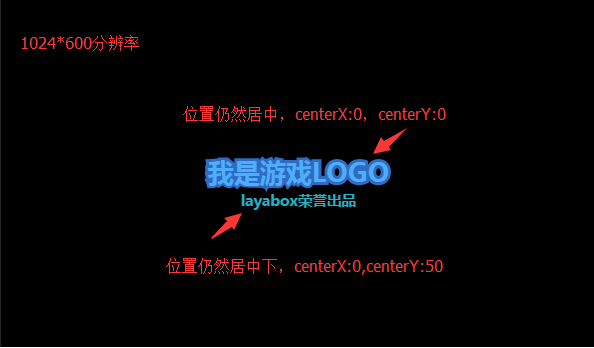
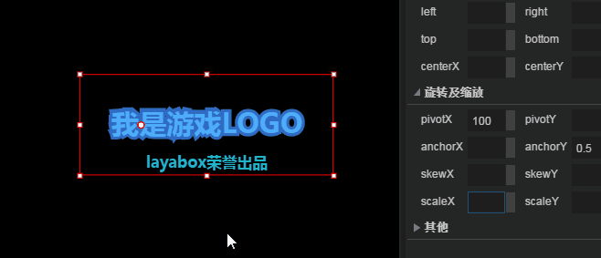

# 属性设置器

​         属性设置器是我们查看并编辑当前选中组件属性的工作区域。在场景编辑器或层级管理器中选中组件，就会在属性设置器中显示该组件的属性以供查询和编辑。

属性设置器面板如图1所示，从上到下通常为： 组件或节点名、**公用**属性、**常用**属性、**宽高及位置**、**旋转及缩放**、**其他**等等。

  
​        	（图1）属性面板分组

## 1、`公用`属性介绍

公用属性中通常是`var`、`name`、`renderType`。如图2-1所示。

   (图2-1)

### 1.1 设置全局变量名称

`Var` ：声名一个唯一的全局变量名称，用于在项目的代码中根据这个名称来调用这个组件。

### 1.2 设置组件标识名称

`name`： 是组件的标识名称，通常用于层级管理器中区分其它组件，他的父容器也可以通过这个名称找到这个组件。

### 1.3 设置组件的节点功能类型

`renderType`：节点功能类型，分别有mask、hit、unHit、render、instance五种。

#### 1.3.1 设置为遮罩

　　当组件被设置为`mask`时，该组件为遮罩，其**父级组件**只有mask遮罩区域为可见，效果如动图2-2所示。

　　   （动图2-2）

#### 1.3.2 设置点击区域与非点击区域

　　当组件被设置为`hit`时，该组件所在的父级组件区域可以被点击。当组件被设置为`unHit`时，该组件所在的父级组件区域为非点击区域。**如果点区域hit的组件与非点击区域unHit的组件叠加时**，非点击区域unHit优先级更高。如图2-3所示，绿色圆所在的非点击区域（unHit），包括被叠加的嘴巴区域都不可以被点击。只有头部的红色半月区域可以被点击。

　　  (图2-3)

#### 1.3.3 设置为List的render

　　当该组件被设置为`render`时，该组件可重复渲染，用于列表List的制作。在制作列表的思路上，需要先将多个组件全选后通过ctrl+B设置为box容器。并将该容器的renderType属性设置为render。然后再使用ctrl+B将该box设置为List。如动图2-4所示。

  (动图2-4)

#### 1.3.4 设置为单例instance

　　当该组件被设置为`instance`时，该组件为单例组件，当多处重复使用的时候，单例组件仅会被实例化一次。节约性能开销。

　　

## 2、`常用`属性介绍

在常用属性里，有一些操作是通用的。这里我们分别介绍一下。

### 2.1 九宫格操作(sizeGrid)

九宫格是通过四条直线将UI分隔成9块，如果出现对UI的拉伸操作，中间区域为计算填充，其它区域会保持原有设计，无论UI如何拉伸都会保持不变。是游戏开发中常用的功能。

常用属性中的`sizeGrid`属性正是九宫格设置，通过点击属性输入栏右侧的`grid`按钮，可以进入九宫格设置的可视化操作面板。如图3-1所示。

   (图3-1)

当打开九宫格设置后，左侧为效果预览区、右侧为九宫格可视化操作区。通过鼠标拖拽的方式改变九宫格填充区域，即时获得预览效果，调整完点击确定即可。操作如动图3-2所示。

   (动图3-2)

### 2.2 皮肤设置(skin)

`skin`属性可以设置改变组件的皮肤。除了手动在属性栏内输入皮肤的路径外，还可以从资源管理器中直接拖动资源到`skin`属性输入栏，快速实现皮肤的切换。另外，点击属性输入栏右侧的`skin按钮`，可以从众多的资源中，快速定位到当前的资源。操作如动图3-3所示。

   (动图3-3)

### 2.3 皮肤状态切割(stateNum)

在Button、checkBox等组件的使用中，组件的皮肤资源是多态竖向排列组成，如图3-4所示。

   (图3-4)

#### 皮肤的切割方式：

三态是将皮肤图片按竖直方向以等比分割的形式分为3部分，如图1所示，**从上至下**依次为`弹起或离开状态`皮肤、 `经过状态`皮肤、 `按下和选中`（*保持按下*）状态皮肤，三态常用于PC浏览器中。

在移动设备上，通常只采用两态，图片以竖直方向被等比切割为两部分，上面的部分为`弹起或离开状态状态`皮肤，下面的部分为 `经过和按下以及选中状态`（*保持按下*）皮肤。

单态不切割图片，无论什么状态，皮肤只有一种，保持不变。

#### 用stateNum指定皮肤按几态切割：

对于存在状态区分的组件，stateNum的属性值决定皮肤资源图片的切割方式。默认的stateNum属性值为3，也就是说默认按3态按钮进行切割，等比分割为3部分。如果是两态按钮，需要将stateNum的属性值设为2，等比切割为2部分。单态按钮设置为1，不进行切割。

　这里需要注意的是，指定按钮状态，需要与按钮皮肤对应好。如果是三态的按钮皮肤，stateNum设置为2，切割后如图3-5所示，是错误的。

   (图3-5)

### 2.4 强大的runtime属性

`runtime`是属性管理器中非常强大的一个组件扩展功能。通过在runtime属性中设置逻辑类，实例时创建的不再是组件的可视类，而是runtime属性中指定的逻辑类。该属性中需要指定逻辑类的全路径，例如“game.user.player”。

### 2.5 可视化颜色设置

在color的属性设置时，可以手动输入颜色值，也可以点击右侧的颜色设置按钮，在颜色设置面板中指定颜色，然后点击面板外的任意区域即可完成可视化颜色设置，如动图3-6所示。

  （动图3-6）

### 2.6 数字的拖拉调节

如果属性值是数字的话，输入框边上会有一个拖拉调节面板。很多开发者没有注意到这个小技巧，通过鼠标左键点击调节面板，然后向上拖动或向下拉，即可对数字进行微调，场景编辑器中的对应组件也会产生即时的可视化变化。如动图3-7所示。

   (动图3-7)

### 

## 3、宽高及位置属性

宽高及位置属性在UI制作中有着很重要的作用。主要用于调整位置及UI屏幕适配（图4）。

 （图4）

### 3.1 x、y属性

x与y属性是组件在场景编辑器中的x与y轴坐标。

场景编辑器的左上角为坐标原点`（0, 0）`。 以原点为中心，x轴向右延伸为正坐标增加，y轴向下为正坐标增加。

在`场景编辑器`中选中组件后按住鼠标可以移动修改x与y轴位置，也可以在属性输入框中设置固定值。

### 3.2  width、height宽高属性

在不改变组件大小的情况下，组件的宽高虽会自动计算，但在属性面板中并不会显示出来。当通过约束框或固定值设置对组件进行了缩放重置后，宽高属性会显示出来，同时也可以进行数字的拖拉调节。

不选择任意组件时，当前宽高为页面宽高。

*Tips：部分组件只改能改变约束框大小，实际组件并不会放大，但鼠标点击区域会缩放到约束框的大小，例如CheckBox。*

### 3.3  UI适配属性

`left、right、top、bottom`四个属性主要用于组件与页面边缘距离位置适配。`centerX、centerY`两个属性主要用于组件与页面中心位置适配。在游戏开发中，我们不可能把所有屏幕分辨率全部考虑到，有的分辨率高，有的分辨率低。如果游戏选用了不整体放大适配，组件又固定了位置，在不同分辨率的屏幕下就会造成UI组件错位现象。

#### 3.3.1 边距位置适配

**设计目标**：在游戏右上角放一个头像，始终保持屏幕上边缘和右边缘50px。

**错误的实现效果**：

如果我们按某一种屏幕分辨率为组件的x与y设置固定值，则会出现动图5-1的效果。与设计目标不符。

  
 (动图5-1) 为组件的x与y设置固定值时，不同屏幕分辨率效果。

**正确的实现效果**：

`left、right、top、bottom`四个属性分别基于父容器的左边缘、右边缘、上边缘、下边缘。所以要实现在不同屏幕分辨率下的相同居右效果，需要设置right与top的属性值。设置后的运行效果如动图5-2所示。

  (动图5-2)

**屏幕适配对边距设置的影响**：

这里特别要注意的是，`left、right、top、bottom`的属性效果是基于父容器的各个边缘，而不是屏幕的各个边缘。如果父容器没有进行屏幕适配设置，那么并不能实现动图5-2的运行效果。

#### 3.3.2 边距的拉伸适配

除了居于某一个边缘的适配作用外，同时设置left、right、top、bottom的属性值，还可以根据不同屏幕对组件进行拉伸适配。例如我们将left、right、top、bottom的属性值都设置为100，运行后如动图5-3所示。

   (动图5-3)

*Tips：拉伸适配的边距设置方式通常需要结合九宫格来实现。*

#### 3.3.3 中心位置适配

中心适配常用于基于屏幕中间的游戏启动LOGO，弹出提示框等。我们可以通过centerX、centerY进行位置居中设置，如图6-1、6-2所示。

 （图6-1）

 （图6-2）

## 4、旋转及缩放属性

旋转及缩放属性在游戏UI中，特别是在IDE制作动画时经常用到。

#### 4.1 修改轴心点

“轴心点”：组件的旋转或缩放中心点，默认在组件中的原点`（0,0）`点位置。

pivotX、pivotY、anchorX、anchorY四个属性都是用于修改轴心点位置。

pivotX、pivotY（轴心点）是通过改变组件轴心点XY坐标的固定值来修改轴心点位置。

anchorX、anchorY（锚点）是通过X与Y轴的组件宽或高的百分比计算出轴心点坐标位置，如图7所示，宽与高的50%计算出的坐标正好是中心点坐标位置。

 （图7）

**Tips**：*通过锚点是一种非常方便快捷的设置轴心点方式。但是锚点方式只能对UI组件设置轴心点，对于Graphics组件以及Sprite等2D基础组件的轴心点只能通过设置`pivotX与pivotY`的方式实现。*

#### 4.2 修改倾斜角度

skewX、skewY是以轴心点为中心进行水平、垂直角度倾斜，修改属性值效果如动图8所示。

 （动图8） 

#### 4.3 修改组件缩放大小

scaleX、scaleY是以轴心点为中心进行水平、垂直大小缩放。

默认为1，不缩放；正数值越大，缩放尺寸越大。

缩放到0，不可见；

`-1`为**镜像**，效果如动图9所示 。负数值越大，镜像后缩放尺寸越大。

 （动图9） 

**Tips**：*如果轴心点在中心，可以原地镜像，比如角色两个方向可以使用同一个资源实现。*

## 5、其他通用属性介绍

LayaAirIDE提供了大量的组件，它们都有一些相同的通用属性，因为它们大都继承于Component组件基类。在这里我们主要介绍一下其他属性中的通用部分，组件本身的特殊属性，我们将在每个单独组件介绍时讲解。

通用属性包括以下几类

显示相关属性：alpha、visible

缓存相关属性：cacheAs、cacheAsBitmap、staticCache

鼠标操作相关属性：disabled、gray、htTestPrior、mouseEnabled、mouseThrough

label相关属性：labelAlign、labelColors、labelBold、labelFont、labelPadding、labelSize、labelStroke、labelStrokeColor、strokeColor

### 5.1 显示相关属性

显示相关属性相对比较容易理解，显示对象都具有alpha和visible属性。

`alpha`调整显示对象透明度，数值在0-1之间，0为全部透明，1为不透明，区间内属于不同程度半透明。注：显示对象alpha数值无论为多少，如果加了鼠标监听，那么它都支持鼠标事件，哪怕alpha为0的情况下，鼠标事件也会发生。

`visible`调整显示对象的显示与否，布尔值，为false时，对象不显示出来，为true时显示。注：显示对象visible为false时，鼠标事件失去效果。

### 5.2 缓存相关属性

关于缓存优化方面的属性，cacheAs、cacheAsBitmap、staticCache建议单个组件不要使用，复杂页面时再使用。

在游戏中有大量的UI，当一个UI有多个节点且变化较小时，我们推荐使用cacheAs或cahceAsBitmap。比如我们正在使用的LayaAirIDE软件中的所有面板，属性设置器、资源管理器、项目管理器等，在开发时我们都使用了cacheAs进行缓存，提高了渲染效率。

对于经常变化的复杂UI，比如有“倒计时”显示的UI，我们也可以把它分成两部分，倒计时对象部分和相对变化少的UI部分，只对变化少的UI部分进行cacheAs。

开发时使用cacheAs需认真学习理解，错误的理解和使用缓存机制反而会降低性能。

下列为三个属性的详细说明：

**cacheAs：**

缓存组件，是否缓存为静态图像，合理作用能提高性能 。

它有"none"，"normal"和"bitmap"三个值可选，cacheAs为非"none"时，子对象发生变化，会自动重新缓存，同时也可以手动调用reCache方法更新缓存。

 默认为"none"，不做任何缓存。当值为"normal"时，canvas模式下进行画布缓存，webgl模式下进行命令缓存。 当值为"bitmap"时，canvas模式下进行依然是画布缓存，webgl模式下使用renderTarget缓存。

  webgl下renderTarget缓存模式有最大2048大小限制，会额外增加内存开销，不断重绘时开销比较大，但是会减少drawcall，渲染性能最高。 webgl下命令缓存模式只会减少节点遍历及命令组织，不会减少drawcall，性能中等。

**cacheAsBitmap：**

组件是否缓存为静态图像。功能同cacheAs的normal模式。

**staticCache：**

设置cacheAs为非空时此值才有效，staticCache=true时，子对象变化时不会自动更新缓存，只能通过调用reCache方法手动刷新。

### 5.3 鼠标操作相关属性

鼠标操作相关属性说明及演示效果如下

| **其他属性**     | **功能说明**                                 |
| ------------ | ---------------------------------------- |
| disabled     | 是否禁用，禁用后变灰，且不接收鼠标事件。                     |
| gray         | 是否变灰，变灰后仍能接受鼠标事件。                        |
| htTestPrior  | 否优先检测自己。默认为false 鼠标碰撞检测是优先检测子对象，然后冒泡到父对象，如果hitTestPrior=true 鼠标碰撞优先检测本对象，本对象被击中后，才进一步检测子对象。 对于已知大小的容器（特别是根容器），设置此值为true，能减少节点碰撞，提高性能。默认为false。UI的View组件默认为true。 |
| mouseEnabled | 是否接受鼠标事件。 默认为false，如果监听鼠标事件，则会自动设置本对象及父节点的属性 mouseEnable 的值都为 true（如果父节点手动设置为false，则不会更改）。 |
| mouseThrough | 指定当mouseEnabled=true时，是否可穿透。默认值为false，如果设置为true，则点击空白区域可以穿透过去，只针对自身有效。 |

 （动图10） 

### 5.4 label相关属性

很多组件的内部包含了label标签，比如Button、CheckBox、Tab等。它们的其他属性中也有相同的label属性设置，如下表

| **label相关的其他属性** | **功能说明**                                 |
| ---------------- | ---------------------------------------- |
| labelAlign       | 标签对齐模式，默认为居中对齐。注：在CheckBox中无效            |
| labelColors      | 表示标签各个状态下的文本颜色。 格式: "upColor,overColor,downColor,disableColor"。默认为“蓝色，绿色”。 |
| labelBold        | 表示标签文本标签是否为粗体字。                          |
| labelFont        | 表示文本标签的字体名称，以字符串形式表示。IDE中可选择。            |
| labelPadding     | 表示文本标签的边距。 格式："上边距,右边距,下边距,左边距"。         |
| labelSize        | 表示文本标签的字体大小。                             |
| labelStroke      | 文字描边宽度（以像素为单位）。 默认值0，表示不描边。              |
| labelStrokeColor | 文字描边颜色，以字符串表示。 默认值为 "#000000"（黑色）;       |
| strokeColor      | 表示各个状态下的描边颜色。 格式: "upColor,overColor,downColor,disableColor"。 |