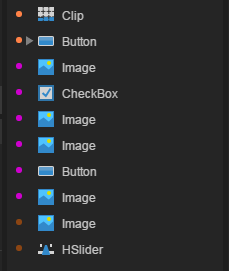
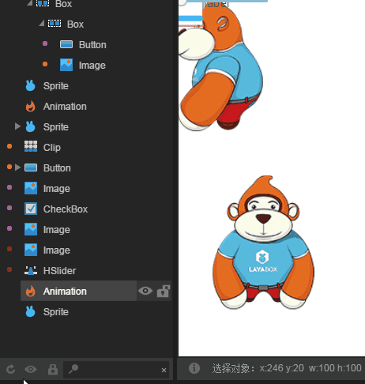
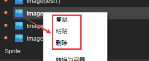
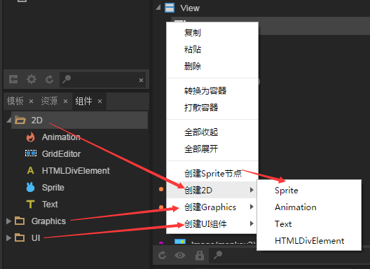

# 层级管理器

层级管理器是设计模式中的核心组成部分之一，所有在`场景编辑器`中的组件都将在`层级管理器`中以层级结构进行展现。

### 1、层级结构

#### 1.1 根级

除非在创建UI页面时选择Dialog，否则，无论是UI还是动画，根级都是View，ID为1。如图1所示。

  (图1)

#### 1.2 多层嵌套

层级管理器中允许多层嵌套，每一个父级层都会以灰色三角标开头，点击三角标可以展开层级，如图2所示。

 (图2)

#### 1.3 层级结构优化

在层级管理器中，组件图标前会有不同颜色的圆点。同样的颜色代表相同图集的节点，如果颜色值不同，如图3所示，则需要进行优化。

  (图3) 不同颜色的圆点交叉排列时，需要优化

优化的方式很简单，让同一层级下的相同颜色圆点排列在一起即可，这里有个小技巧需要注意一下，当拖到组件下，为一条直线时，是在同一层级改变顺序。如果在拖动组件的时候，显示是一个框，则会拖动到目标组件的子层级。

   (图4)

改变层级显示顺序后，圆点颜色相同时，才算达到优化的目标。如图5所示。

   （图5）

### 2、层级管理器面板的功能

#### 2.1 显示与隐藏组件

当选中`层级管理器`中的某个组件，点击组件右侧的`眼睛图标`会**隐藏**`场景编辑器`中的**对应组件**，再次点击会解除隐藏。效果如动图6所示。

  (动图6)

#### 2.2 锁定组件与解锁

选中`层级管理器`中的某个组件，点击组件右侧的`锁形图标`会**锁定**`场景编辑器`中的对应组件，再次点击会解除锁定。效果如动图7所示。

  (动图7)

#### 2.3 底部功能按钮

层级管理器的底部功能按钮，是针对整个层级列表进行操作。

点击`刷新`按钮，将会刷新整个层级管理器列表；

点击`眼睛`按钮，会将整个层级管理器的组件全部隐藏或显示；

点击`锁形`按钮，会将整个层级管理器的组件全部锁定或解除锁定；

具体效果如动图8所示。

  （动图8）

#### 2.4 组件查找过滤

组件在层级管理器中查找，可以通过组件的原始名称的关键字过滤，也可以通过组件的别名进行过滤，效果如图9所示。

   （图9）

**Tips：组件的别名，通过属性设置器的name属性进行设置。设置别名后方便组件的查找与定位。**

### 3、层级管理器右键菜单操作

#### 3.1 复制、粘贴、删除组件

选中层级管理器中的组件后，右键可进行复制、删除以及粘贴等常用操作。如图10所示。

  （图10）

**Tips：**也可以使用快捷键`ctrl+c`进行复制、`ctrl+v`进行粘贴、`Delete`进行删除。

#### 3.2 转换与打散容器

选择一个或多个组件后，右键可以`转换为容器`，如图11所示。

  （图11）

**Tips：**也可以使用快捷键`ctrl+B`将组件`转换为容器`。

选中容器组件，右键选择`打散容器`可以将容器层级关系解除，如动图12所示。

   (动图12)

#### 3.3 全部收起和展开

点击图标前的三角标可以展开或收起当前容器下的组件，右键`全部收起`和`全部展开`可以展开或收起整个根级下的组件，效果如动图13所示。

   (动图13)

#### 3.4 创建组件节点

选中组件后可以通过右键菜单快捷的创建常用组件，右键菜单中`创建2D`可以直接创建2D基础组件，`创建Graphics`可以创建矢量图形组件，`创建UI组件`可以创建UI常用组件，这些组件的创建对应组件库中的组件，如图14。

  (图14)

**Tips**：*右键的组件创建与组件库完全对应，所以也可以通过组件库进行组件的创建。*

### 4、其它操作

#### 4.1多选操作

按住Shift可以同时选择同一层级下的多个相邻组件；

按住Ctrl可以同时选择同一层级下的多个相邻或相隔的组件； 

#### 4.2添加组件操作

除右键菜单中直接创建组件外，还可以从`组件库`以及`资源管理器`中以拖拽的方式创建组件，当场景编辑器中多个组件叠加的复杂场景设计时，直接通过`层级管理器`创建和管理组件是比较高效的开发方式。组件添加操作如动图15所示。

   (动图15)

