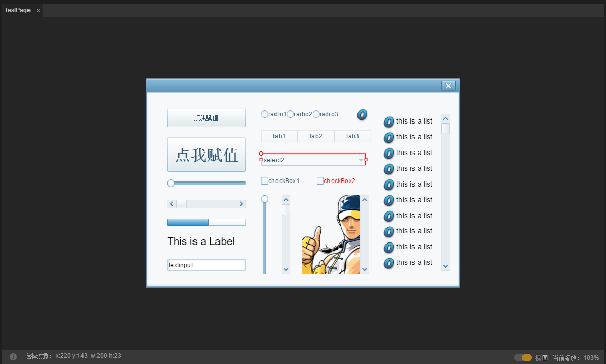

# UI场景编辑器

​        场景编辑器 是内容创作的核心工作区域，您可以使用它选择和摆放控件，组合容器等。在这个工作区域里，您可以选中并通过 属性检查器 修改控件或组件的位置、旋转、缩放、尺寸等属性，并可以获得所见即所得的场景效果预览。

​     	  
​     	（图1）

### 视图介绍

#### 1、导航

​        您可以通过以下的操作，来移动和定位场景编辑器的视图：

​            1.鼠标右键拖拽：平移视图。

​            2.Ctrl++：放大视图。

​            3.Ctrl--：缩小视图。

#### 2、坐标系

​        场景视图的背景会显示一组标尺，表示世界坐标系中各个点的位置信息。初始为（0,0）的点为场景中世界坐标系的原点。使用快捷键放大缩小视图显示时，每一个刻度代表60像素的距离。根据当前视图缩放尺度的不同，会在不同刻度上显示表示该点到原点距离的数字，单位都是像素。 

#### 3、控件的约束框

​        控件在鼠标选中状态下能够看到约束框（红色且带节点的线框），约束框的矩形区域表示控件的尺寸（size）属性大小。即使控件没有包含图像渲染组件（如Sprite）,也可以为控件设置size属性，而控件约束框以内的透明区域都可以被鼠标点击选中。

​          
​     	（图2） 

#### 4、多选节点

​        在场景编辑器中按住鼠标左键并拖拽，可以画出一个红色线条的矩形选区框，和选取框有部分重合的节点，在放开鼠标按键后都会被选中。在放开鼠标键之前可以任意滑动鼠标来更改选取框的区域。

​     	 
​     	（图3）

​         
​     	（图4）

#### 5、使用变换工具布置节点

​        场景编辑器的核心功能就是以所见即所得的方式编辑和布置场景中的可见元素。我们还可以通过主窗口工具栏上方的一系列变换工具来将场景中的节点按我们希望的方式布置。 

​        变换工具使用方式请阅读工具栏介绍一节。

 

 