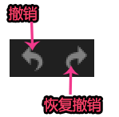
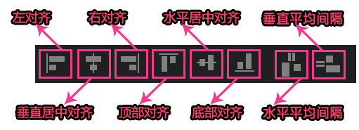

# 工具栏介绍

​         工具栏 位于编辑器主窗口的正上方，菜单栏下方，包含了八组控制按钮或信息，用来为特定面板提供编辑功能或方便我们实施工作流。

​         
​    （图1）

 

### 一、项目操作工具

​         
​    （图2）

​        新建目录： 在当前项目中新建一个目录文件夹，快捷键 （Ctrl + D）。

​        新建页面： 在选中的目录中新建一个页面（Page），快捷键 （Ctrl + N）。

 

### 二、保存工具

​         
​    （图3）

 

​        保存当前： 保存当前操作的页面，快捷键（Ctrl + S）。

​        保存所有： 保存对该项目的所有更改，快捷键（Ctrl + Shift + S）。

 

### 三、撤销工具

​         
​    （图4）

 

​        撤销： 撤销一次当前操作，快捷键（Ctrl + Z）。

​        恢复撤销： 误撤销时可以将撤销掉的操作返回回来，快捷键（Ctrl + Y）。

 

### 四、刷新发布工具

​         
​    （图5）

​        刷新： 在用户导入新资源或对文件有更改后点击刷新，程序会自动加载新的资源或配置，快捷键（F5）。

​        发布： 在用户完成设计之后，可以点击发布，生成发布文件进行共享或使用，快捷键（F12）。

 

### 五、视图工具

​         
​    （图6）

​        缩小视图： 点击缩小视图按钮后场景会自动进行缩放，但并不影响设计宽高控件大小，快捷键（Ctrl + +）。

​        放大视图： 点击放大视图按钮后场景会自动进行放大，放大不影响设计宽高及控件大小，快捷键（Ctrl + - ）。

​        恢复视图： 点击恢复视图按钮后场景会自动恢复至初始大小，快捷键（Ctrl + \ ）。

 

### 六、对齐工具

​         
​    （图7）

 

​        左对齐： 多个控件左对齐方式将以最左侧控件的起始坐标为对齐点进行左对齐。

​        右对齐： 多个控件右对齐方式将以最右侧控件的结束坐标为对起点进行右对齐。

​        水平居中对齐： 多个控件水平居中对齐方式将自动计算水平中心坐标进行居中对齐。

​        垂直居中对齐： 多个控件垂直居中对齐方式将自动计算垂直中心坐标进行居中对齐。

​        顶部对齐： 多个控件顶部对齐方式将以最上方控件的顶点坐标作为对齐点进行顶部对齐。

​        底部对齐： 多个控件底部对齐方式将以最下方控件的底部坐标作为对齐点进行底部对齐。

 

### 七、位移操作

​         
​    （图8）

 

​        移动到左上角： 将选中的控件移动到场景视图的左上角位置。

​        移动到左下角： 将选中的控件移动到场景视图的左下角位置。

​        移动到右上角： 将选中的控件移动到场景视图的右上角位置。

​        移动到右下角： 将选中的控件移动到场景视图的右下角位置。

​        移动到水平居中： 将选中的控件移动到场景视图的水平居中位置，控件的垂直位置不变。

​        移动到垂直居中： 将选中的控件移动到场景视图的垂直居中位置，控件的水平位置不变。

 