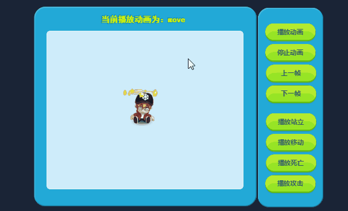

# 用LayaAirIDE制作图集动画

> 阅读本文前，需要先阅读2D动画基础的图集动画、Aimation组件属性详解，以及其它的IDE基础文档。基础概念及操作本篇不再细讲。

## 1. 制作目标

 

（动图1） 

如动画1所示。本篇在LayaAirIDE里制作图集动画，并制作简单的UI面板及控制按钮。然后编写代码对制作的图集动画进行控制。

## 2. 素材准备

将用到的动画面板背景组件与按钮组件、以及动画序列帧资源复制到IDE的资源管理器中。本篇文档的UI组件在comp目录中，动画资源在role目录。如图2所示。

 

(图2)

## 3. 制作UI背景

3.1 设置九宫格

先创建一个View类型的UI页面（*本例为 animation.ui*）。然后拖入背景图组件到场景编辑器，设置九宫格后，拉伸至图3的效果。


### 3.2 动画模版的创建与运用

根据动画模版的概述，我们修改代码，并加入动画模版创建方法Animation.createFrames()，它需要的两个参数分别是动作的图片序列url地址，及动作的名称，代码如下：

```java
package
{
	import laya.debug.DebugPanel;
	import laya.display.Animation;
	import laya.display.Stage;
	import laya.events.Event;
	import laya.maths.Rectangle;
	import laya.utils.Handler;
	import laya.webgl.WebGL;
	
	import ui.PlayControlUI;

	public class AtlasAnimation
	{
		/****角色动画****/
		private var roleAni:Animation
		
		public function AtlasAnimation()
		{
			// 不支持WebGL时自动切换至Canvas
			Laya.init(1280,720, WebGL);
			//画布垂直居中对齐
			Laya.stage.alignV = Stage.ALIGN_MIDDLE;
			//画布水平居中对齐
			Laya.stage.alignH = Stage.ALIGN_CENTER;
			//等比缩放
			Laya.stage.scaleMode = Stage.SCALE_SHOWALL;
			//背景颜色
			Laya.stage.bgColor = "#1b2436";
			
			
			//加载角色图集资源
			Laya.loader.load(["res/atlas/role.atlas"], Handler.create(this, createAni));
		}
		
		private function createAni():void 
		{
			
			//实例化角色动画
			roleAni = new Animation();
			// 加载图集动画
			roleAni.loadAtlas("res/atlas/role.atlas");	
			// 设置动画每帧间播放间隔（单位：毫秒）
			roleAni.interval = 100;
			//角色动画放大
			roleAni.scale(1.4,1.4);			
			
			//创建动画模版，以供动作切换控制使用
			Animation.createFrames(actionUrls("stand",7),"stand");    	//站立动画
			Animation.createFrames(actionUrls("move",8),"move");		//移动动画
			Animation.createFrames(actionUrls("die",8),"die");			//死亡动画
			Animation.createFrames(actionUrls("attack",7),"attack");	//攻击动画
			
			//播放某个缓存的动画模版
			roleAni.play(0,true,"attack");	
			
			//动画实例无宽高，需通过getGraphicBounds()或getBounds()获取
			//获取动画的边界信息
			var bounds:Rectangle = roleAni.getGraphicBounds();
			//设置动画轴心点
			roleAni.pivot(bounds.width / 2, bounds.height / 2);
			//设置动画在舞台中心位置
			roleAni.pos(Laya.stage.width / 2-200, Laya.stage.height / 2);
			//加载到舞台
			Laya.stage.addChild(roleAni);

		}
		
		/**
		 * 动作资源的一组url数组（美术资源地址数组）
		 * @param aniName  动作的名称，用于生成url
		 * @param length   动画的帧数
		 */		
		private function actionUrls(aniName:String,length:int):Array
		{
			var urls:Array=[];
			for(var i:int=0;i<length;i++)
			{
				urls.push("role/" + aniName + i + ".png")
			}
			return urls;
		}
	}
}
```

编译运行上述代码，我们可以看到，默认不再播放全部动画序列，只播放了角色的攻击动作。可以切换 `roleAni.play(0,true,"attack");`中的第二个参数“attack”为其他动画模版名称观察效果，其他动画模版是否播放正确。


## 4. 动画的播放控制

为了更好的观察创建的动画效果，切换不同动作的动画模版，并让大家了解更多的动画播放控制。我们在IDE中制作了控制UI，并设置了按钮名称name，用于控制测试角色动作。UI效果图及说明如下（图8）：

<br/>（图8）

在程序中加载UI资源并实例化生成的PlayControlUI类，加入UI监听角色切换和播放控制代码。

动画播放控制运用了动画的stop()方法，及动画的index当前播放索引、count动画总长度属性。

tips：index 播放索引是指当前播放动画（或动画模版）的帧位置。如果当前播放的是动画模版，index会切换成动画模版的帧索引位置，而不是整个图集动画的帧索引位置。同时，count属性也会从整个动画的总长度切换成动画模版的总长度（总帧数）。

代码参考如下：

```java
package
{
	import laya.debug.DebugPanel;
	import laya.display.Animation;
	import laya.display.Stage;
	import laya.events.Event;
	import laya.maths.Rectangle;
	import laya.utils.Handler;
	import laya.webgl.WebGL;
	
	import ui.PlayControlUI;

	public class AtlasAnimation
	{
		/****角色动画****/
		private var roleAni:Animation
		/***IDE制作的角色动画控制UI***/
		private var control:PlayControlUI
		
		public function AtlasAnimation()
		{
			// 不支持WebGL时自动切换至Canvas
			Laya.init(1280,720, WebGL);
			//画布垂直居中对齐
			Laya.stage.alignV = Stage.ALIGN_MIDDLE;
			//画布水平居中对齐
			Laya.stage.alignH = Stage.ALIGN_CENTER;
			//等比缩放
			Laya.stage.scaleMode = Stage.SCALE_SHOWALL;
			//背景颜色
			Laya.stage.bgColor = "#1b2436";
			
			//加载角色图集资源
			Laya.loader.load(["res/atlas/role.atlas","res/atlas/comp.atlas"], Handler.create(this, createAni));
		}
		
		private function createAni():void 
		{
			//实例化控制UI,并加载到舞台上
			control=new PlayControlUI();
			Laya.stage.addChild(control);
			
			
			//实例化角色动画
			roleAni = new Animation();
			// 加载图集动画
			roleAni.loadAtlas("res/atlas/role.atlas");	
			// 设置动画每帧间播放间隔（单位：毫秒）
			roleAni.interval = 100;
			//角色动画放大
			roleAni.scale(1.4,1.4)
			//默认会播放全部动画
			roleAni.play();	
			
			//动画实例无宽高，需通过getGraphicBounds()或getBounds获取
			//获取动画的边界信息
			var bounds:Rectangle = roleAni.getGraphicBounds();
			//设置动画轴心点
			roleAni.pivot(bounds.width / 2, bounds.height / 2);
			//设置动画在舞台中心位置
			roleAni.pos(Laya.stage.width / 2-120, Laya.stage.height / 2);
			//加载到舞台
			Laya.stage.addChild(roleAni);
			
			
			//创建动画模版，以供动画切换控制使用
			Animation.createFrames(actionUrls("stand",7),"stand");    	//站立动画
			Animation.createFrames(actionUrls("move",8),"move");		//移动动画
			Animation.createFrames(actionUrls("die",8),"die");			//死亡动画
			Animation.createFrames(actionUrls("attack",7),"attack");	//攻击动画
			
			//动画播放控制按钮组事件监听
			control.box_control.on(Event.MOUSE_DOWN,this,onControl);
			//动作切换按钮组事件监听
			control.box_frames.on(Event.MOUSE_DOWN,this,onChangeFrames);
		}
		
		/****角色动画切换****/
		private function onChangeFrames(e:Event):void
		{
			//根据名字播放动画模版（IDE中设置按钮名字name与动画模版设置名字需相同）
			roleAni.play(0,true,e.target.name);
			//改变标题
			control.title.text="当前播放动画为："+e.target.name
		}
		
		/****角色动画播放控制****/
		private function onControl(e:Event):void
		{
			//获得按钮名字（IDE中设置的按钮名字name）
			var names:String=e.target.name;
			if(names=="stop")
			{
				//动画停止
				roleAni.stop();	
				control.title.text="停止动画";
			}else if(names=="play")
			{
				//播放动画
				roleAni.play();	
				control.title.text="播放动画";
				
			}else if(names=="up")//动画的上一帧
			{
				//动画停止
				roleAni.stop();	
				//当前动画的帧位置减1（如播放动画模版，index、count都会切换为动画模版的帧位置与总帧数）
				roleAni.index--;
				//如果帧位置小于0，则帧位置等于当前动画的帧总数-1
				if(roleAni.index<0) roleAni.index=roleAni.count-1;
				control.title.text="当前帧位置为："+roleAni.index;
				
			}else if(names=="next")//动画的下一帧
			{
				//动画停止
				roleAni.stop();	
				//当前动画的帧位置加1（如播放动画模版，index、count都会切换为动画模版的帧位置与总帧数）
				roleAni.index++;
				//如果帧位置大于动画的帧总数-1，则帧位置等于0
				if(roleAni.index>roleAni.count-1) roleAni.index=0;
				control.title.text="当前帧位置为："+roleAni.index;
			}

		}
		
		/**
		 * 一组动画资源的url数组（美术资源地址数组）
		 * @param aniName  动作的名称，用于生成url
		 * @param length   动画的帧数
		 */		
		private function actionUrls(aniName:String,length:int):Array
		{
			var urls:Array=[];
			for(var i:int=0;i<length;i++)
			{
				urls.push("role/"+aniName+i+".png")
			}
			return urls;
		}
	}
}
```

编译运行代码，效果也如图1所示。我们可以通过点击不同按钮来播放不同的动画动作及动画的停止和帧切换了。 