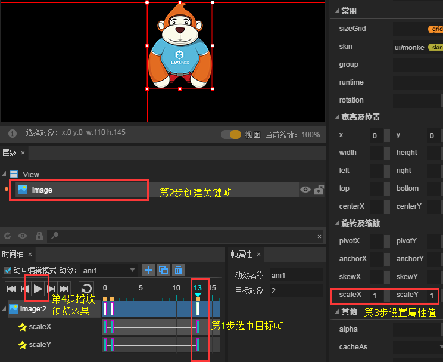

# 动画模板(EffectAnimation)

### 1、什么是动画模板

动画模板是基于时间轴的动画效果，通过预设动画效果，然后把效果附加给某个组件。使得组件无需编码，却轻松实现与编码相同的动画效果。动画模板不能独立显示，仅可作为动效模板让UI页面中的组件获得动画效果。


### 2、在IDE中制作与使用动画模板

#### 2.1 创建EffectAnimation模板文件

在项目管理器中，鼠标`右键` --> 选择`新建` --> `动画`。在新建动画的面板中，动画类型选为`EffectAnimation`。由于我们要创建一个缩放效果的动画模板，动画名称我们命名为`scale`，如图1所示。

 <br />（图1）

点击`确定`后，会创建一个`scale.efc`的动画模板文件，双击该文件，我们看到动画编辑场景如图2所示。

 <br />（图2）


#### 2.2 创建动画模板

**目标：创建一个先缩小后恢复的动画效果模板。**

**步骤一**：我们从资源管理器中，将一个Image组件拖拽到`scale.efc`的场景编辑器中。如图3所示。

 <br /> (图3)


**步骤二**：勾选`动画编辑模式`，然后选中`第1帧`和`Image`组件，在组件上右键`创建关键帧`。 如图4所示。

 <br />(图4)


**步骤三**：选中`第1帧`，在属性管理器中，将旋转与缩放的`scaleX`与`scaleY`属性值都设为`0.2`。如图5所示。设置属性值之后，Image时间轴中会自动增加缩放属性scaleX与scaleY。（*由于我们这个动画模板不需要位移效果，之前创建关键帧自动生成的属性X直接删掉就可以了。*）

 <br />（图5）

**Tips:** 需要注意的是，动画模板与时间轴动画有一个重要的区别，那就是时间轴动画是当前动画效果的首帧决定动画效果的目标。而动画模板是当前动画效果的尾帧决定动画效果的目标。所以当我们想先缩小至0.2大小时。不能在第0帧设置缩放效果目标，必须在第1帧设置缩放目标（`scaleX`与`scaleY`值为0.2）。


**步骤四：**在第13帧创建关键帧（参照图4），设置`scaleX`与`scaleY`属性值为`1`，点击播放即可预览动画效果。

 <br /> (图6)


#### 2.3 在IDE中使用动画模板

**步骤一**：创建一个UI页面（本例为`EffectAnimation.ui`），然后拖拽一个Button组件到场景编辑器中，如图7所示，（*注意：本例中的button组件在ui目录下*）。

 <br /> （图7）


**步骤二**：将制作的缩放动画模板（scale.efc）拖拽到Button组件下，如动画8所示。

<br />(图8) 


**步骤三**：为实现居中缩放效果，以及让按钮看的更清楚一些。我们选中Button组件，在属性面板，设置轴心点属性`anchorX`与`anchorY`的值为`0.5`，然后，设置Button宽高与轴心点的xy轴位置，如图9所示。

<br> (图9)

*Tips：轴心点效果需要在UI中的组件属性中设置，在动画模板中设置轴心点效果对组件无效。*


**步骤四**：选中Button组件下的动画模板，在右侧属性面板中，设置触发播放的事件属性`playEvent`的值为`mousedown`。如图10所示，然后按F12导出UI页面，即可在项目中使用了。

 <br />(图10)


### 3、在项目中展示动画模板的效果

创建一个`Main.as`的入口类，并设置为默认应用程序。编写代码如下：


```java
package
{
	import laya.net.Loader;
	import laya.utils.Handler;
	import ui.EffectAnimationDemoUI;

	
	public class Main
	{
		public function Main()
		{
			//初始化舞台
			Laya.init(1334,750);
			//设置舞台背景色
			Laya.stage.bgColor = "#ffffff"    
			
			//加载图集资源，加载成功后添加到舞台
			Laya.loader.load([{url:"./res/atlas/ui.atlas",type:Loader.ATLAS}],Handler.create(this,onLoaded));
			
		}
		
		private function onLoaded():void
		{	
			//实例导出的UI类
			var efc:EffectAnimationDemoUI = new EffectAnimationDemoUI();
			
			//添加到舞台
			Laya.stage.addChild(efc);
		}
	}
}
```

运行后，按钮被按下时，动画效果如动图11所示：

 <br /> (动图11)


### 4、多个动画模板创建复杂动效

刚刚实现了按钮按下后，从小变大的动画效果，我们可以再制作一个动画模板，实现弹起时的缩小效果。从而实现按下和弹起快速切换状态的连续动画效果演示。

首先，我们再创建一个动画模板文件，这个动画模板由于是直接缩小。仅需两个关键帧即可，如图12所示，我们在`第12帧`，将缩放属性`scaleX`与`scaleY`的值设置为`0.2`。

 <br /> (图12)


然后，在UI页面中，将动画模板拖到Button组件下，并设置`playEvent`属性为`mouseup`。如图13所示。

 <br /> (图13)


最后保存后，按F12导出UI，然后在项目中再次编译刚才的代码。运行效果如动图14所示，连续的动画效果非常平滑。

 <br /> （图14）

 

至此，EffectAnimation基础教程已结束，开发者可以用LayaAirIDE的动画模板功能，快捷的开发各种组件的动画效果。


