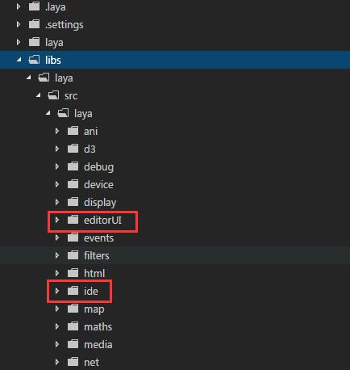
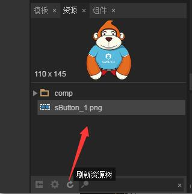
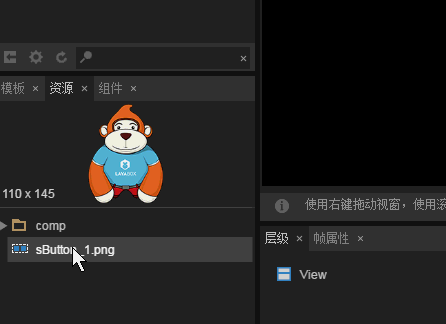
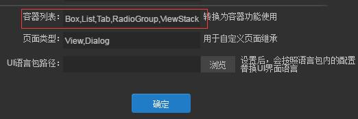

# 自定义组件的制作与使用

　　LayaAir IDE提供多种常用UI组件以满足基本的需求，然而实际开发中开发者往往需要自定义的UI组件以满足其特殊需求。LayaAir提供自定义组件的接口，开发者可以根据需要修改或添加组件，新的组件能够被LayaAirIDE识别、使用。本篇以缩放按钮为例，介绍如何添加一个新的组件，以及如何在LayaAirIDE中使用这个组件。

### 	**1、 了解组件结构与规则**   
#### 					**1.1 组件目录结构**

​	组件目录位于LayaAirIDE根目录下的“\resources\app\out\vs\layaEditor\renders”目录内。如图1所示：
​	 <br />
​	（图1）

​	**组件目录结构介绍：**

​		“custom”：该目录用于存放自定义组件的js与xml文件；

​		“laya.editorUI.js”：LayaAirIDE自带组件的功能实现代码；

​		“laya.editorUI.xml”：LayaAirIDE自带组件的配置信息；

#### 				**1.2 组件的xml配置信息说明**

​	一个完整的组件由js与xml两部分构成，其中js是组件的功能实现部分，xml是在IDE内的组件显示与调用部分，包括了组件图片资源名（区分大小写）、属性面板的选项与默认值等。

​	下面以laya.editorUI.xml中的TextArea组件为例进行介绍：

```xml
	<TextArea className="laya.editorUI.TextArea" inherit="TextInput" defaultValue="text='TextArea'" skinLabel="skin" resName="area" icon="TextArea" groups="公用,常用,宽高及位置,旋转及缩放" drag="3">
		<prop name="vScrollBarSkin" tips="垂直滚动条皮肤" type="string" default="" accept="res" group="常用" />
		<prop name="hScrollBarSkin" tips="水平滚动条皮肤" type="string" default="" accept="res" group="常用" />
	</TextArea>
```

​	

​	**组件XML说明：**

​		"TextArea": TextArea标记作为组件的开始和结束。TextArea的命名可以与类别不同，但是要易于理解记忆，用于IDE中的组件名显示；

​		"classsName": 该组件的完整的类路径，如：laya.editorUI.TextArea；

​		"inherit": 继承的父类；

​		"defaultValue": 组件属性的默认值；

​		"skinLabel": 用于属性面板中的skin相关设置。skinLabel的值对应prop的name字段及相关设置，如果prop中没有，则不进行设置，TextArea组件内就没有这个设置；

​		"resName": 组件资源前缀（区分大小写），具有该前缀的资源才被识别为该组件；TextArea的配置area为TextArea的缩写模式，在IDE的组件面板会显示TextArea。关于组件命名方面，可以查看IDE组件基础的“组件资源命名规则”文档；

​		"icon":  组件在IDE中显示的图标名（区分大小写），图标的目录位于LayaAirIDE根目录下的"resources\app\out\vs\layaEditor\laya\icons\components"目录内，这里我们可以创建新的icon图标，也可以多个组件共同使用一个图标。如: TextArea将对应component目录内的TextArea.png

​		"groups": 用于属性面板的分组显示，以逗号分隔；

​		"drag": 拉伸取值参数：1：有两个点，只可以横向拉伸，如hscroll组件；2：有两个点，只可以竖向拉伸，如vscroll组件；3：有八个点，可以横向、竖向、放大、缩小拉伸；

​		"prop": prop内是属性面板中属性的设置，每一个prop标记对应一个组件属性；

​		"name": 属性的名字，会显示在属性面板中；

​		"tips": 鼠标停留在属性名上显示的tips提示信息；

​		"type": 输入框内的属性值类型；

​		"default": 该属性的默认值；

​		"accept": 该属性接收res与files两个值。res代表该属性栏可以拖入单个资源；files代表该属性栏可以拖入多个资源；

​		"group": 该属性所在的分组；对应groups中的分组，不存在的归属于“其他”分组；

### 2、导入LayaAirIDE组件库   
#### 			2.1  下载LayaAirIDE组件库（本篇为AS版）

​	下载地址： [https://github.com/layabox/layaair-ide-ui]( https://github.com/layabox/layaair-ide-ui)

#### 2.2  创建项目并导入到项目的目录内

​	先采用LayaAirIDE创建一个AS3项目（创建项目请查看相关教程，本篇不再详解）。然后将下载的zip包解压，把editorUI和ide目录放在项目根目录下的"libs/laya/src/laya"目录下。如图2所示：

​	

​	(图2)

### 3、制作一个自定义组件   
#### 			3.1  创建一个组件类

​	   先创建一个组件目录(包)"component"，方便未来其它组件的分类，然后在component目录下创建一个缩放按钮类ScaleButton.as，如图3所示：

​	

​	（图3）

​	创建完成后，我们开始编写缩放组件的代码如下：

```javascript
package component
{
	import laya.editorUI.Button;
	import laya.events.Event;
	import laya.utils.Tween;
	
  	//继承button组件
	public class ScaleButton extends Button
	{
	
		//缩放时间100毫秒
		public var scaleTime:int = 100;
		public function ScaleButton(skin:String=null,label:String="")
		{
			//调用父类的构造函数
			super(skin,label);
			
			/* 设置按钮为单态按钮
			** 取值：
			** 1：单态。图片不做切割，按钮的皮肤状态只有一种。
			** 2：两态。图片将以竖直方向被等比切割为2部分，从上向下，依次为弹起状态皮肤、按下和经过及选中状态皮肤。
			** 3：三态。图片将以竖直方向被等比切割为2部分，从上向下，依次为弹起状态皮肤、经过状态皮肤、按下和选中状态皮肤
			*/
			this.stateNum = 1;
			
			//添加鼠标按下事件侦听。按时时缩小按钮。
			this.on(Event.MOUSE_DOWN,this,scaleSmal);
			//添加鼠标抬起事件侦听。抬起时还原按钮。
			this.on(Event.MOUSE_UP,this, scaleBig);
			//添加鼠标离开事件侦听。离开时还原按钮。
			this.on(Event.MOUSE_UP,this, scaleBig);
			
		}
		
		private function scaleBig():void
		{
			//变大还原的缓动效果
			Tween.to(this, {scaleX:1,scaleY:1},scaleTime);
		}
		
		private function scaleSmal():void
		{
			//缩小至0.8的缓动效果
			Tween.to(this,{scaleX:0.8,scaleY:0.8},scaleTime);
		}
	}
}
```

#### 3.2 用分包功能编译组件JS

​	AS3编译JS默认是整包编译的，也就是说把所有的逻辑代码与引擎库全都编译到一个JS文件里，对于自定义组件来说，这个JS需要复制到IDE的组件目录下，而大量的代码都是用不上的。所以，我们需要进行分包编译。（详细的分包教程请查看相关的官网文档，本篇仅对需要用到的步骤说明）
​	在项目的根目录创建一个分包配置文件module.def，打开该文件，并在文件内按分包规则编写编译生成的JS文件名“ScaleButton”和需要分包的编译路径“src/component”。参照如下：

```
module:"ScaleButton"  	//设置组件编译后的分包JS文件名
path:"src/component"      //设置需要分包的组件所在目录路径
```

​	分包规则编写完成并保存后，我们编译刚刚编写的ScaleButton.as（在本篇为了方便演示，我们直接将ScaleButton.as文件设置为文档类），可以看到js目录下有一个ScaleButton.js，如图4所示，打开这个js我们可以看到，对应了我们刚编写的ScaleButton.as代码，这个js就是我们自定义组件的JS功能实现部分，而没有包含引擎库等其它代码。

​	

​	（图4）

#### 3.3 编写组件的xml配置文件
​	按照上文中讲到的xml配置说明，我们完成这个缩放按钮的xml配置，那这个自定义组件就算是制作完成了。缩放按钮的xml配置信息编写如下：

```xml
<?xml version="1.0" encoding="utf-8" ?>
<uiComp>
	<ScaleButton className="component.ScaleButton" inherit="Button" skinLabel="skin" 
	defaultValue="label=''" resName="sButton" icon="Box" groups="公用, 常用, 宽高及位置" drag="3">
		<prop name="scaleTime" tips="缩放使用的时间" type="number" default="100" group="常用" />
	</ScaleButton>
</uiComp>
```

​	Tips：xml的配置信息内容解释参照上文的组件xml说明。

### 4、添加与使用自定义组件

#### 	4.1 将组件添加到IDE的自定义组件目录

​	xml配置文件编写完成后，直接保存在自定义组件的目录（LayaAirIDE根目录下的“resources\app\out\vs\layaEditor\renders\custom”内），组件xml的命名需要与组件js保持一致，这里我们命名为ScaleButton.xml。然后我们将分包编译生成的ScaleButton.js（"项目根目录/bin/h5/js"目录下，参照图4）复制到自定义组件的目录。如图5所示：

​	

​	（图5）

#### 4.2 在IDE组件面板中显示

​	打开IDE组件目录（LayaAirIDE根目录\resources\app\out\vs\layaEditor\laya\basics）新建一个自定义组件存放目录Custom，用于存放自义定的组件，如图6所示。

​	

​	（图6）

​	然后在Custom目录内放一个以sButton命名的png 图标（建议尺寸为16*16），如图7所示，完成该步骤即可在IDE的组件面板中找到我们自己创建的缩放按钮组件，如图8所示。

​	

​	（图7）图标命名对应组件xml中resName属性的值

​	

​	（图8）IDE的组件名对应组件xml的标记名

​	**Tips:** 额外提醒的是，组件的icon图标并非是"LayaAirIDE根目录\resources\app\out\vs\layaEditor\laya\basics\Custom"目录中的sButton.png。icon图标位于LayaAirIDE根目录下的"resources\app\out\vs\layaEditor\laya\icons\components"目录内，对应xml中icon属性的值，上文中的xml说明已进行介绍。如果创建自己的icon图标，参照components目录内的icon尺寸标识制作，放到components目录内，然后在xml中设置对应的文件名即可。

#### 4.3 在IDE资源面板中显示

​	资源面板中，默认在comp文件中放置了常用UI组件的skin资源，通过组件命名规则方便的将skin资源识别为组件使用（资源必须存放于"项目根目录\laya\assets"下才会被识别为组件）。与组件面板的组件属性skin值为空不同，资源面板中的组件属性skin默认值是"\laya\assets"目录下的相对路径。
​	为了方便项目使用带skin资源的组件，我们继续介绍如何在资源面板中显示组件。首先我们先准备一张skin资源，由于上文示例的自定义组件是缩放按钮，我们直接复制任意一张图片即可体验缩放按钮组件的缩放效果。图片资源复制到"项目根目录\laya\assets"目录下即可，图片资源命名为xml中resName的属性值sButton或以sButton为前缀，如图9所示。

​	

​	（图9）

​	资源复制完成后，我们再次打开LayaAirIDE的资源管理面板，点击刷新资源树按钮即可看到刚刚复制的sButton_1.png，点击该图片，我们可以看到图片的预览。说明我们带skin默认值的自定义组件成功的添加到项目的资源管理面板中，如图10所示。

​	

​	（图10）

​	Tips：资源面板中显示的组件仅用于当前项目，添加到组件面板中才是所有项目的通用组件。
​		

#### 4.4 使用自定义组件

​	在项目管理面板创建一个演示页面（该页仅用于组件的效果演示，不进行操作步骤的详细介绍），有两种方式使用我们自定义的缩放按钮组件。

​	4.4.1 从资源面板中使用

​	在资源管理面板中找到sButton为前缀的组件，直接拖拽到页面，点击可看到缩放效果，如图11。

​	

​	（图11）

​	4.4.2  从组件面板中使用

​	在组件面板中找到ScaleButton组件，直接拖拽到页面，点击可看到缩放效果，如图12

​	

​	（图12）组件面板中不含图片资源，需要通过属性skin设置

### 5、组件的调试

​	根据上面的内容，我们已经完成了LayaAirIDE的组件制作与使用全部流程。但是，在正式的自定义组件的过程中，有一步非常重要的环节，为了简化流程，尽快实现自定义组件的目标而跳过了，这一步就是组件的调试。

​	跟着文档操作一帆风顺，缺少调试环节固然没有什么问题，然而在实际开发过程中，大多数人无法保障编码无任何错误。而将带着错误的组件添加到IDE，就不会像本篇文档中那么顺利了，并且在IDE里组件很难调试。因此，在这一小节里，我们补充上遗失的步骤，编写完组件后，先进行调试，然后再分包编译。

#### 	**5.1 复制图片到项目的资源路径**

​	复制一张图片到项目的资源路径"项目根目录/h5/res/img"目录下，如图13。

​	

​	（图13）

#### 				5.2 修改组件的类引用 

​	打开上文编写的缩放按钮代码ScaleButton.as，将原来的组件库引入“import laya.editorUI.Button;”改为引擎的UI库引入“import laya.ui.Button;”，其它保持不变。因为 laya.editorUI是用于LayaAirIDE的，而项目运行必须引用引擎库laya.ui。如图14所示：

​	

​	（图14）

#### 	5.3 创建一个入口类

​	在“项目根目录/src”下创建一个入口类Main.as，编码如下：

```javascript
package
{
	import component.ScaleButton;	
	import laya.utils.Handler;
	
	public class Main
	{
		public function Main()
		{
			//初始化舞台
			Laya.init(1136,640);
					
			//加载图片资源，回调
			Laya.loader.load("res/img/monkey1.png",Handler.create(this, onLoaded));
			
		}
		
		private function onLoaded():void
		{
			var scaleButton:ScaleButton = new ScaleButton();
			//组件skin的资源路径
			scaleButton.skin = "res/img/monkey1.png";
			//添加到舞台
			Laya.stage.addChild(scaleButton);
		}
	}
}
```

​	将入口类设置为文档类后编译运行，在浏览器中点击能够实现缩放效果时，如图15所示。说明这是有效的自定义组件，可以放心的添加到IDE中使用了。（注意：正常的步骤是调试在分包之前，而本篇先介绍的分包操作，如果直接调试会出现报错，所以在编译运行之前，需要先将分包配置文件module.def改名或删除）

​	

​	（图15）

​	Tips：调试成功，准备发布组件时，不要忘记把分包配置文件module.def恢复。另外，发布分包的JS代码时，调试时import的laya.ui也要恢复为 laya.editor。

### 6、组件的注册

​	组件注册是把自定义的组件和某个类名关联起来，显示的时候按照注册映射进行实例。

​	例如：

```java
View.regComponent("ScaleButton",component.ScaleButton);//注册组件
```


### 7、其它说明

​	如果自定义的组件是容器类组件，如果需要在项目中使用，则需要在LayaAir IDE 项目的编辑器模式下，按F9打开项目设置面板，在“容器列表”中添加自定义的容器组件类名（以逗号间隔），如图16所示。

​	

​	（图16）

​	如果自定义的组件是页面类组件，如果需要在项目中使用，则需要在此LayaAir IDE 项目的编辑器模式下，打开项目设置面板，在“页面列表”中添加自定义的页面组件类名（以逗号间隔），如图17所示。

​	

​	（图17）

本篇至此结束，如有疑问请到社区提出：http://ask.layabox.com

