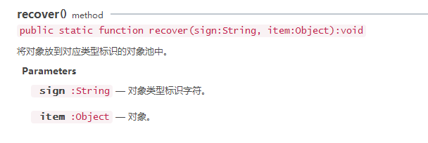

# 内存优化方式

### 1、通过对象池优化内存

对象池优化是游戏开发中非常重要的优化方式，也是影响游戏性能的重要因素之一。

在游戏中有许多对象在不停的创建与移除，比如角色攻击子弹、特效的创建与移除，NPC的被消灭与刷新等，在创建过程中非常消耗性能，特别是数量多的情况下。

对象池技术能很好解决以上问题，在对象移除消失的时候回收到对象池，需要新对象的时候直接从对象池中取出使用。

优点是减少了实例化对象时的开销，且能让对象反复使用，减少了新内存分配与垃圾回收器运行的机会。

**注意**：对象移除时并不是立即从内存中抹去，只有认为内存不足时，才会使用垃圾回收机制清空，清空时很耗内存，很可能就会造成卡顿现象。**用了对象池后将减少程序的垃圾对象，有效的提高程序的运行速度和稳定性**。

#### 1.1 LayaAir引擎的对象池类

LayaAir引擎提供了对象池类[laya.utils.Pool](http://layaair.ldc.layabox.com/api/index.html?category=Core&class=laya.utils.Pool)，用于对象的存贮、重复使用。比较常用的是`对象池创建`方法`getItemByClass()`与`回收到对象池`方法`recover()`。 如图1-1、图1-2所示。

</br>

（图1）对象池创建方法

</br>

（图2）回收到对象池方法，将使用的对象放回对象池中。

#### 1.2 使用对象池优化的示例

以下代码演示每隔100帧使用对象池方法创建100个雪花，当雪花移动超出边界或缩放小于0时进行了移除舞台，并调用Pool.recover()法方，使指定的对象回收至对象池内。

##### 

```typescript
//初始化引擎
Laya.init(1136, 640, Laya.WebGL);
//等比缩放
Laya.stage.scaleMode = Laya.Stage.SCALE_SHOWALL;
//背景颜色
Laya.stage.bgColor = "#232628";
//帧循环
Laya.timer.frameLoop(1, this, onFrame);
this.createTime = 0;
function onFrame() {
    //如果创建对象时间为100帧间隔后
    if (this.createTime >= 100) {
        //每200帧间隔创建30个雪花
        for (var i = 0; i < 100; i++) {

            //img:Image=new Image(); //不使用对象池的写法
            //通过对象池创建图片，如对象池中无相应的对象，则根据Image类型执行new Image()创建
            var img = Laya.Pool.getItemByClass("img", Laya.Image);
            //通过锚点设置轴心点
            img.anchorX = img.anchorY = 0.5;
            //图片的资源
            img.skin = "res/snow0.png"
            //在舞台上方随机位置创建
            img.x = Math.random() * 1136;
            img.y = Math.random() * -150;
            //对象池中的图片被缩放了，需重新设置其缩放属性。
            //如果对象中还有其他属性被改变了，
            img.scaleX = img.scaleY = 1;
            //加载到舞台
            Laya.stage.addChild(img);
            //到100帧后创建完对象后时间归0
            this.createTime = 0;
        }
    } else {
        //更新创建时间
        this.createTime++;
    }
    //检测每个舞台中的图片对象，并进行位置更新。
    for (var j = 0; j < Laya.stage.numChildren; j++) {
        //获取舞台中的图片对象
        var img1 = Laya.stage.getChildAt(j);
        //位置更新
        img1.y++;
        //缩放更新
        img1.scaleX -= 0.001;
        img1.scaleY -= 0.001;
        //图片旋转
        img1.rotation++;
        //超出边界或缩放小于0
        if (img1.y > 640 + 20 || img1.scaleX <= 0) {
            //从舞台中移除
            Laya.stage.removeChild(img1);
            //img1.destroy(); //不使用对象池的编写方式,直接用destroy清空             
            //回收到对象池
            Laya.Pool.recover("img", img1);
        }
    }
}
```

### 2、使用Handler.create

在开发过程中，会经常使用Handler来完成异步回调。Laya.Handler.create使用了内置对象池管理，因此在使用Handler对象时可使用Laya.Handler.create来创建回调处理器。以下代码使用Laya.Handler.create创建资源加载的回调处理器：

1. `Laya.loader.load(urls, Laya.Handler.create(this, onAssetLoaded));`

我们在游戏中经常根据游戏逻辑和阶段分批加载资源，第一批资源加载完成，触发Laya.Handler.create()创建的complete事件回调方法后被对象池回收；当游戏进行到某个时候，需要加载第二批资源时，Laya.Handler.create()会首先在对象池中检索相同的回调方法处理器，如果找到就直接使用对象池中方法，从而节省了内存开销。

#### 使用Handler.create需要注意的地方

</br>

在一些特殊情况我们需要注意`Laya.Hanlder.create()`的使用方式，我们仔细看图3中的`Laya.Hanlder.create()`方法说明。

从对象池内创建一个Handler，默认会执行一次并立即回收。

也就是说，如果需要多次触发这个回调方法，那么就需要对`Laya.Hanlder.create()`方法中的`once`参数设置为`false`。或者用`new Laya.Handler()`的方式创建。

例如，我们需要在游戏开始界面中加载资源，需要对加载资源的进度进行显示，下面的编码为就是错误的。

1. `Laya.loader.load(urls, Laya.Handler.create(this, onAssetLoaded), Laya.Handler.create(this, onLoading));`

在上面的代码中，使用`Laya.Handler.create(this,onLoading)`返回的回调方法，是要处理progress加载进度事件，由于回调执行一次之后就被对象池回收了，所以，progress加载进度事件只触发了一次就结束了，但实际上资源并未加载完成，还处于加载中，所以这样的编码达不到我们的预期需求。

正确的写法是：

```
Laya.loader.load(urls, Laya.Handler.create(this,onAssetLoaded), Laya.Handler.create(this,onLoading, null, false));
```

或者是：

1. `Laya.loader.load(urls, Laya.Handler.create(this,onAssetLoaded), new Laya.Handler(this, onLoading));`

**Tips**：这里不能混淆的是，`Handler()`是没有使用对象池的方式，`Handler.create()`默认使用了对象池。关于Handler不能混淆。

**Handler() API参考如图4所示**：

</br>

（图4）

### 3、释放内存

JavaScript运行时无法启动垃圾回收器。要确保一个对象能够被回收，需要删除对该对象的所有引用。Sprite提供的`destory()`方法会帮助设置内部引用为null。

例如，以下代码确保对象能够被作为垃圾回收：

1. `//创建一个Sprite实例`
2. `var sp = new Laya.Sprite();`
3. `//将sp内部引用设置为null`
4. `sp.destroy();`

当对象设置为null，不会立即将其从内存中删除。只有系统认为内存足够低时，垃圾回收器才会运行。内存分配（而不是对象删除）会触发垃圾回收。

垃圾回收期间可能占用大量CPU并影响性能。通过重用对象，尝试限制使用垃圾回收。此外，尽可能将引用设置为null，以便垃圾回收器用较少时间来查找对象。有时（比如两个对象相互引用），无法同时设置两个引用为null，垃圾回收器将扫描无法被访问到的对象，并将其清除，这会比引用计数更消耗性能。

### 4、资源卸载

游戏运行时总会加载许多资源，这些资源在使用完成后应及时卸载，否则一直残留在内存中。

下例演示加载资源后对比资源卸载前和卸载后的资源状态：

```javascript
var assets = [
    { assets: "res/apes/monkey0.png", type: Laya.Loader.IMAGE },
    { assets: "res/apes/monkey1.png", type: Laya.Loader.IMAGE },
    { assets: "res/apes/monkey2.png", type: Laya.Loader.IMAGE },
    { assets: "res/apes/monkey3.png", type: Laya.Loader.IMAGE },
];
Laya.loader.load(assets, Laya.Handler.create(this, onAssetsLoaded));
function onAssetsLoaded() {
    for (var i = 0, len = assets.length; i < len; ++i) {
        var asset = assets[i];
        //查看log，清理前资源一直在内存中
        console.log(Laya.loader.getRes(asset));
        //调用清理方法
        Laya.loader.clearRes(asset);
        //查看log，清理后，资源被卸载
        console.log(Laya.loader.getRes(asset));
    }
}
```

### 5、关于滤镜、遮罩

尝试尽量减少使用滤镜效果。将滤镜（BlurFilter和GlowFilter）应用于显示对象时，运行时将在内存中创建两张位图。其中每个位图的大小与显示对象相同。将第一个位图创建为显示对象的栅格化版本，然后用于生成应用滤镜的另一个位图：

</br>

 （图5）

应用滤镜时内存中的两个位图

当修改滤镜的某个属性或者显示对象时，内存中的两个位图都将更新以创建生成的位图，这两个位图可能会占用大量内存。此外，此过程涉及CPU计算，动态更新时将会降低性能。

ColorFiter在Canvas渲染下需要计算每个像素点，而在WebGL下的GPU消耗可以忽略不计。

最佳的做法是，尽可能使用图像创作工具创建的位图来模拟滤镜。避免在运行时中创建动态位图，可以帮助减少CPU或GPU负载。特别是一张应用了滤镜并且不会在修改的图像。