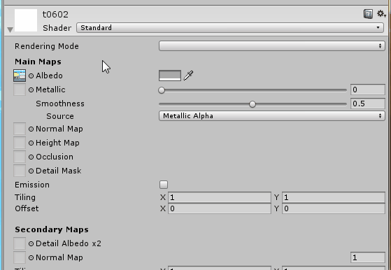
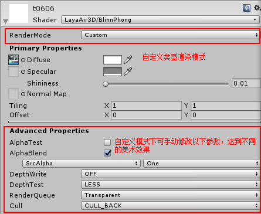

## LayaAir3D之BlinnPhong材质

### BlinnPhong材质概述

在之前的LayaAir 3D引擎版本中（1.7.12版本前），模型材质只支持传统的StandardMaterial标准材质，在Unity中无论模型材质用哪种类型的Shader，插件导出的都为标准材质（粒子材质除外）。

因为Unity中标准和其他材质与LayaAir标准材质有所差异，因此开发者使用导出的3D资源时，我们会发现美术效果与Unity中会有不同，需要在代码中修改各种材质属性参数或调节灯光后才能达到所需效果，为开发者们带来了不便。

为了使LayaAir引擎中运行效果与Unity中调整的美术效果一致，LayaAir官方在Unity导出插件中和引擎中增加BlinnPhongMaterial材质，可以让开发者们所见即所得，减少代码修改美术效果的时间，提高工作效率。因此建议以后的开发中尽量都使用该材质。


### 创建BlinnPhong材质

代码创建BlinnPhong材质与标准材质一致，可以直接创建它的实例，或者通过BlinnPhongMaterial.load()方法加载相关材质资源创建，并赋给模型使用。它的光色属性修改与赋值方式也与标准材质相同，只是材质类型有所不同。

```java
//创建盒子模型
var box=new Laya.MeshSprite3D(new Laya.BoxMesh());
scene.addChild(box);

//创建BlinnPhong材质
var mat=new Laya.BlinnPhongMaterial();
mat.albedoColor=new Laya.Vector4(0.5,0.3,0.3,1);
mat.albedoTexture=Laya.Texture2D.load("res/layabox.png");

//加载材质资源方法创建
//var mat=Laya.BlinnPhongMaterial.load("truck/Assets/Materials/t0200.lmat");

//为模型赋材质
box.meshRender.material=mat;
```


### 在Unity中使用BlinnPhong材质

LayaAir引擎从1.7.12版、Untiy导出插件从1.7.0版开始支持BlinnPhong材质的创建，因此开发者们想体验新功能需要下载新的引擎和插件。在项目中安装1.7.0插件步骤与之前版本安装插件方法完全一致。

#### 场景一键转换成BlinnPhong材质

安装好新插件后，在Untiy  LayaAir3D菜单中增加了一键将场景材质转化成BlinnPhong材质功能（图1），点击菜单LayaAir Tool--------> Switch Shader to LayaBlinnPhong选项后，可以发现资源界面中的模型会变成紫色，场景中的效果也有所变化，说明材质类型修改成功。

<br>（图1）

鼠标选择场景中的任意模型，我们可以看到在右侧Inspector面板中出现了新的材质Shader类型（图2）。材质属性与Unity中Standard标准材质有所不同，简化了很多，去掉了LayaAir不支持的一些属性。我们可以通过修改这些属性来改变模型的显示。

<br>（图2）


#### 手动修改为BlinnPhong材质

一般情况我们推荐使用菜单中的一键转化成BlinnPhong材质，这样场景中的所有材质都会被修改，不会发生某个材质因找不到或忽略，导致未修改的情况发生。

当然，在创建新材质的时候，默认生成的是标准材质，这时需要开发者手动修改材质的Shader类型为BlinnPhong。当我们安装好插件后，材质面板的Shader类型中就会出现LayaAir3D选项供我们进行修改使用。（图3）

<br>（图3）


### BlinnPhong材质渲染模式

材质的渲染模式RenderMode主要是用于材质的效果表现，如不同的透明半透明效果等，在StandardMaterial中共有十多种类型可选，但比较复杂，还需要用代码修改，很不方便。

导出插件提供了BlinnPhong材质修改界面，可直接修改渲染模式，并且它在BlinnPhong材质中进行了减化，综合总结了常用的几种类型。通过它的修改可以让开发者们轻松调节材质效果。

选择不同的类型，在BlinnPhong材质面板中的Advanced Properties选项也会有所不同。

类型说明如下：

**Opaque  材质不透明**。无任何透明效果，即使贴图中有半透明，模型也不会发生半透明效果。

**Cutout   材质透明裁剪**。 根据贴图中透明像素的alpha值进行透明裁剪，透明alpha值也可以在Utniy中根据情况调整，小于一定的alpha值部分模型透明（图4）。

Tips：此种透明，边缘有像素锯齿，但性能较高，如想去除锯齿效果，请选择Transparent类型，性能稍低。

<br>（图4）

**Transparent  材质半透明** 。根据贴图中的像素alpha值进行半透明渲染，透明效果与像素的alpha透明度效果一致，去锯齿效果较好。

**Addtive   材质透明加色混合** 。 主要用于一些透明并颜色亮度较高的材质，它会根据贴图像素的亮度进行加色混合，模型正面与背面贴图颜色、相重叠的模型的贴图颜色会相互叠加，形成高亮半透明效果（图5）。

<br>（图5）


**Custom 材质自定义效果** 。 上述四种渲染模式基本包括了游戏开发中的大部分效果，如果还无法满足开发者们的美术需求效果，那么还可以进行Custom自定义的渲染模式设置。

在上述四种类型模式中，Advanced Properties选项基本都是固定的设置，无法修改。而在Custom自定义中，开发者们可以手动修改它的参数值，效果更丰富，在反复设置修改中达到开发者们所需要的美术效果。

<br>（图6）


### BlinnPhong材质光色贴图属性

BlinnPhong材质光色贴图属性基本与标准材质基本一致，在Unity中材质面板可调节以下属性：

**diffuse漫反射颜色与贴图** 。

**specular高光颜色与贴图。**增加了高光范围的调节滑杆，即使不使用高光贴图也可以进行高光范围的调节。

**normal法线贴图。**

以上的光色贴图在Untiy中设置好后，可以直接导出加载，或在导出插件中按LayaAir Run按钮模拟运行。可以发现，浏览器中美术效果与Unity中摄像机视图效果一致。

那么BlinnPhong材质支持反射贴图与反射颜色吗？当然能，它们实现方式与StandardMaterial一致，需用代码进行修改，代码如下：

```java
//创建盒子模型
var box=new Laya.MeshSprite3D(new Laya.BoxMesh());
scene.addChild(box);
//创建BlinnPhong材质
var mat=new Laya.BlinnPhongMaterial();
//增加反射贴图（与StandardMaterial一致）
mat.reflectTexture = Laya.TextureCube.load("skyBox/skyCube.ltc");
mat.reflectColor=new Laya.Vector3(1,1,1);
//为模型赋材质
box.meshRender.material=mat;
```
