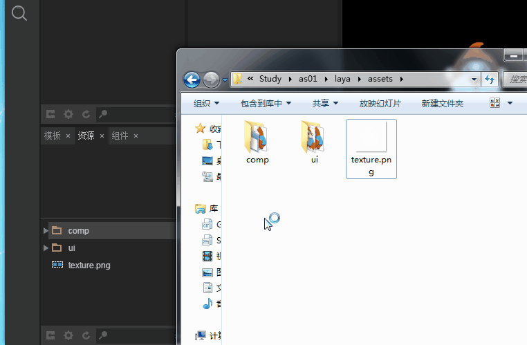
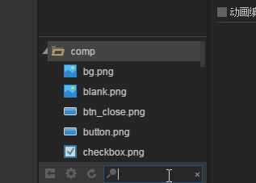
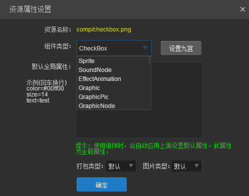
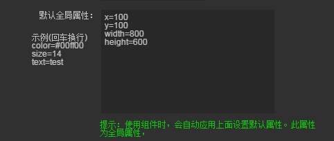
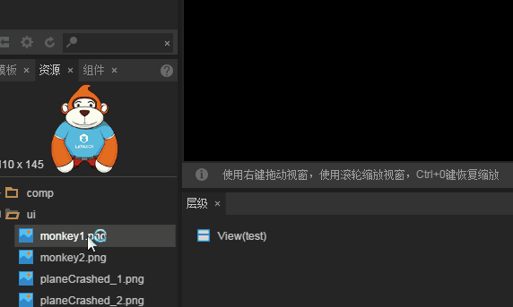
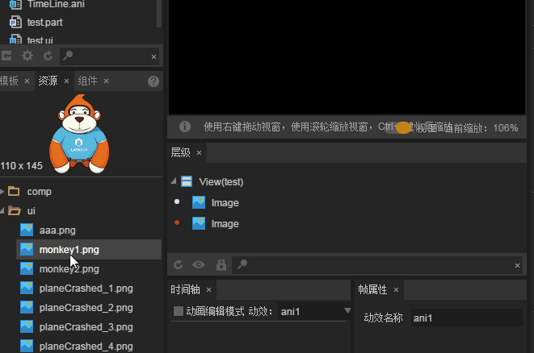
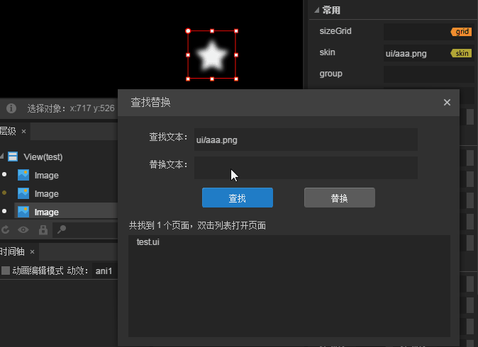
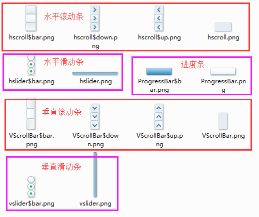
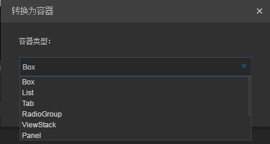
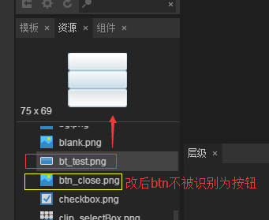

# 资源管理器介绍

资源管理器是我们用来访问和管理项目资源的工作区域。在开始工作时，添加资源是必须的步骤。本篇将会介绍资源管理器的功能使用以及资源命名规则。 

## 1、界面介绍

​        资源管理器将项目资源文件夹中的内容以树状结构展示出来，如图1所示， 下面我们介绍各个界面元素。

 （图1）

​        `资源预览界面`：资源列表中选中的资源会直接在`资源预览界面`显示出来。

​        `资源列表`：在`项目根目录/laya/assets/`目录下的资源都会在`资源列表`中显示。选中目录或目录下的资源，右键`打开所在目录`，会直接打开操作系统中的目录。

​       `常用功能按钮`：在资源管理器的最下面是常用的功能按钮，包括打开目录、设置默认属性、刷新资源列表、关键字过滤。

## 2、功能介绍

### 2.1 打开所在目录

资源管理器中的所有资源，即可以在IDE中管理，也可以直接在系统中直接操作管理。因此，当`选中`目录或资源时，`右键菜单`里点击`打开所在目录`或直接点击打开所在目录的`功能按钮`直接打开。操作如图2所示。

   (图2)

### 2.2 创建、删除、刷新

#### 创建资源和目录

当打开所在目录后，我们可以方便创建资源和目录。比如将所需的资源或目录直接粘贴到资源管理器根目录中（*项目根目录/laya/assets/*），按F5刷新后，资源就可以在IDE里使用了。

#### 删除

当删除目录或资源的时候，有两种方式。第一种是IDE里选中要删除的资源或目录，右键菜单里点击删除选项或者直接按Delete键删除。第二种是打开所在目录，在系统目录内，直接删除。两者的区别是IDE里删除会自动刷新，系统目录里删除需要在IDE里点击刷新按钮或快捷键F5刷新。

#### 刷新

刷新是资源管理器中的常见操作。点击资源管理器底部的`刷新按钮`或者`快捷键F7`可以刷新资源管理器的资源列表，与系统列表保持一致。也可以按快捷键F5刷新资源管理器列表。

*Tips：F5快捷键不仅是刷新资源管理器，会同时也刷新项目管理器，如果修改的资源是UI项目中使用的，需要按F5快捷键。*

关于资源和目录的创建、删除与刷新操作可以参考动图3所示。

   (动图3)

### 2.3 过滤资源

当资源较多时，可以通过在资源管理器搜索框中输入文本关键字来过滤资源，方便快速找到资源。操作如动图4所示。

  (动图4)

### 2.4 设置默认属性

选中资源或目录，可以右键设置默认属性，或者直接点击资源管理器最底层的功能按钮，如图5所示。

  (图5)

点击`设置默认属性`后，会弹面资源属性设置面板，如图6所示。

   (图6)

**设置面板介绍**

`资源名称`：显示资源管理器中的资源名称与路径。

`组件类型`：组件类型的下拉选项内是全部的组件类型（*全部组件类型可查看文档《IDE组件详解》*），如果我们想改变IDE默认识别的组件类型，指定为其它组件类型时，可以在这里设置。

`设置九宫`：为资源设置九宫格属性，该功能的效果与属性设置器中的九宫格设置相同，具体操作参照属性设置器中的九宫格设置说明。

`默认全局属性`：该栏也是对应`属性设置器`中的属性设置，比如组件的属性width想设置为800，那么在该栏中设置“width=800”即可。如果要提前设置多个属性，直接换行设置多个属性值即可。如图7所示

   (图7)

**Tips：`设置九宫`与`默认全局属性`设置，都属于组件属性的预先设置。当同一个组件资源在多处使用，并需要配置相同的属性时，该设置可以减少很多的重复性操作。**

`打包类型`：`默认`会采用项目设置（F9）中的打包规则。除此之外，通过该处功能可以手动对资源设置为`打包`或`不打包`。当设置为非默认选项后，指定的打包类型优先级高于项目设置。

`图片类型`：当IDE中两张相邻的图片拼接完好，但是在浏览器运行时存在拼接空隙（通常为黑线）时，将图片类型设置为`Repeat`即可解决。

### 2.5 使用资源

选中资源后，按住鼠标拖拽至场景编辑器即可使用该资源组件，如动图8所示。

   (动图8)

### 2.6   查找引用与文本替换

#### 查找引用

选中资源组件后，`右键`点击`查找引用`，在查找替换面板内，点击`查找`可以找到当前选中组件被哪些项目页面所引用。操作如动图9所示。

   (动图9)

#### 替换文本

在`查找替换`面板内，点击`替换`，可以替换所有与`查找文本`中的值相同的`skin属性`内容。如动图10所示。

  (动图10)

### 2.7  一键替换场景编辑器中的选中组件

先选中`场景编辑器`中的组件，然后`右键`选中`资源管理器`内要替换的资源，点击右键菜单的`替换选中对象`，即可一键替换场景编辑器中的组件，如动图11所示。当已调整好位置，只想切换其它资源的时候，该功能比较实用。

   (动图11)

 *Tips：一键替换不仅可以替换相同类型的组件，也可以一键替换不同类型的组件。*

## 3、资源命名规则

资源管理器中的资源在场景编辑器中都会识别为组件使用，而识别组件类型的默认方式就是资源的命名前缀。比如命名为 btn_xxx 会被识别为按钮，命名为 tab_xxx 的会被识别为Tab组件。下面我们对于资源命名的详细规则进行介绍，开发者务必熟练记忆掌握。如果对组件并不了解的开发者，请先阅读《IDE组件详解》文档。

### 3.1 基础组件的命名规则

 下面列举LayaAirIDE基础组件默认的资源命名规则： 

| 基础组件名称      | 组件中文名称   | 资源前缀（全写，不区分大小写）     | 资源前缀(缩写，区分大小写) |
| ----------- | -------- | ------------------- | -------------- |
| Label       | 文本框      | label_              | --             |
| TextInput   | 输入框      | textinput_          | input_         |
| TextArea    | 带滚动条的文本域 | textarea_           | area_          |
| Button      | 按钮       | button_             | btn_           |
| CheckBox    | 多选框      | checkbox_           | check_         |
| Radio       | 单选框      | radio_              | radio_         |
| Tab         | 标签       | tab_                | --             |
| RadioGroup  | 单选框按钮组   | radiogroup_         | --             |
| VSlider     | 垂直滑动条    | vslider_            | --             |
| HSlider     | 水平滑动条    | hslider_            | --             |
| Clip        | 位图切片     | clip_               | --             |
| ProgressBar | 进度条      | progressbar_        | progress_      |
| ComboBox    | 下拉框      | combobox_           | combo_         |
| VScrollBar  | 垂直滚动条    | vscrollbar_         | vscroll_       |
| HScrollBar  | 水平滚动条    | hscrollbar_         | hscroll_       |
| Image       | 位图       | 不被识别为其它组件的都被视为Image | --             |

**Tips**: 资源可以直接用前缀名的全写或缩写，而不加下划线。比如`textinput.png`和`input.png`。但是如果还跟随其它字符必须加下划线，比如`inputAAA.png`不会被识别为输入框组件，`input_AAA.png`会识别为输入框（TextInput）组件。

### 3.2 特殊组件

IDE自带的特殊组件一共有五个，分别是垂直滑动条组件VSlider、水平滑动条组件HSlider、进度条组件ProgressBar、垂直滚动条组件VScrollBar、水平滚动条组件HScrollBar。

#### 特殊组件的构成

特殊组件并不是单张图片，而是由多张图片组成。主资源图片的命名规则遵守基础组件的命名规则，附加资源由两部分构成，这两部分用`$`符号相连，`$`之前是主资源的名称，`$`之后是关联状态的名称。

`bar`指的是`滑动\移动`状态。比如`ProgressBa$bar.png`，从命名上可以看出，他从属于默认状态为ProgressBar组件，当产生进度条（`bar`）时使用`ProgressBa$bar.png`资源。

`down`指的是`向下`状态。如果是横向滚动条，dow通常是向右的默认状态或点击时的状态。

`up`指的是`向上`状态。如果是横向滚动条，up通常是向左的默认状态或点击时的状态。

特殊组件的命名与构成，如想更直观的了解，可以详细对比图12中的资源命名。

  (图12)

**Tips**：*由于`资源管理器`中对于特殊组件的附加资源不会单独显示，列表中只会显示主资源组件。如果要对特殊组件资源进行操作，需要通过`打开所在目录`功能，在系统的文件目录中进行管理操作。*

### 3.3 容器组件

容器组件包括Box、List、Tab、RadioGroup、ViewStack、Panel、HBox、VBox、Tree、Sprite。除Tab外，通常不会在资源列表中出现，而是在`场景编辑器`中转换而来，当在`场景编辑器`内选中单个或多个组件时，通过快捷键`Ctrl + B`可以转换为容器，容器的各种类型可以在下拉列表中查看，如图13所示。

  (图13)

### 3.4 自定义组件识别的前缀

如果我们不想采用IDE默认的组件前缀，如何修改呢？修改`laya.editorUI.xml`文件对应的组件配置即可，所有的IDE自带组件相关信息都存储该文件中。

`laya.editorUI.xml`位于`LayaAirIDE根目录\resources\app\out\vs\layaEditor\renders\`目录下。

resName中即是组件的前缀缩写名称（组件的前缀全称不可修改），修改resName的值即可。比如我们将Button组件的识别前缀由`resName="btn"`改为resName="bt"。保存好，我们刷新IDE编辑器，发现原来以btn前缀命名的Button资源被识别为Image资源，而以bt前缀命名的资源则被识别为Button组件。如图14所示。

   (图14)

*Tips：在没有特殊需求的情况下，不建议修改默认前缀。*

### 3.5 可识别的资源类型（资源后缀）

 LayaAir IDE 识别的图像资源格式只有标准的png和jpg图像格式。请不要使用其它类型的图像资源或者是其它类型资源改名为png和jpg的图像资源。

