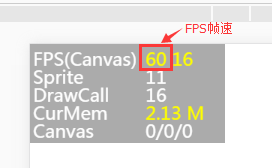
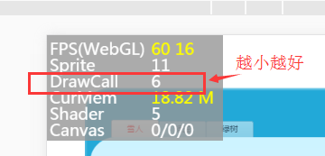

# 性能统计面板介绍     

　　LayaAir 引擎设计之初，就以性能为第一目标，在引擎内做了大量的性能优化。合理运用好引擎，可以让游戏等引擎产品达到原生APP的体验。如果开发者不能发挥好引擎的优势，那么游戏最终的性能体验或将无从谈起。因此，在制作游戏过程中，掌握游戏以及引擎的优化技巧还是非常有必要的。


> 要了解引擎的性能，首先要看懂性能统计面板，下面将针对性能统计面板进行详细介绍。


### 1、性能统计面板的调用

LayaAir引擎内置的性能统计面板可实时检测当前性能。调用统计面板因开发语言的不同，会有所不同。

TS语言直接在代码中输入 `Laya.Stat.show(0,0);` 即可调出性能统计面板。

示例Demo.ts编写代码如下：

```typescript
//初始化舞台
Laya.init(1136, 640);
//调用性能统计面板方法，(0,0)为面板位置坐标
Laya.Stat.show(0,0);
```

**Tips**:要注意大小写。


### 2、FPS相关的介绍

### 2.1  FPS概述

FPS是每秒传输帧数(Frames Per Second)的缩写。假设游戏的帧速为60FPS，表明游戏运行时每个帧的执行时间为1/60 秒。帧速值越高，视觉上感觉越流畅。

<br />	（图1）

当前PC与手机等设备的满帧是60帧，如图1所示，但某些游戏对画面的流畅度要求并不高，也可以采用引擎的帧速限制方法`Stage.FRAME_SLOW`，将FPS帧速限制为最高30帧。

由于实际运行环境是在浏览器中，所以性能还取决于JavaScript解释器的效率，因此，同一款游戏的FPS值在不同的浏览器中可能会存在差异。这部分不是开发者能够决定的，开发者能作的是尽可能使用好引擎及优化项目，争取在低端设备或低性能浏览器中，提升FPS帧速。 

#### 2.2 不同模式下的FPS

LayaAir引擎支持Canvas与WebGL两种渲染模式。因此在看FPS帧速时要注意是在哪种模式下，`FPS(Canvas)`说明是Canvas模式下的帧速，如图1所示；`FPS(WebGL)`说明是WebGL模式下的帧速，如图2所示。

<br />	（图2）

#### 2.3  FPS的数值说明

图1与图2中，FPS的第一个黄色值`60`为当前的**FPS帧速**，越高越好。

第二个黄色值`16`为**每帧渲染所消耗的时间**，单位为毫秒，这个值越小越好。

这两个值如果不能维持在满帧，会在产品操作过程中产生变化，如动图3所示。

 <br /> (动图3)


###  3、Sprite介绍

Sprite统计所有渲染节点（包括容器）数量，这个数字的大小会影响引擎节点遍历，数据组织和渲染的次数。数字越低越好。因此建议在项目设计的时候，尽可能的减少渲染节点。


### 4、DrawCall介绍

 **DrawCall的次数是决定性能的重要指标**，位于统计面板的第三行，如图4所示。DrawCall在Canvas和WebGL渲染下代表不同的意义，但都是越少越好，**建议开发者尽量限制在100之下**。

 <br /> (图4)


#### 4.1 Canvas下的DrawCall

 Canvas模式下DrawCall表示每帧的绘制次数，包括图片、文字、矢量图。

#### 4.2 WebGL下的DrawCall

WebGL模式下DrawCall表示渲染提交批次，每次准备数据并通知GPU渲染绘制的过程称为1次DrawCall，在每1次DrawCall中除了在通知GPU的渲染上比较耗时之外，切换材质与shader也是非常耗时的操作。


### 5、CurMem介绍

WebGL模式下，CurMem表示内存与显存的占用，值越低越好。

在Canvas模式下，没有显存的概念，CurMem只表示内存的占用情况，值越低越好。


### 6、Shader介绍

Shader是WebGL模式独有的性能指标，表示每帧Shader提交次数，值越低越好。


### 7、Canvas介绍

Canvas这里有三个数值，如图5所示，该处只有设置CacheAs后才会有值，默认为`0/0/0`。从左至右数值的意义分别为：`每帧重绘的画布数量` / `缓存类型为“normal”类型的画布数量` / `缓存类型为“bitmap”类型的画布数量`。


 <br /> (图5)


**Tips**：关于CacheAs的更多优化介绍，可以查看文档《CacheAs静态缓存优化》


 