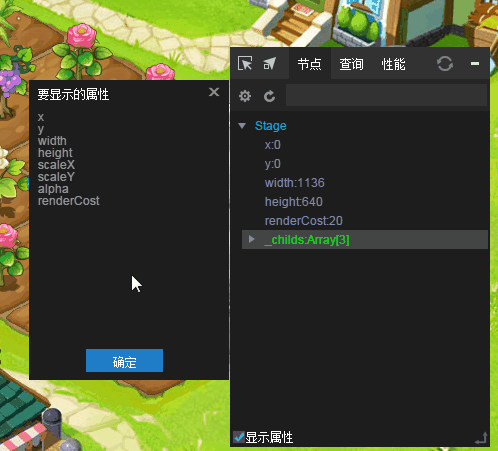
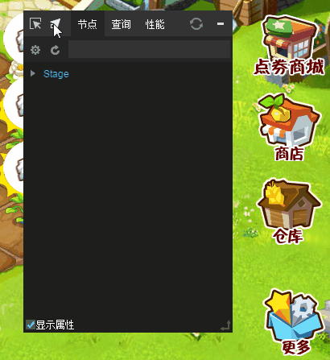
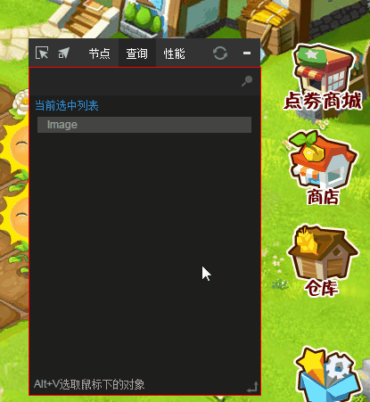
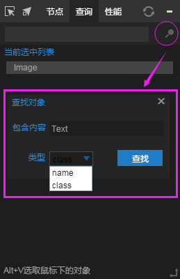
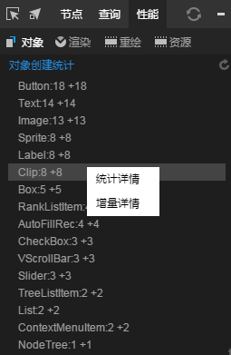

# LayaAir DebugTool调试工具

### 1、启用DebugTool调试面板

LayaAir DebugTool调试面板是基于Div的调试窗口，无需下载安装任何插件，引入调试库即可以直接运行在项目中。启动调试面板的`DebugTool.init()`方法位于`laya.debugtool.js`文件中，在index.html中引入该js文件后可以在初始化舞台方法`Laya.init()`后的任意代码中增加使用，index.html中引入js文件代码如下所示：

```javascript
<script type="text/javascript" src="libs/laya.debugtool.js"></script>
```

使用方式例如下面代码所示：

入口类Main.as

```java
// 程序入口
class GameMain{
    constructor()
    {
        //初始化舞台
        Laya.init(1334,750);
        //调用DebugTool调试面板
        Laya.DebugTool.init();
        //设置舞台背景色
        Laya.stage.bgColor = "#ffffff";
        var Img:Laya.Sprite = new Laya.Sprite();
        //添加到舞台
        Laya.stage.addChild(Img);
        Img.loadImage("res/img/monkey1.png",200);
    }
}
new GameMain();
```

调试面板启用成功后如图1所示。

  

（图1）


### 2、节点选取功能

先点击调试面板的顶部第一个`选取`按钮图标。

然后在游戏页面的节点中滑动，会显示节点的边框。

单击鼠标可选中该节点。与此同时，调试面板的节点分类中会显示出该节点的属性值信息。效果如动图2所示。

 

(动图2)


### 3、设置显示属性

点击调试面板第二排的齿轮图标，可以设置`要显示的属性`。

在新弹出的显示属性设置面板内，可以添加和删除节点中要显示的属性信息。相关操作如动图3所示。

  

（动图3）


### 4、拖动选取

左键点击顶部的第二个`拖动选取`按钮图标，然后保持按住并拖动到想要查看的显示对象节点上，即可在调试面板中查看到该节点的属性信息，相关操作如动图4所示。


  

（动图4）


### 5、快速查询功能

#### 5.1 用快捷键获取页面中的节点对象

通过长按快捷键`Alt+V`,并同时用鼠标选取页面节点对象的方式。可以获取页面中的节点对象，用以右键操作或快速查询该对象的属性，如动图5-1所示。

  

（动图5-1）

#### 5.2 通过关键字查询获取页面中的节点对象列表

相对于快捷键的精准定位获取方式，可以通过`对象查询`按钮（*放大镜图标*）来获取对象列表。

当点击放大镜图标后，会弹出一个新的对象查询面板，可以查找到在name或class中包含了关键字的对象。如图5-2所示。

 

（图5-2）

#### 5.3 在对象中快速查询属性内容

无论是通过快捷键还是关键字定位到的对象，都可以通过属性查询功能，快速查询到属性值。

操作方式为：在`属性查询输入框`中**输入**一个或多个`属性名称`（多个属性需要用英文逗号相隔），然后`按回车键`即可获得属性内容。操作方式如动图5-3所示。

  

（动图5-3）


### 6、性能统计

#### 6.1 对象创建统计

点击`对象`按钮，可以获得对象创建的统计信息，信息的内容分别是 `对象名、当前运行创建的对象数量、当前运行距上次运行增加的对象数量`。统计信息如图6-1所示。

   

（图6-1）

#### 6.2 对象创建统计详情与增量详情

在对象创建的统计信息列表中，鼠标右键可以点击查询统计的详细情况和增量创建的详细情况，如图6-2所示。

   

（图6-2）

#### 6.3  渲染用时统计

渲染用时统计用于查询当前游戏渲染所消耗的用时，单位为毫秒(ms)。点击`渲染`按钮可以获得当前游戏渲染用时统计数据，如图6-3所示。

   

（图6-3）


#### 6.4 cache重绘统计

点击`重绘`按钮可以查询到cache重绘的数据排行，重绘数量多的对象排在前列。效果如图6-4所示。

   

（图6-4）


#### 6.5 资源缓存统计

点击`资源`按钮，可以查看到**资源缓存的列表**，如图6-5所示。

   

（图6-5）


### 7、右键功能菜单

调试面板中，右键会弹出相应的功能菜单，如图7所示。尤其是节点、查询以及渲染性能统计的右键功能菜单，需要熟练了了解与掌握。

 

(图7)


右键中的功能比较容易理解。开发者可以逐一体验。这里大家可以重点关注一下**节点工具**，该工具可以针对选择的节点进行显示/隐藏操作、可以显示出当前节点的mouseEnable关系链、可以显示出选中节点的Size关系链等等！比较实用和常用。

节点工具操作如动图8所示。

  

(动图8)


