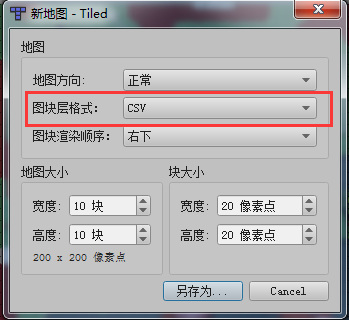
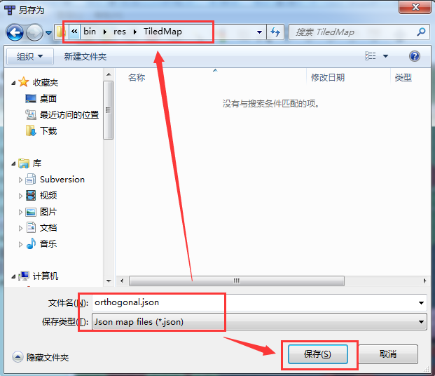
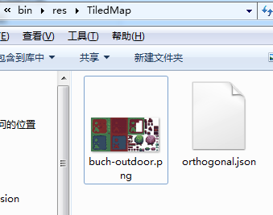
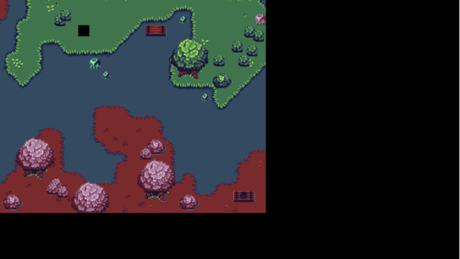
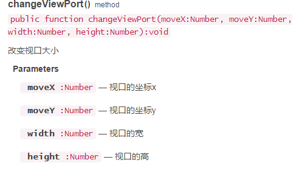

# 用LayaAir引擎解析Tiled Map地图

Tiled Map Editor是一个免费的地图编辑器，可以用来编辑2D游戏地图，LayaAir引擎支持解析Tiled Map导出的地图。本文将介绍如何在LayaAir引擎开发中使用Tiled Map Editor导出的地图。

> 注意：本文仅面向熟悉和使用Tiled Map地图工具的开发者。在文中介绍Tiled Map Editor导出的地图在LayaAir引擎的项目中如何使用，关于Tiled Map Editor工具的自身内容请自行查找第三方教程文档。
>
> 本篇文档中的部分内容是LayaAir引擎1.7.7版本中新增的，阅读本文前请将引擎更新至1.7.7版本或更高。


## 1、导出Tiled Map地图

### 1.1 Tiled Map Editor下载安装

打开官方首页（[http://www.mapeditor.org/](http://www.mapeditor.org/)）后，直接点击`DownLoad at itch.io`按钮进入下载链接（[https://thorbjorn.itch.io/tiled](https://thorbjorn.itch.io/tiled)）。如果官网改版，也可以直接从下载页[http://www.mapeditor.org/download.html](http://www.mapeditor.org/download.html)找到下载链接。

找到对应的系统版本链接，下载安装即可，(*本篇文档采用的版本为Tiled 1.0.1*)。

**Tips**：

*打开下载会弹出赞助该软件的付费页面，如果不想付费，可以直接点击 No thanks, just take me to the downloads，会带你进入一个免费下载的链接。*


### 1.2 	新建与导出Tiled Map地图的格式

#### 1.2.1 图块层格式的要求

LayaAir引擎不支持Tiled Map地图为Base64的图块层格式。所以在`创建`新地图时必须为`CSV格式`，如图1所示。

 

（图1）

如果创建的时候选错了，可以在属性面板里，将`图块层格式`改为CSV或者是XML，如图2所示，Base64相关的格式都不支持。

 

(图2)

#### 1.2.2  导出为json格式

在导出的时候，我们要选择json的格式。本例中，我们直接打开Tiled Map的示例地图orthogonal-outside.tmx（*位于Tiled Map地图安装目录的 examples目录下*）然后命名为orthogonal.json，保存到项目目录内（本例为`项目根目录\bin\h5\res\TiledMap\`），如图3所示。

 

(图3)

### 1.3 修改图集路径

打开刚刚保存的`orthogonal.json`，搜索关键字`"image"`我们会发现默认的image路径位于Tiled安装目录中(路径前边遮挡的是TiledMap的安装路径)。如图4所示。

 

(图4)路径在Tiled安装目录中肯定是不行的，所以，我们需要先将这个图片(*buch-outdoor.png*)复制到项目目录，与之前保存的`orthogonal.json`同级，如图5所示。

 

(图5)

然后将orthogonal.json中的`image`路径修改为相对路径`"image":"buch-outdoor.png",`

准备阶段结束，下面开始步入编码阶段……


## 2、LayaAir引擎使用Tiled Map 地图

### 2.1 创建TiledMap地图

#### 2.1.1 createMap API 说明

laya.map.TiledMap类中的createMap方法可以创建一个TiledMap地图。基础的参数说明如图6所示。

 

(图6)

#### 2.1.2 创建地图示例

```java
// 程序入口
class GameMain{
    private tMap:Laya.TiledMap;
    constructor()
    {
        //初始化舞台
        Laya.init(Laya.Browser.width,Laya.Browser.height,Laya.WebGL);
        //创建TiledMap实例
        this.tMap = new Laya.TiledMap();
        //创建Rectangle实例，视口区域
        var viewRect:Laya.Rectangle = new Laya.Rectangle();
        //创建TiledMap地图
        this.tMap.createMap("res/TiledMap/orthogonal.json",viewRect);
    }
}
new GameMain();
```

编译运行代码，效果如图7所示，说明地图已创建成功。

 

(图7)

### 2.2 控制地图

控制地图必须要先加载地图的json，然后在回调方法里控制。下面将结合实例了解相关的用法。

#### 2.2.1 地图的缩放

`laya.map.TiledMap`类中的`scale`属性可以控制地图的缩放比例。我们沿用之前的示例，在createMap方法内，增加回调，然后使用`scale`属性对地图进行缩放。

示例代码如下：

```typescript
// 程序入口
class GameMain{
    private tMap:Laya.TiledMap;
    constructor()
    {
        //初始化舞台
        Laya.init(Laya.Browser.width,Laya.Browser.height,Laya.WebGL);
        //创建TiledMap实例
        this.tMap = new Laya.TiledMap();
        //创建Rectangle实例，视口区域
        var viewRect:Laya.Rectangle = new Laya.Rectangle();
        //创建TiledMap地图，加载orthogonal.json后，执行回调方法onMapLoaded()
        this.tMap.createMap("res/TiledMap/orthogonal.json",viewRect,Laya.Handler.create(this,this.onMapLoaded));
    }
    private onMapLoaded():void{
        //将原地图放大2倍
        this.tMap.scale = 2;
    }
}
new GameMain();
```

运行效果如图8所示。

 

(图8)

#### 2.2.2  设置地图缩放的中心点

很明显，图8中的效果并不是我们想要的。放大后。有一部分并没有显示出来。这是默认的缩放的中心点是在视口的中心区域造成的。

#### 视口区域与默认的缩放中心点位置 

视口区域在创建地图方法(*createMap*)的第二个参数中所设置，

```java
//创建Rectangle实例，视口区域
var viewRect:Laya.Rectangle = new Laya.Rectangle();
//创建TiledMap地图，加载orthogonal.json后，执行回调方法onMapLoaded()
this.tMap.createMap("res/TiledMap/orthogonal.json",viewRect,Laya.Handler.create(this,this.onMapLoaded));
```

通过查看代码，我们发现视口被设置为浏览器的物理宽高（ `Laya.Browser.width, Laya.Browser.heigh`）。而控制缩放的方法setViewPortPivotByScale默认值为0.5。那么中心点位置如图9-1所图。

 

(图9-1)

当地图放大两倍时（`this.tMap.scale = 2;`）由于是以视口区域的x与y轴的中心点进行的缩放，所以放大后，会产生图9-2的效果。

 

(图9-2)

下面我们通过动图9-3，从原图比例的0.1到2倍的缩放变化效果，来进一步理解scale属性的中心点。

 

(动图9-3)

#### 用setViewPortPivotByScale方法设置缩放中心点

前文中介绍的是默认的缩放中心点效果。那如何设置和改变缩放中心点呢。在`laya.map.TiledMap`类中的`setViewPortPivotByScale()`方法可以设置视口的中心点。API基础说明如图10所示。

 

（图10）

`setViewPortPivotByScale()`方法的第一个参数scaleX是X轴方向的缩放坐标比例，scaleY是X轴方向的缩放坐标比例。

例如：

```java
this.tMap.setViewPortPivotByScale(0.1,0.5);
```

**代码说明**：

假设视口大小为800*600

- scaleX值`0.1` 表示x轴缩放中心点的坐标为80（800*0.1）

- scaleY值 `0.5` 表示y轴缩放中心点的坐标为300 （600*0.5）

代码运行时以x轴80，y轴300为视口的中心点坐标进行缩放。


#### 将缩放中心点设置为视口的左上角

当setViewPortPivotByScale的缩放中心点设置为`0,0`时，为视口的左上角。继续 沿用前面的示例，编码如下：

```typescript
// 程序入口
class GameMain{
    private tMap:Laya.TiledMap;
    constructor()
    {
        //初始化舞台
        Laya.init(Laya.Browser.width,Laya.Browser.height,Laya.WebGL);
        //创建TiledMap实例
        this.tMap = new Laya.TiledMap();
        //创建Rectangle实例，视口区域
        var viewRect:Laya.Rectangle = new Laya.Rectangle();
        //创建TiledMap地图，加载orthogonal.json后，执行回调方法onMapLoaded()
        this.tMap.createMap("res/TiledMap/orthogonal.json",viewRect,Laya.Handler.create(this,this.onMapLoaded));
    }
    private onMapLoaded():void{
        //设置缩放中心点为视口的左上角
        this.tMap.setViewPortPivotByScale(0,0);
        //将原地图放大2倍
        this.tMap.scale = 2;
    }
}
new GameMain();
```

将缩放中心点设置在视口的左上角，再放大2倍时，我们在iPhone6设备上可以铺排全屏，没有黑边。效果如图11所示。

 

(图11)


### 2.3 拖动地图

当地图被放大后，无法全部显示。这时就需要拖动地图查看全部。

拖动地图除了前文中介绍的方法外，还需要用到`moveViewPort()`（移动视口）方法和`changeViewPort()`（改变视口大小）方法。 这两个API的基础说明如图12-1与12-2所示。

 

（图12-1）


 

（图12-2）

下面直接查看代码，了解这两个方法的使用。

```typescript
// 程序入口
class GameMain{
    private tMap:Laya.TiledMap;
    private scaleValue:number = 0;
    private MapX:number = 0;
    private MapY:number = 0;
    private mLastMouseX:number;
    private mLastMouseY:number;
    constructor()
    {
        //初始化舞台
        Laya.init(Laya.Browser.width,Laya.Browser.height,Laya.WebGL);
        //创建TiledMap实例
        this.tMap = new Laya.TiledMap();
        //创建Rectangle实例，视口区域
        var viewRect:Laya.Rectangle = new Laya.Rectangle();
        //创建TiledMap地图，加载orthogonal.json后，执行回调方法onMapLoaded()
        this.tMap.createMap("res/TiledMap/orthogonal.json",viewRect,Laya.Handler.create(this,this.onMapLoaded));
    }
    private onMapLoaded():void{
        //设置缩放中心点为视口的左上角
        this.tMap.setViewPortPivotByScale(0,0);
        //将原地图放大3倍
        this.tMap.scale = 3;

        Laya.stage.on(Laya.Event.RESIZE,this,this.resize);
        Laya.stage.on(Laya.Event.MOUSE_DOWN, this, this.mouseDown);
        Laya.stage.on(Laya.Event.MOUSE_UP, this, this.mouseUp);
        this.resize();
    }
    /**
     * 移动地图视口
     */
    private mouseMove():void{
        var moveX:number = this.MapX - (Laya.stage.mouseX - this.mLastMouseX);
        var moveY:number = this.MapY - (Laya.stage.mouseY - this.mLastMouseY)
			//移动地图视口
        this.tMap.moveViewPort(moveX, moveY);
    }
    private mouseUp():void
    {
        this.MapX = this.MapX - (Laya.stage.mouseX - this.mLastMouseX);
        this.MapY = this.MapY - (Laya.stage.mouseY - this.mLastMouseY);
        Laya.stage.off(Laya.Event.MOUSE_MOVE, this, this.mouseMove);
    }
    
    private mouseDown():void
    {
        this.mLastMouseX = Laya.stage.mouseX;
        this.mLastMouseY = Laya.stage.mouseY;
        Laya.stage.on(Laya.Event.MOUSE_MOVE, this, this.mouseMove);
    }		
    

    /**
     *  改变视口大小
     *  重设地图视口区域
     */	
    private resize():void
    {
        //改变视口大小
        this.tMap.changeViewPort(this.MapX, this.MapY, Laya.Browser.width, Laya.Browser.height);
    }
}
new GameMain();
```

代码运行效果如动图13所示。

 

(动图13)


## 3、Tiled Map 使用优化

### 3.1 销毁地图

当Tiled Mapa不再使用的时候，需要使用destroy()方法进行销毁，回收被占用的内存。

例如：

```java
this.tMap.destroy();
```


### 3.2 缓存相关

#### 3.2.1 开启和关闭自动缓存

LayaAir引擎使用TiledMap时，默认会将没有动画的地块自动缓存起来，并且缓存类型默认为normal。

```java
//自动缓存没有动画的地块
this.tMap.autoCache = true;
//自动缓存的类型,地图较大时建议使用normal
this.tMap.autoCacheType = "normal";
//消除缩放导致的缝隙,也就是去黑边，1.7.7版本新增的优化属性
this.tMap.antiCrack = true;
```

以上的代码属性是引擎的默认值，在多数情况下，保持默认值即可，无需额外设置。

那么为什么要再介绍一遍呢？

因为有的时候，缓存后的Tiled地图会出现黑边（缝隙）。尽管在1.7.7版本新增了antiCrack属性，可以消除绝大多数因normal缓存导致的黑边。但如果偶现的黑边问题仍未得到解决时。可以通过关闭自动缓存来解决黑边（缝隙）问题。

#### 3.2.2 设置缓存区块大小

#### 缓存区块的设置推荐

TiledMap地图都是由一个个单元区块拼接组成。如果缓存时保持原大小，当小图区块很多时会对性能产生影响。因此建议开启缓存区块设置，并将缓存区块的大小设置为512像素左右，必须保持原小图区块的整数倍。

例如，本文示例中的单图区块大小为`16*16`，那么缓存区块可以设置 16的32倍，即为`512*512`。

如果单图是`15*15`，缓存可区块可以设置为`510*510`（34倍），以此类推，尽量在原区块整数倍的前提下，设置在512左右。推荐`为512*512`。

#### 缓存区块的具体设置方法

缓存区块的设置需要在createMap（创建地图）的时候设置。设置第四个参数gridSize，示例如下：

```javascript
//为第二个参数创建Rectangle实例，视口区域
var viewRect:Laya.Rectangle = new Laya.Rectangle(0, 0, Laya.Browser.width, Laya.Browser.height);

//为第四个参数gridSize创建一个512*512大小的Point对象实例
var gridSize:Laya.Point = new Laya.Point(512, 512);

//创建TiledMap地图
this.tMap.createMap("res/TiledMap/orthogonal.json",viewRect, Laya.Handler.create(this,this.onMapLoaded), null, gridSize)
```


### 3.3 合并图层

#### 3.3.1 开启合并图层

当TiledMap里有多个图层时，开启合并图层的属性enableMergeLayer，可以将图层合并，会对性能有所提高。

开启的方式为：

```java
//开启图层合并
this.tMap.enableMergeLayer = true;
```

**Tips**:

需要注意的是，如果需要对合并前的图层进行操作，那就不能直接合并。因为合并后会导致无法对合并前的图层进行操作。

#### 3.3.2 图层合并分组

如果没有在TiledMap里将图层分组，那么图层合并时，会将所有图层合并到一起。因此，需要分为多个图层并分别操作时。可以在TiledMap里将图层分组。

#### TiledMap图层分组方式：

打开TiledMap地图编辑器，选中要分组的图层，在图层的自定义属性栏，添加一个名为`layer`的`string`类型属性。操作如图14-1所示。

 

（图14-1）

点击OK，添加完成后，将所有添加了自定义属性layer的图层。设置分组名称。

例如，我们将块层2与块层3的分组名称设置为layaAir，那么名为layaAir的图层，开启enableMergeLayer后，会合并到同一个图层。操作如图14-2所示。

 

(图14-2)

开启合并图层时，图层属性内可添加layer属性，运行时将会将相邻的layer属性相同的图层进行合并以提高性能

#### 3.4 移除被覆盖的格子

如果下层的格子被遮挡，并且遮挡地块并不是透明的，那么被遮挡的部分直接移除而不被渲染，可以提高性能。

移除被覆盖的开启方式为：

```java
//移除被非透明地块覆盖的部分
this.tMap.removeCoveredTile = true;
```

**Tips**：

如果开启后，需要对移除的部分进行操作，是不可能的。所以开启该功能前要确认，不再对移除部分进行操作。

#### removeCoveredTile 开启的前提

如果在Tiled Map中没有对`图块`设置`type`属性，那么即便开启了removeCoveredTile ，也是无效的。所以，开启之前，需要先在TiledMap编辑器中，为图块新增自定义属性type，并将设置为1。

**Tiled Map中设置图块type的操作方式**

在图块面板中，点击图块编辑，打开图块地形编辑面板。操作如图15-1所示。

 

(图15-1)

在图块地形编辑面板内，选中地形，在自定义属性栏，点击`+`号图标，添加`int`类型的`type`属性。然后点击OK，完成添加。操作如图15-2所示。


 

(图15-2)

完成添加后，设置type属性值为1。操作如图15-3所示。

 

(图15-3)

只要是自定义属性type设置为1的地形，当removeCoveredTile开启后。被遮挡不可见时都可以被移除，以提高性能。