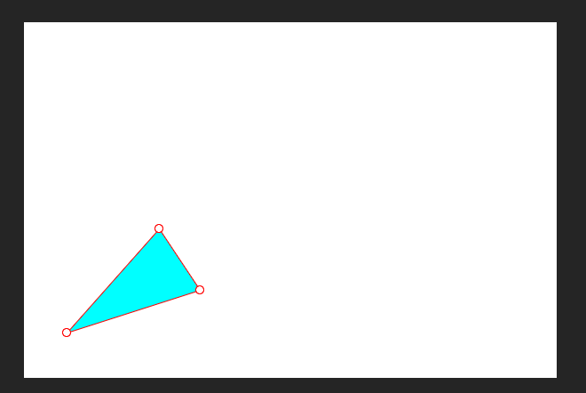

# 绘制三角形、多边形及根据数据绘制图案


​        在绘制三角形、多边形以及根据指定的路径数据绘制出图案均可使用LayaAir引擎中laya.display.Graphics类的“drawpoly();”方法实现。该方法的详细说明如下图所示：

​	<br/>
​	（图1）


### 一、绘制三角形

下面我们用LayaAir引擎先绘制一个三角形，示例代码如下：

```javascript
(function()
{
    var Sprite = Laya.Sprite;
    var Stage  = Laya.Stage;
    var WebGL  = Laya.WebGL;
    var sp;
  
    (function()
    {
        //初始化舞台，不支持WebGL时自动切换至Canvas
        Laya.init(500, 300, WebGL);
        drawSomething();
    })();
  
    function drawSomething()
    {
        sp = new Sprite();
        Laya.stage.addChild(sp);
        //画三角形
        sp.graphics.drawPoly(30, 28, [0, 100, 50, 0, 100, 100], "#ffff00");
    }
})();
```

代码运行效果如下图所示：

​	<br/>
​	（图2）

​        通过代码，我们可以看出，drawPoly第三位参数的“0，100”是A点坐标。“50，0”是B点坐标。“100, 100”是C点坐标，将三个坐标点连接后填充第四位参数的颜色值，即绘制出上图的黄色三角形。但是这里需要大家理解和注意的是，第三位参数中所有的坐标都是相对坐标，都会受到第一位和第二位坐标参数“30，28”的影响。一旦“30，28”产生改变，整体形状位置都会受到影响。


### **二、绘制多边形**

​        我们继续用上面的代码示例，通过增加drawPoly第三位参数的坐标，来实现多边形的绘制，修改的代码如下：

```javascript
//画多边形
sp.graphics.drawPoly(30, 28, [0, 100, 50, 0, 100, 100, 75, 150, 25, 150], "#ffff00");
```

代码运行效果如下图所示：

​	<br/>
​	（图3）

​        在修改的代码中，新增了D点坐标”75，150“与E点坐标”25，150“。通过将各个坐标点连接填充颜色后，即绘制出我们想要的多边形。要绘制更多边的多边形，按上述方式增加坐标点即可。


### **三、根据指定的路径数据绘制出图案**

​        通过上面的三角形和多边形，我们已经掌握了drawPoly的绘图用法，下面再通过示例深入介绍一下，如何指定路径绘制一个五角星。示例代码如下：

```javascript
(function()
{
    var Sprite = Laya.Sprite;
    var Stage  = Laya.Stage;
    var WebGL   = Laya.WebGL;
    var sp;
     
    (function()
    {
        //消除矢量绘制的锯齿，但会增加性能消耗
        Laya.Config.isAntialias=true;
         
        //初始化舞台
        Laya.init(500, 300, WebGL);
        drawSomething();
    })();
  
    function drawSomething()
    {
       var canvas = new Sprite();
        Laya.stage.addChild(canvas);
 
        var path = [];
        path.push(0, -130);//五角星A点
        path.push(33, -33);//五角星B点
        path.push(137, -30);//五角星C点
        path.push(55, 32);//五角星D点
        path.push(85, 130);//五角星E点
        path.push(0, 73);//五角星F点
        path.push(-85, 130);//五角星G点
        path.push(-55, 32);//五角星H点
        path.push(-137, -30);//五角星I点
        path.push(-33, -33);//五角星J点
 
        canvas.graphics.drawPoly(Laya.stage.width / 2, Laya.stage.height / 2, path, "#FF7F50");   
    }
})();
```

代码运行效果如下图所示：

​	<br/>
​	（图4）

​        通过上面的示例代码的写法，是不是感觉代码的可读性得到了增强，大家也可以将之前的三角形或多边形改成这种方式去体验一下，掌握了这些基础，可以衍生出很多灵活的用法，比如数据来自服务端等。


### 四、用LayaAirIDE通过控件绘制不规则图形（包括三角形，多边形）


**步骤一**：打开我们的LayaAirIDE，点击设计模式，新建一个View页面

​	<br/>
​   	（图5）  

**步骤二**：将组件中的曲线组件拖动到View页面上，就会自动生成默认的多边形

​	<br/>
​   	（图6）  

**步骤三**：修改（添加/减少）Poly组件属性中的数值，改变多边形的大小、颜色等等。

​   	<br/>
​   	（图7）  

​   	<br/>
​   	（图8） 三角形

​   	<br/>
​   	（图9） 不规则多边形 


到此我们通过LayaAirIDE的组件绘制多边形就完成了。