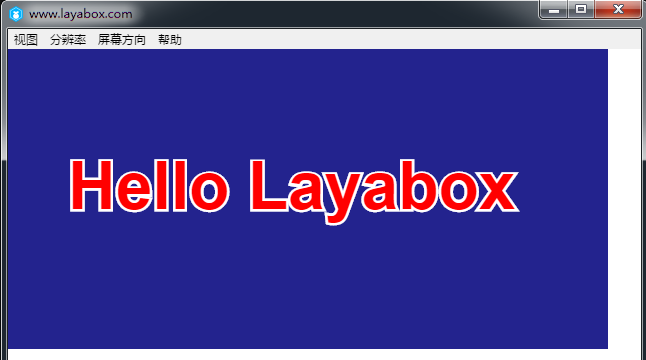

# 第一个程序：显示文本“Hello Layabox”

 **【提示】阅读本文前，必须先阅读《搭建开发环境（TS代码编译器）》和《创建TS项目并详解目录结构》两篇。**


​    **步骤一：**选中src右键单击，然后左键点击“新建文件”，在src目录下建立一个HelloLayabox.ts的文件。（Tips：HelloLayabox.ts必须创建在src目录下，才会被编译）

​	<br/>
​	图（1）


​         **步骤二**：点击打开src目录下的HelloLayabox.ts，开始编写如下代码：

```typescript
//创建舞台，默认背景色是黑色的
Laya.init(600, 300); 
var txt = new Laya.Text(); 
//设置文本内容
txt.text = "Hello Layabox";  
//设置文本颜色为白色，默认颜色为黑色
txt.color = "#ffffff";  
//将文本内容添加到舞台 
Laya.stage.addChild(txt);
```

​    

​     **步骤三**：编码完成后，按F5编译，在弹出的页面里，我们可以看到代码的运行结果，如下图所示：

​	<br/>
​	图（2）


​        **步骤四：**显示成功后，关闭显示窗口。我们继续编写代码，让文字显的美观一些。继续完善代码如下：

```typescript
//创建舞台，默认背景色是黑色的
Laya.init(600, 300); 
var txt = new Laya.Text(); 
//设置文本内容
txt.text = "Hello Layabox";  
//设置文本颜色
txt.color = "#FF0000";
//设置文本字体大小，单位是像素
txt.fontSize    = 66;  
//设置字体描边
txt.stroke = 5;//描边为5像素
txt.strokeColor = "#FFFFFF";  
//设置为粗体
txt.bold = true;  
//设置文本的显示起点位置X,Y
txt.pos(60,100);  
//设置舞台背景色
Laya.stage.bgColor  = '#23238E';  
//将文本内容添加到舞台 
Laya.stage.addChild(txt);
```


步骤五： **编写完成后，再次按F5编译，美化后的运行结果如下图所示：
​	<br/>
​	图（3）

**至此，如果您能跟随本篇入门教程，完成上图的显示，恭喜您入门成功，我们已经完成了第一个采用TypeScript语言开发的LayaAir引擎HTML5程序。更多LayaAir引擎开发的API使用方法，请前往官网Layabox开发者中心查看在线API与引擎示例。**