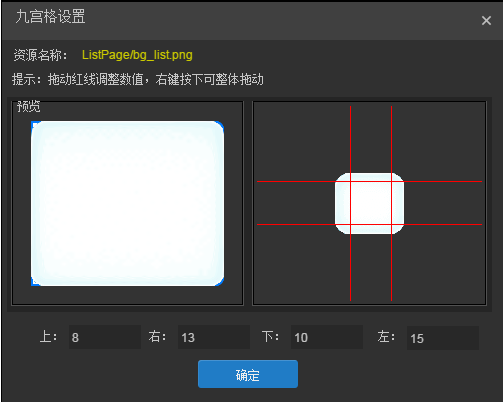
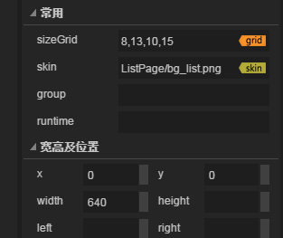
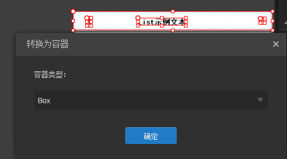
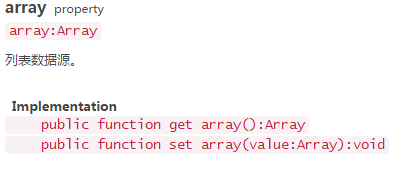
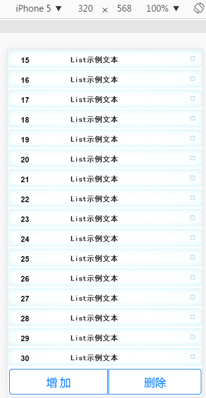

# List示例：显示、增加、删除

​        List（列表）是比较常用的功能。本篇结合LayaAir引擎与IDE针对List显示、增加、删除等相关操作进行逐步讲解，供开发者学习引擎与IDE的实战参考。（创建项目等基础操作，请查看其它文档，本篇跳过）

### 一、用LayaAirIDE制作UI

#####  1.1 创建一个View类型的UI页面 

​        
​        （图1）创建一个名为ListPage的View类型UI页面

​        首先，我们在LayaAirIDE的项目管理器内，创建一个View类型的UI页面，宽高为640*1136。页面命名为ListPage。

##### 1.2 导入UI资源

​      将美术制作好的UI页面资源导入到资源管理器中。（具体导入方式参考LayaAirIDE资源导入的文档。）

​        
​        （图2）

##### 1.3 用九宫格制作List背景

**1.3.1 拖拽List背景到舞台**

​      
​      （图3）将图片背景bg_list.png拖拽到舞台

​	 **1.3.2  Image属性中通过sizeGrid属性设置九宫格。**

​      
​      （图4）点击sizeGrid属性右侧按钮打开九宫格设置面板

​	    **1.3.3 在属性里设置width为640（全屏宽度）**

​      
​      （图5）


 ##### 1.4 制作List容器

**1.4.1 拖拽checkbox.png到舞台，并设置属性name为check。**

​    
​        （图6）

​**1.4.2 拖拽一个label.png到舞台，设置属性name为listNumber，其它属性参照图7。**

​      
​      （图7）用于序号的label组件

​	**1.4.3 再拖拽一个label.png到舞台，修改文本内容为“List示例文本”，属性设置参照图8所示：**

​      
​   （图8）用于List文本的label组件

​	**1.4.4 选中list背景图、序号label、文本label、checkbox，用Ctrl+B快捷键创建一个Box容器。然后选中Box容器，设置Box属性renderType为render。如图9，图10。**

​      
​     （图9）

​     
​      （图10）

​	**1.4.5 点击box容器再次通过Ctrl+B创建一个List容器，如图11。注意，所有的List容器，必须是基于Box容器的，我们看一下图12的层级关系，会更加清晰一些，list基于box循环产生。**

​      
​      （图11）

​      
​      （图12）

#####  1.5 设置List属性

​	选取List容器，设置Lis属性 var为_list（通过此变量可以调用该组件下的所有属性），然后根据实际需要设置其它属性，repeatX是X轴的列表数量，repeatY是Y轴的列表数量，spaceX是X轴列表间距，spaceY是Y轴列表间距。如图13所示：

​        
​      （图13）

##### 1.6 添加操作按钮

​        这里，我们直接使用了模板的ButtonTab，拖拽到舞台中，然后点击进入子节点，设置var、label属性以及九宫格等。如图14，图15：

​        
​      （图14）

​        
​      （图15）

​      调整好UI位置细节后，如图16。F12发布UI，就可以进入代码阶段

​       
​      （图16）

### 二、用ActionScript语言实现List代码逻辑

#####         2.1 显示制作的UI页面

​      2.1.1 创建一个ListDemo.ts程序文件，并把对应的js在index.html入口设置为启动类。

​      
​     （图17）

​      2.1.2  编辑代码，显示UI，主要三个环节，引入加载以及UI类，加载显示UI用到的图集资源，实例UI界面并添加到舞台。

```typescript
module demo{        
        import WebGL = Laya.WebGL;
        import Loader = laya.net.Loader;
        import Handler = laya.utils.Handler;  
 
        //引入制作的List UI页面类，此处要结合自己项目，注意引入名称是否正确     
        import listPageUI = ui.test.ListPageUI;
                 
        export class list
        {                  
              private  listP:listPageUI;
              constructor()
           {
                //初始化舞台宽高
                Laya.init(640, 1136,WebGL);
                Laya.stage.bgColor = "#ffffff";
 
                //预加载资源文件后执行回调
                Laya.loader.load(["./res/atlas/ListPage.atlas","res/atlas/template/ButtonTab.atlas"], Handler.create(this, this.onLoaded));
              }
                 
              private  onLoaded():void 
            {
                    //实例UI界面
                    this.listP = new listPageUI();
                    //添加UI界面到舞台
                    Laya.stage.addChild(this.listP);
       
              }
        }
}
new demo.list();
```

​      Tips：代码中的图集路径要根据自己的项目实际情况，灵活调整

​        2.1.3 编码完成后，按F5运行，如图18所示，页面显示和IDE制作的效果一致后，开始编辑逻辑代码。

​        
​        （图18）

#####     2.2 编写代码逻辑

​**2.2.1 实现List序号逻辑**

​      要实现List序号的数据添加，需要用到“laya.ui.List” API中的list数据源赋值array，单元格渲染处理器renderHandler，以及“laya.display.Node ”API下通过子节点名字获取子节点对象的方法getChildByName。我们先看下API说明：如图19、图20、图21。

​        
​      （图19）

​      
​      （图20）

​      
​        （图21）

 **List序号添加代码如下：**

```typescript
module demo{        
        import WebGL = Laya.WebGL;
        import Loader = laya.net.Loader;
        import Handler = laya.utils.Handler;  
        import Box = laya.ui.Box;
        import Label = laya.ui.Label;
 
        //引入制作的List UI页面类，此处要结合自己项目，注意引入名称是否正确     
        import listPageUI = ui.test.ListPageUI;
                 
        export class list{                  
                private listP:listPageUI;
                private arr:Array;
                constructor()
                {
                        //初始化舞台宽高
                        Laya.init(640, 1136,WebGL);
                        Laya.stage.bgColor = "#ffffff";

                        //预加载资源文件后执行回调
                       Laya.loader.load(["./res/atlas/ListPage.atlas","res/atlas/template/ButtonTab.atlas"], Handler.create(this, this.onLoaded));
                  
                }
                 
                //资源加载后回调
                private  onLoaded():void 
                {
                        //实例UI界面
                        this.listP = new listPageUI();
                        //添加UI界面到舞台
                        Laya.stage.addChild(this.listP);
 
                        //获得List模拟数据，并渲染
                        this.getListData();                
                }
 
                //List数据模拟，渲染
                private  getListData():void
                {
                  //添加list数据
                  this.arr = [];
                  for (var i:number = 1; i <= 30; i++) {
                      this.arr.push({listNumber:{text:i}});
                  }
 
                  //将this.arr数据赋值到列表数据源。
                  this.listP._list.array = this.arr;
                  //list渲染:单元格渲染处理器(默认返回参数cell:Box,index:int)。
                  this.listP._list.renderHandler=new Handler(this,this.onRender);
                }
 
                /**
                 *渲染List 
                 * @param cell
                 * @param index
                 * 
                 */                
                private  onRender(cell:Box,index:number):void
                {
                    //如果索引不再可索引范围，则终止该函数
                    if(indexthis.arr.length)return;
                    //获取当前渲染条目的数据
                    var data:any=this.arr[index];
                    //根据子节点的名字listNumber，获取子节点对象。         
                    var listNumber:Label=cell.getChildByName("listNumber");
                    //label渲染列表文本（序号）
                    listNumber.text=data.listNumber.text;
                }
        }
}
new demo.list();
```

​        代码运行结果如图22所示，成功实现了序号数据的带入。具体实现逻辑与代码说明直接查看代码和注释。

​        
​      （图22）

2.2.2 实现List序滚动
​      30条模拟数据在上面的示例运行后，只能看到16条。所以我们需要增加一个滚动效果。laya.ui.List的API中vScrollBarSkin可以满足我们的需求，API说明如图23：

​        
​        （图23）
该功能增加只需一行代码，就不粘全部代码了，将下面代码放到赋值列表数据源之前。

```typescript
//添加list滚动条功能
this.listView._list.vScrollBarSkin='';
```

​       再次运行效果如图24所示：

​        
​        （图24）

2.2.3 实现List增加功能

​       实现List增加，需要用到LayaAir引擎laya.display.Sprite中的事件侦听on()方法对鼠标点击事件CLICK进行侦听，以及laya.ui.List API中添加单元格数据源的方法addItem()；

​    
​       （图25）

​       
​       （图26）

 ```typescript
module demo{        
        import WebGL = Laya.WebGL;
        import Loader = laya.net.Loader;
        import Handler = laya.utils.Handler;  
        import Box = laya.ui.Box;
        import Label = laya.ui.Label;
        import Event = laya.events.Event;
 
        //引入制作的List UI页面类，此处要结合自己项目，注意引入名称是否正确     
        import listPageUI = ui.test.ListPageUI;
                 
        export class list{                  
                private listP:listPageUI;
                private arr:Array;
                constructor()
                {
                        //初始化舞台宽高
                        Laya.init(640, 1136,WebGL);
                        Laya.stage.bgColor = "#ffffff";
 
                        
                        //预加载资源文件后执行回调
                        Laya.loader.load(["res/atlas/ListPage.atlas","res/atlas/template/ButtonTab.atlas"], Handler.create(this, this.onLoaded));
                }
                 
                //资源加载后回调
                private  onLoaded():void 
                {
                        //实例UI界面
                        this.listP = new listPageUI();
                        //添加UI界面到舞台
                        Laya.stage.addChild(this.listP);
 
                        //获得List模拟数据，并渲染
                        this.getListData();                
                        //侦听增加按钮点击事件
                        this.listP.add.on(Event.CLICK,this,this.onAddClick);
                }
 
                //模拟List数据
                private  getListData():void
                {
                        //添加list数据
                        this.arr = [];
                        for (var i:number = 1; i <= 30; i++) {
                                        this.arr.push({listNumber:{text:i}});
                        }
                         
                        //添加list滚动条功能
                        this.listP._list.vScrollBarSkin='';
                        //将this.arr数据赋值到列表数据源。
                        this.listP._list.array = this.arr;
                        //list渲染:单元格渲染处理器(默认返回参数cell:Box,index:int)。
                        this.listP._list.renderHandler=new Handler(this,this.onRender);
                }
 
                /**
                 *渲染List 
                 * @param cell
                 * @param index
                 * 
                 */                
                private  onRender(cell:Box,index:number):void
                {
                        //如果索引不再可索引范围，则终止该函数
                        if(indexthis.arr.length)return;
                        //获取当前渲染条目的数据
                        var data:any=this.arr[index];
                        //根据子节点的名字listNumber，获取子节点对象。         
                        var listNumber:Label=cell.getChildByName("listNumber");
                        //label渲染列表文本（序号）
                        listNumber.text=data.listNumber.text;
                }
 
                //添加新的List条目                 
                private  onAddClick():void
                {                
                        //添加单元格数据源
                        this.listP._list.addItem({listNumber: {text:this.arr.length+1}});
                }
        }
}
new demo.list();
 ```

​       详情直接查看代码与注释：


​       代码运行效果如图27所示：

​       
​       （图27）实现列表增加效果

2.2.3 实现List增加功能删除功能

​       实现List删除功能需要实现多选框checkbox功能、删除按钮的鼠标侦听，删除操作后的数据重新渲染。详情直接查看代码与注释：

 ```typescript
module demo{        
    import WebGL = Laya.WebGL;
    import Loader = laya.net.Loader;
    import Handler = laya.utils.Handler;  
    import Box = laya.ui.Box;
    import Label = laya.ui.Label;
    import Event = laya.events.Event;
    import CheckBox = laya.ui.CheckBox;
    //引入制作的List UI页面类，此处要结合自己项目，注意引入名称是否正确     
    import listPageUI = ui.test.ListPageUI;
         
    export class list{                  
        private listP:listPageUI;
        private arr:Array;
        constructor()
        {
            //初始化舞台宽高
            Laya.init(640, 1136,WebGL);
            Laya.stage.bgColor = "#ffffff";
 
 
            //预加载资源文件后执行回调
            Laya.loader.load(["res/atlas/ListPage.atlas","res/atlas/template/ButtonTab.atlas"], Handler.create(this, this.onLoaded));
        }
         
        //资源加载后回调
        private  onLoaded():void 
        {
            //实例UI界面
            this.listP = new listPageUI();
            //添加UI界面到舞台
            Laya.stage.addChild(this.listP);
 
            //获得List模拟数据，并渲染
            this.getListData();    
            //侦听增加按钮点击事件
            this.listP.add.on(Event.CLICK,this,this.onAddClick);
            //侦听删除按钮点击事件
            this.listP.del.on(Event.CLICK,this,this.onRemoveClick);
        }
 
        //模拟List数据
        private  getListData():void
        {
            //添加list数据
            this.arr = [];
            for (var i:number = 1; i <= 30; i++) {
                    this.arr.push({listNumber:{text:i,isCheck:false}});
            }
             
            //添加list滚动条功能
            this.listP._list.vScrollBarSkin='';
            //将this.arr数据赋值到列表数据源。
            this.listP._list.array = this.arr;
            //renderHandler:单元格渲染处理器(默认返回参数cell:Box,index:int)。
            this.listP._list.renderHandler=new Handler(this,this.onRender);
            //mouseHandler: list单元格鼠标事件处理器
             this.listP._list.mouseHandler = new Handler(this,this.onMouse);
        }
 
        /**
         *渲染List 
         * @param cell
         * @param index
         * 
         */                
        private  onRender(cell:Box,index:number):void
        {
            //如果索引不再可索引范围，则终止该函数
            if(indexthis.arr.length)return;
            //获取当前渲染条目的数据
            var data:any=this.arr[index];
            //根据子节点的名字listNumber，获取子节点对象。         
            var listNumber:Label=cell.getChildByName("listNumber");
            //label渲染列表文本（序号）
            listNumber.text=data.listNumber.text;
 
            //获取当前渲染条目的check组件
            var check:CheckBox=cell.getChildByName("check");
            //根据isCheck的值，确定当前check组件是否为勾选状态（可以避免出现其他多余的选中状态）
            if(data.isCheck)
            {
                    check.selected=true;
            }
            else
            {
                    check.selected=false;
            }
        }
 
        //添加新的List条目                 
        private  onAddClick():void
        {      
            //添加单元格数据源
            this.listP._list.addItem({listNumber: {text:this.arr.length+1},isCheck:false});
        }
 
        /**
         *鼠标事件添加 
         * @param e
         * @param index
         * 
         */                
        private  onMouse(e:Event,index:number):void
        {
            //鼠标单击事件触发
            if(e.type == Event.CLICK)
            {
                //判断点击事件类型,如果点中的是checkBox组件执行
                if((e.target) instanceof CheckBox)
                {
                    //记录当前条目所包含组件的数据信息(避免后续删除条目后数据结构显示错误)
                    var tempObj:any = this.arr[index];
                     
                    //根据check的选中状态，设置条目的数据信息
                    if(((e.target) as CheckBox).selected)
                    {
                        this.listP._list.setItem(index,{listNumber:{text:tempObj.listNumber.text} ,isCheck:true});
                    }
                    else
                    {
                        this.listP._list.setItem(index,{listNumber:{text:tempObj.listNumber.text},isCheck:false});
                    }
                }
            }
        }
 
 
        //移除选中的条目                 
        private  onRemoveClick():void
        {
            //创建一个新的数组，存放移除条目后的数据
            var temp:any = [];
            for(var i:number=0;i<this.arr.length;i++)
            {
                //将非选中状态的条目数据存储起来
                if(!this.arr[i].isCheck)
                {
                    temp.push(this.arr[i]);
                }
            }
            // this.arr = null;
            this.arr = temp;
            //将新的数组赋值给list
            this.listP._list.array = this.arr;
        }
 
 
    }
}
new demo.list();
 ```


​       运行效果如图28所示：
​       
​       （图28）删除2、3、4条后的效果
​

​        至此，我们已经完成了列表的UI制作，以及显示，新增，删除的代码逻辑。如有疑问请前往社区提出：ask.layabox.com。


