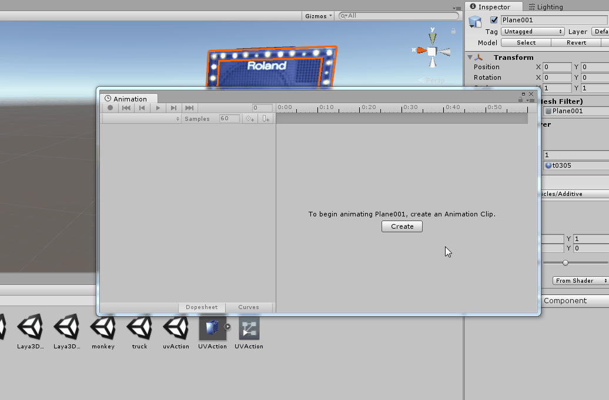

# LayaAir3D之动画二

在上一章节课程中我们了解了骨骼动画的unity处理与导出使用，在本节中，我们将继续介绍材质动画与刚体动画的制作与使用，它们在3D游戏的特效中运用非常广泛。

### 材质动画

骨骼动画主要是以改变模型顶点的方式产生动画，而材质动画则是以改变材质的颜色与贴图方式进行动画。

在三维软件中，例如3ds max中虽然可以制作材质相关动画，但导出成FBX格式时，unity并不能识别，也无法导出成LayaAir 3D引擎所识别的材质动画。因此游戏模型的材质动画必须在unity中制作，并进行某些设置导出后才能为LayaAir 3D引擎使用。

下面我们就用霓虹灯材质动画（图1）效果来讲解在unity中创建动画并导出使用方法，步骤如下。

(图1)</br>


### 导入模型，修改材质类型

在3ds max中制作的空调机箱、霓虹灯带导出成FBX后，再导入untiy中（开发者们可以偿试在3ds max中制作材质动画并导出使用，可以发现在unity无法播放）。

拖拽入场景中，选择需要制作的动画模型，在右侧界面中修改其材质，Shader类型为粒子加色类型Particles/Additive（目前暂时只支持此种材质类型的动画 ，其他的shader类型导出时会报错）。

(图2)</br>


### 创建材质动画

1、修改好材质类型后，同样选择要制作动画的模型，点击菜单栏window下Animation打开动画编辑界面，快捷键Ctrl+6。

2、点击create按钮创建动画并取名，本例中取名为uvAnimation，保存后在资源管理器中会生成动画文件uvAnimation。

3、选择时间轴上时间，修改材质的UV属性Offset中的X方向，每0.05秒调整一次UV位置0.25（相当于贴图向左移动了25%宽度），可以看到霓虹灯模型材质变化了，按时间依次进行调整，形成一个动画循环。

4、修改动画帧的曲线变化，默认为线形滑动动画，不符合我们的动画需求，修改为恒量变化，播放查看，材质动画按需求全部完成。当然，如果需要制作流水、浮云飘动动画可以用线形变化方式。

**tips：使用standard标准Shader类型制作材质动画也可，但注意如果动画编辑界面左框中出现了LayaAir不支持的属性，例如材质Emission属性，在资源导出时会报错，可以将它右键移除，即可正常导出。**

此种制作动画方式与3ds max中制作流程基本相同，可以让美术设计师直接在unity中编辑（图3）。

(图3)</br>


### 创建动画控制器

与之前的创建动画控制器相同，在资源管理器中右键创建动画控制器，取名为uvAction，双击打开后，将上一步创建的动画文件uvAnimation拖拽入动画控制器中。

选择模型，将动画控制器拖拽入模型的动画组件中，点击unity运行，我们就可以看到动画按我们的需求播放了（图4）。

(图4)</br>


### 导出并使用动画资源

在unity中编辑好动画，用LayaAir插件导出Sprite3D类型.lh资源，如果导出时没有报错，将资源拷贝到项目的h5目录下，那么在项目中可以直接用Sprite3D.load()方法加载或预加载。

参考以下代码，加载完成动画2000毫秒后动画停止（图1）。

```typescript
//创建加载材质动画模型
this.box = Laya.Sprite3D.load("LayaScene_uvAction/uvAction.lh");
//模型与材质、动画加载完成后回调
this.box.on(Laya.Event.HIERARCHY_LOADED,this,this.onLoadComplete);
scene.addChild(this.box);
//模型与材质加载完成后回调
private onLoadComplete():void{
  //获取模型上的动画组件
  this.ani = this.box.getChildAt(0).getComponentByType(Laya.Animator) as Laya.Animator;
  //动画2000毫秒后停止
  Laya.timer.once(2000,this,this.onLoop);
}
private onLoop():void{
	this.ani.stop();
}
```


### 刚体动画（变换动画）

刚体动画又称为变换动画，是指不改变模型顶点、材质的基础上，只对模型进行旋转、缩放、位移的动画，这种动画在游戏中也经常使用，比如说脚底光环、刀光等。当然刚体动画与材质动画也经常结合使用。

刚体动画与材质动画在制作上也有区别，材质动画必须在unity中制作，否则无法识别和播放动画，而刚体动画可以在3D软件中制作再导入unity中，它可以被识别。

建议在untiy中编辑动画，刚体动画与材质动画结合使用，配上粒子特效动画，效果更佳，三维软件只提供基本模型导入即可！

以下为制作的刚体动画效果（图5），对四个模型片分别使用了不同的材质，然后对模型进行了旋转和缩放修改产生动画。

(图5)</br>


### 摄像机动画

LayaAir摄像机目前还无法导出，在未来的版本中，摄像机可以导出到引擎中使用，因此，如果在unity中制作了摄像机动画，导出后在游戏中也能进行控制使用。

它在unity中的动画制作方法与刚体动画一致，可对它的属性进行动画修改。使用加载方式也一致。