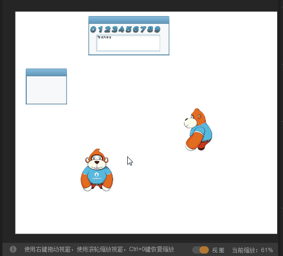

# UI场景编辑器

​        场景编辑器是UI、动画等内容创作的核心工作区域，如图1所示，我们可以在场景编辑器中选择和摆放控件，组合容器等。当我们在场景编辑器中选中的组件，还可以通过属性设置器中修改组件的位置、旋转、缩放、尺寸等属性，获得所见即所得的场景效果预览。

​     	  
​     	（图1）

## 1、视图介绍

#### 1.1 视图操作

​        您可以通过以下的操作，来移动和定位场景编辑器的视图：

​        1、按住`鼠标右键`或者按住`鼠标滚轮`可以拖拽移动视图。

​         2、快捷键 `Ctrl + +` 或`鼠标滚轮向前`，可以放大视图。

​         3、快捷键 `Ctrl + -`或 鼠标滚轮向后，可以缩小视图。

　     4、快捷键 `Ctrl + 0` 可以恢复为100%原始比例视图。

​         视图操作时，在UI场景编辑器右下角可看到缩放比例大小提示。相关操作如动图2所示。

    (动图2)

#### 1.2 组件的约束框

​        组件在鼠标选中状态下能够看到约束框（红色且带节点的线框），约束框的矩形区域表示组件的尺寸（size）属性大小。点中任何一个节点可以直接改变组件的大小。

​          （动图3） 

**Tips**：即使控件没有包含图像渲染组件（如Sprite）,也可以为控件设置size属性。

#### 1.3 多选节点

​        在场景编辑器中按住鼠标左键并拖拽，可以画出一个红色线条的矩形选区框，松开鼠标按键后，选框内的同层组件都会被选中。在松开鼠标键之前可以任意滑动鼠标来更改选取框的区域。操作效果如动图4所示

   （动图4）

#### 1.4 使用对齐工具布置节点

​        场景编辑器的核心功能就是以所见即所得的方式编辑和布置场景中的可见元素。我们还可以通过主窗口工具栏上方的一系列对齐工具来快捷的布置场景节点。 

​      （图5）

**Tips**：关于具体的对齐工具使用介绍请参考`工具栏介绍`文档。

## 2、代码视图

　　点击`场景编辑器`右下角 的`视图`切换按钮 即可切换至`代码`视图模式，如动图6所示。代码视图中显示为场景页面的XML文本配置文件，也可编辑修改XML文本文件进行页面及控件的修改、增删等。

   (动图6)

