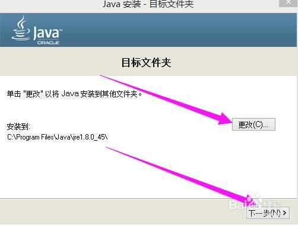
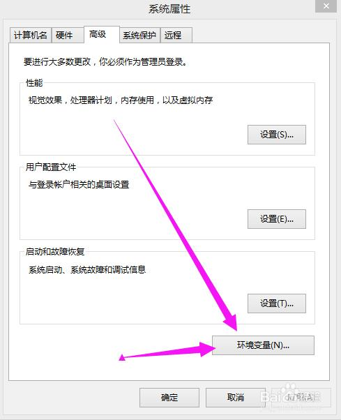
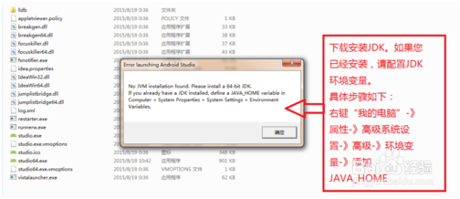
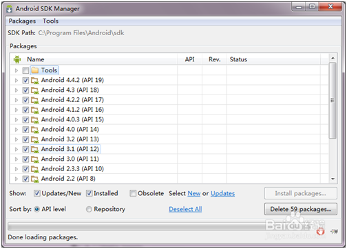
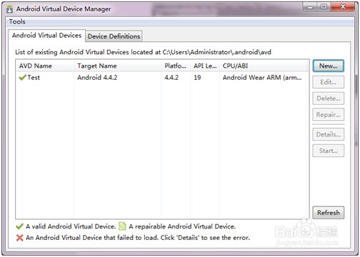
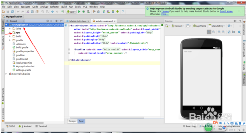
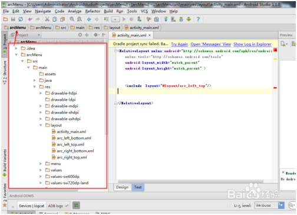

# Android Studio的使用和配置

## 1、 安装Android Studio的准备工作

### **1. 1下载java JDK**

　　去官网下载java JDK。具体教程可以参考：[http://jingyan.baidu.com/article/9989c746064d46f648ecfe9a.html](http://jingyan.baidu.com/article/9989c746064d46f648ecfe9a.html)

### **1.2 安装JDK.并配置环境变量.**

　　在Java或android的学习过程中，搭建JDK环境是必须的。本篇以jdk-8u45-windows-x64为例，在windows8.1的64位系统上进行配置环境。

#### 1.2.1 安装JDK

　　双击jdk安装包，进入安装向导，然后进行无脑操作，参照图片一直点下一步即可；

 

 

 

 

 

#### 1.2.2 配置环境变量

　　**第一步，右击我的电脑，点击属性（如下图），进入属性面板；**

　　**第二步，点击左侧高级系统设置，进入系统属性设置**

　　**第三步，点击高级，点击环境变量**

　　**第四步，下面系统变量，点击新建；**

　　`变量名：JAVA_HOME`

　　`变量值：JDK的安装路径（如：E:\Program Files\Java\jdk1.8.0_45）`

　　**第五步，系统变量栏，再次点击新建；**

　　变量名：`CLASSPATH`

　　变量值：（`.;%JAVA_HOME%\lib;%JAVA_HOME%\lib\tools.jar`）

前面括号内可复制。注意不要忘记前面的点和中间的分号，分号记得英文输入法。

　　**第六步，系统变量里找到Path（或者path）变量**，双击Path（或者选中--编辑），由于原来的变量值已经存在，故应在已有的变量后加上（`;%JAVA_HOME%\bin;%JAVA_HOME%\jre\bin`）括号内可复制。

注意前面的分号（将原有的路径与添加的用;隔开）。

　　**第七步，环境变量已经配置完毕。**

　　验证方法：Win+R打开运行框，输入cmd命令回车；

　　输入java-version回车，显示java版本信息；输入javac，出现如下画面便说明配置成功；

*注意事项*

`配置环境变量时记得将原有的和新加的用;隔开，不要出现中文；号`

### **1.3 安装Android Studio**

自从Google宣布Android Studio将取代Eclipse，正式成为官方集成开发软件，中止对后者支持。本文将介绍Android Studio的安装（以Android Studio 1.4为例，文中简写AS） 

1）由于国内网络因素的限制，不通过特殊手段是无法访问Google官网来下载AS。所以大家可以自行搜索其它站点的下载地址。本篇不作

2）下载完毕之后，解压。进入android-studio-ide-141.2178183-windows\android-studio\bin，点击studio64.exe即可进入AS开发环境。

3）如果无法运行，提示您需要下载安装JDK。并配置JDK环境变量

4）android studio首次安装运行时卡会卡在更新检查界面。网上有各种处理方法，这里只介绍其中一种方式。进入步骤2解压目录android-studio-ide-141.2178183-windows\android-studio\bin下

5）找到idea.properties文件，用记事本打开（或者用其他文本编辑器UE等）。

在文件最后添加在文件最后追加  disable.android.first.run=true

，保存。重新打开AS。就可跳过AS更新检查。

**注意事项**

·         本操作步骤是基于Win7 64位，其它操作系统请参考Google官方下载

·         安装AS之前，请先安装JDK，并配置相应的JAVA环境变量

 

# **2、 如何使用Android Studio创建新项目**

1）安装好之后,我们要新建我们的项目。重点从这里开始

2）点击    New Project会出现.我们设置好名称,也可以无脑操作,一直点击next,直至结束,不过这个过程需要我们耐心的等待。(时间有点漫长)。

3）  然后我们就会进入我们的开发界面。点击图片中红圈的图标(SDK manager)会出现下图

4）这个步骤是安装Android的sdk,推荐,Android1.6~Android4.4.2全部安装。(这个耗费时间挺长的,请在网速良好且大量闲暇时光下安装,安装过程中可以看部电影)

5）安装完之后,就开始配置我们的avd(Android Virtual Device),也就是Android的虚拟环境。点击,图片中红圈的图标

6）  点击New(Test是我配置好的)

7）  随便设置AVD name,建议如图设置

8）设置完成之后,就可以点击下图的三角号编译我们的程序了。

# **3 、AndroidStudio如何导入项目：**

**3.1开发环境：**

> 　　win7
>
> 　　AndroidStudio
>

**方法/步骤**

1）打开自己的IDE-AndroidStudio，如图：

2）点击“File”的按钮，然后选择“Import Project”，如图：

3）找到你要导入的程序，最好选择build.gradle文件，如图：

4）选择“Next”如图：

5）选择“Next”如图：

6）等待导入过程，如图：

7）最后导入成功，可以查看一下，如图：

