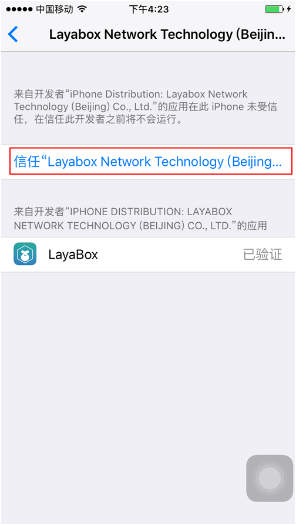
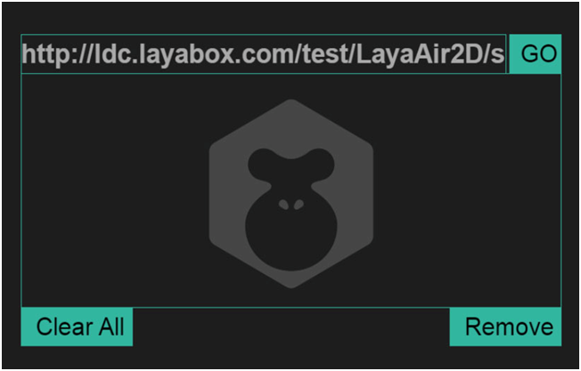

# 如何用Runtime测试游戏

### 一、下载与安装

打开LayaAirIDE，在“工具”菜单里点击"运行器下载"，会弹出二维码下载地址。

​	 
​	图(1)

​	 
​	图(2)

#### **1.Android下载和安装**

　　直接用android手机进行扫码，点击apk进行安装即可。

#### 2.iOS下载和安装

　　用微信扫码后，点击“在Safari中打开”，在Safari浏览器中打开后点击 Install按钮，然后点击安装即可，如下图所示：

**步骤1：**

​	 
​	图(3)

 

**步骤2：**

​	 
​	图(4)

 

**步骤3：**

​	  
​	图(5)

  

　　安装成功后，点击运行会弹出"未受信任的企业开发者"，这个时候需要开发者自己进行设置一下。需要点击"设置"-->"通用"-->"设备管理"-->"点击LayaBox Network Technology.."-->"点击信任"，随后再打开LayaBox应用程序便可以使用了，如下图所示：

**步骤4：**

​	 
​	图(6)

 

**步骤5：**

​	 
​	图(7)

 

**步骤6：**

​	 
​	图(8)

 

**步骤7：**

​	 
​	图(9)

 

**步骤8：**

​	 
​	图(10)

 

#### 3.打开应用

　　打开应用之后，会看见如图11的界面：

​	 
​	图(11)

　　默认的地址是LayaBox提供的一个性能测试实例，点击“GO”按钮便可以进入性能测试。当然开发者可以输入自己的项目地址进行测试，如下图所示：

​	 
​	图(12)

 

在项目中可以点击AssistiveTouch，点击后退便可以返回首页。

​	 
​	图(13)

 

第二次打开app的时候会自动记录上次输入的地址。

​	 
​	图(14)

 

#### 4.注意事项

　　文本格式的文件（例如:ini、xml、html、json、js等）都必须是utf8编码格式，因为IOS设备现在尚不支持非utf8格式编码的文件。

 

#### 5.建议

　　建议开发者学习一下android和ios开发的基本知识，使用过程中可以把移动设备连接到电脑上，随时查看log，log中有很多重要的信息，可以帮助开发者定位问题。比如：非utf8格式编码的文件名字、网络错误、下载错误等等。