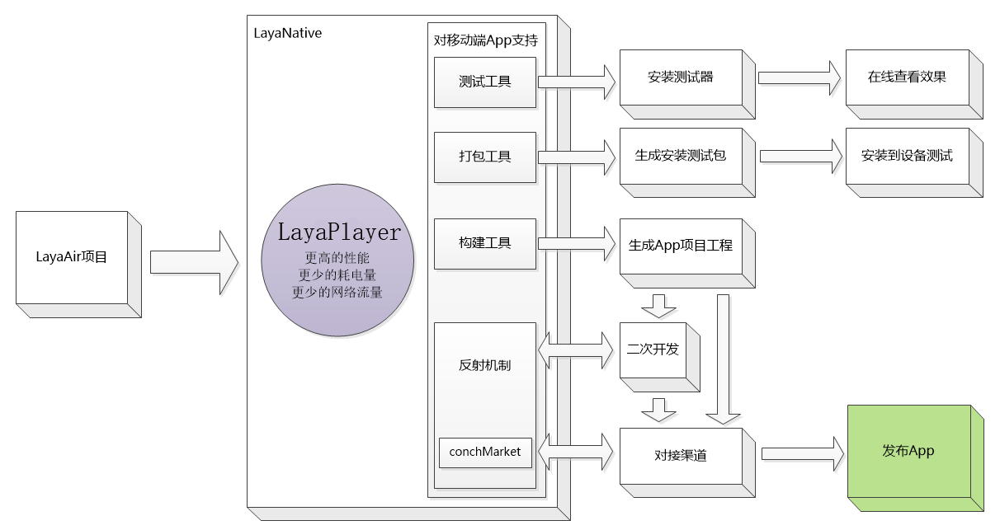

# LayaNative综述

LayaNative是LayaAir引擎针对移动端原生App的开发、测试、发布的一套完整的开发解决方案，但不局限于LayaAir引擎。LayaNative以LayaPlayer为核心运行时的基础上，利用反射机制、渠道对接方案提供开发者在原生App上进行二次开放和渠道对接，并提供测试工具、打包工具、构建工具等，为开发者将html5项目打包、发布成原生App提供便利。

##   **LayaNative包含以下内容:**

### 1. 测试工具：

通过模拟浏览器的方式，在地址栏输入URL运行，帮助开发者快速在移动端看到运行效果, 节省大量反复打包测试的时间；

### 2. 安卓打包工具：

安卓打包工具可帮助开发者快速生成移动端的安卓系统apk安装包（该APK的icon、应用名称、是否打包资源等开发者可自由定制）；

### 3. 构建工具：

构建工具可帮助开发者快速构建移动端APP项目工程, 然后使用Android Studio、Eclipce、XCode 等开发工具打开->构建->运行；

### 4. 反射机制:

通过反射机制,开发者可以实现JavaScript与原生语言(Android/Java 或 iOS/Objective-C)的相互调用，通过反射机制开发者可以很方便的对应用程序进行二次扩展；

### 5. 渠道对接工具内(conchMarket):

渠道对接工具内嵌了渠道常用对接API，例如: 登录, 分享, 充值,好友关系链等；

### 6. LayaPlayer：

LayaPlayer是LayaNative最核心的部分，它是一个基于JavaScript脚本引擎 + openGLES硬件加速渲染的跨平台引擎，通过对内存与渲染流程进行极致优化，为基于HTML5、WEBGL的多媒体应用、游戏等产品加速，使其性能媲美原生Native-APP。LayaPlayer采用C++语言编写,可嵌入浏览器或操作系统运行，也可以独立运行。  

### 7.LayaNative的原理和开发流程

（1）、使用LayaAir开发的项目，准备在发布成app版本（ios或android）。  
（2）、LayaNative会使用核心引擎LayaPlayer进行加速。  
（3）、开发者可以使用测试工具或者打包工具，快速安装到移动设备上进行简单的测试。  
（4）、最终通过命令行或者IDE，构建ios或android的工程，进行编译、执行。  
（5）、如果需要发布到各大渠道（例如：百度、360、AppStroe、google等），需要通过反射机制进行二次开发（即：对接渠道的SDK，登录、充值、分享等）。  
（6）、最后构建成app进行安装、测试、发布。  

流程如图1所示：

​	
​	图（1）

