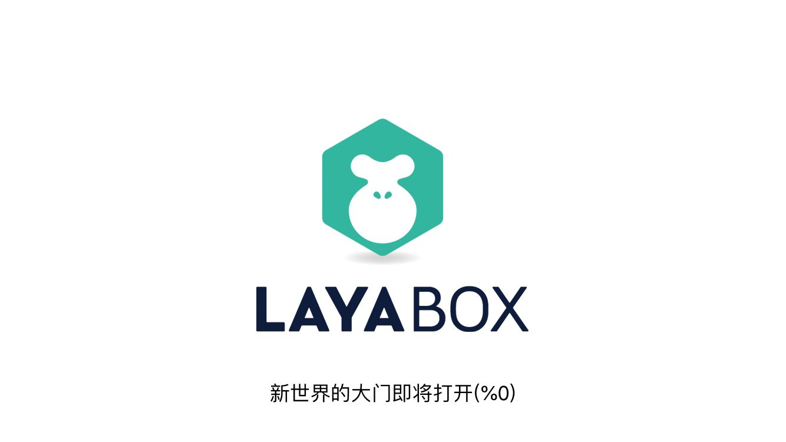

# 加载界面

应用程序在启动的时候，需要加载必要的html、js、图片，这个时候就需要通过加载界面显示进度，LayaPlayer在运行项目的时候，默认有一个LoadingView界面，一段时间后，即可进入游戏，如图一所示：  

​ <br/>

从LayaPlayer-1.0版本开始开始用Android和iOS原生功能实现了新的LoadingView
## 1.进度条控制

​开发者可以在config.js中，控制LoadingView的背景色、字体颜色、Tips等。  

config.js的位置：  
```
Android: 工程目录下的assets/scripts/config.js  
IOS:工程目录下的resources/scripts/config.js  
```

config.js中的内容如下所示，开发者可以根据自己的需求进行修改：

```javascript
window.loadingView = new loadingView();
if(window.loadingView)
{
    window.loadingView.loadingAutoClose=true;//true代表引擎控制关闭时机。false为开发者手动控制
    window.loadingView.bgColor("#FFFFFF");//设置背景颜色
    window.loadingView.setFontColor("#000000");//设置字体颜色
    window.loadingView.setTips(["新世界的大门即将打开","敌军还有30秒抵达战场","妈妈说，心急吃不了热豆腐"]);//设置tips数组，会随机出现
}
```

## 2.进度条控制实例

在实际开发过程中，通常想要精确控制LoadingView的隐藏和显示，那么开发者可以在config.js中这样设置loadingView.loadingAutoClose的值为false
然后在项目中根据加载完成情况，设置进度条的显示进度，调用函数如下:  
`loadingView.loading(nPercent);//参数为0-100的整数值，当值为100的时候LoadingView自动关闭`  

项目中的伪代码如下：
```javascript
var nPercent=0;
var image1 = document.createElement('img');
image1.onload=function()
{
    if(window.loadingView){
        nPercent+=33;
        window.loadingView.loading(nPercent);
    }
}
image1.src = "a.png";

var image2 = document.createElement('img');
image2.onload=function()
{
    if(window.loadingView){
        nPercent+=33;
        window.loadingView.loading(nPercent);
    }
}
image2.src = "b.png";

var image3 = document.createElement('img');
image3.onload=function()
{
    if(window.loadingView){
        nPercent+=33;
        window.loadingView.loading(nPercent);
    }
}
image3.src = "c.png";
```


## 3.去掉所有文字显示

可以去掉所有文字的显示，包括tips和加载百分比，修改config.js，把showTextInfo设置为false即可。
```javascript
loadingView.showTextInfo=true;//改成false
```
## 4.自定义界面和功能
所有代码公开，因此开发者可以根据需要修改代码实现任何所需自定义功能。

