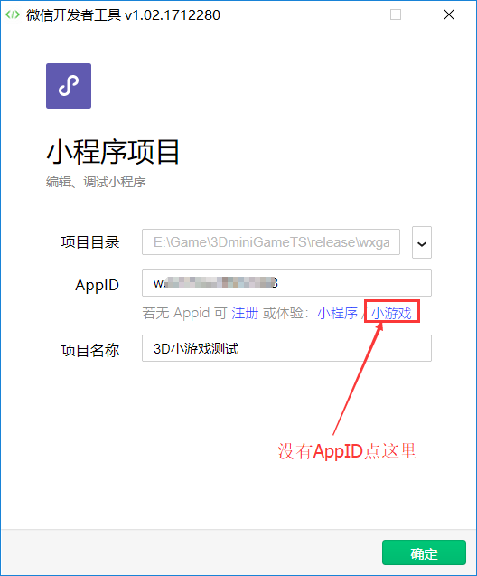

# 用3D项目演示老项目如何适配微信小游戏

基于有部分开发者在3D小游戏方面也有开发需求，以及老项目适配需求，本篇将为大家介绍3D示例项目创建、老项目的适配详解等，完整的小游戏开发流程。

#### 必读提示：

> 1、在LayaAir IDE的1.7.14正式版本中，将支持创建微信小游戏3D示例项目。
>
> 2、阅读本文前，请先阅读《创建微信小游戏》，更多配置环境的基础内容本篇不再重复介绍。
>
> 3、本篇中的小游戏适配流程，也适用于老版本IDE创建和开发的项目。


### 第一步：创建一个3D示例项目（旧项目适配可跳过本步骤）

先打开LayaAirIDE，进入新建项目界面。选择LayaAir 3D示例项目。

 

输入项目名称，路径，选择AS3语言的项目类型，1.7.14beta版引擎。

点击创建，即完成了一个3D项目的创建。

### 第二步：适配微信小游戏

创建完3D示例项目，点击**运行**（或F5）可以看到一个三维的立方体。说明我们这个3D示例项目是可以正常运行的。

 

关闭运行调试弹出的窗口，我们在编码模式下的**文件**菜单内点击**新建窗口**（ctrl+shift+N），然后创建一个新项目，选择微信小游戏示例项目创建之后，打开小游戏示例项目的“bin\h5”目录，将game.js、game.json、project.config.json、weapp-adapter.js 这四个文件复制到3D示例项目的“bin\h5”目录下。复制完效果如下图所示。

 

> Tips：复制小游戏的适配文件，如果不想创建新的小游戏项目，也可以直接在LayaAirIDE根目录下的“resources\app\out\vs\layaEditor\laya\code\as\wxminigame\bin\h5\”目录下复制。


复制适配文件完成后，需要修改小游戏的入口程序game.js。

打开game.js进行编辑，要先引用小游戏适配库文件weapp-adapter.js，然后引入游戏项目的入口程序（本例为LayaAir3D.max.js）。

game.js修改后如下所示：

```javascript
require("weapp-adapter.js");
require("LayaAir3D.max.js");
```

然后，就是修改游戏入口程序，增加适配代码了。

打开src目录下的示例入程序LayaAir3D.as

先导入适配库

```java
import laya.wx.mini.MiniAdpter;
```

然后在初始化引擎前，初始化小游戏适配

```javascript
//微信小游戏适配
MiniAdpter.init();
```

效果如下图所示：

 

完成适配代码的添加，点击编译或运行调试按钮，没有报错提示的话，那就完成了小游戏的适配。


### 第三步，创建微信小游戏项目

打开微信开发者工具，选择小程序项目，在项目创建的界面里。项目目录设置为3D示例项目的bin/h5目录。

 

AppID这一栏，如果有企业的小程序开发者ID就填写，没有的话,就点击ID输入框下的小游戏。如下图所示。

 

**Tips**：

> 1、如果没看到小游戏的字样，请按之前文档中链接重新下开发者工具，一定是下错了。
>
> 2、如果是不是企业的AppID，不要填写，个人AppID不支持开发微信小游戏项目。

完成项目创建后，会进入小游戏开发界面。默认情况下，模拟器是打开的，如果看到和LayaAirIDE效果一致就没问题了。如下图所示。（除非是项目配置错了，一般是不会有问题的。）

 

> Tips：模拟器的顶部状态条，在真机环境上是没有的，真机上的小游戏是全屏显示。所以不用管，如果觉得影响了性能统计面板，可以在项目代码中，把统计面板的位置向下调一下。


### 第四步，了解日常开发与调试流程

因为刚刚在创建微信小游戏的时候，我们使用的是LayaAirIDE项目中的发布目录。所以，每次编译后，小游戏开发工具内会自动刷新编译后的显示效果。

假如，我们让这个三维立方体转起来，修改示例项目的入口程序LayaAir3D.as。

在最后一段的代码后增加

```javascript
//旋转方向与角度设置
var vect:Vector3 = new Vector3(1,1,0);
//每10毫秒旋转一次
Laya.timer.loop(10,null,function():void{
	box.transform.rotate(vect,true,false)
})
```

然后，在LayaAirIDE中点编译，再打开微信开发者工具，我们可以看到转起来的立方体，如下图所示：

 

在这种情况下，我们点预览按钮，通过微信扫码，可以直接在微信中进行真机体验和测试。

但是，当我们的项目超过4M的时候，再点预览，就会提示“上限为4096kb，请删除文件后重试”，如下图所示：

 

问题来了，大型游戏超过4M是肯定的，那如何真机体验和测试呢？

首先，我们要将游戏项目里要放到4M包内的和放到云服务器动态加载的区分开。

刚才示例中，我们使用的是本地路径，所以可以直接访问本地资源。那么正式开发的时候，应该怎么处理呢。我们建议本地4M包内的资源，除了入口JS和项目配置文件，都放到layaNativeDir这个目录中。因为这样，方便我们使用统一的动态加载的URL路径。引擎在适配小游戏的时候已进行了处理，当处于layaNativeDir目录下，即便使用了URL动态路径，仍然会只从本地目录内加载。

所以，正式开发的时候，如果想使用预览功能，在真机上测试，要再创建一个动态加载资源的小游戏项目，只将小于4M的本地包内容，复制到小游戏的项目目录中。其它资源采用动态加载的方式加载进来。