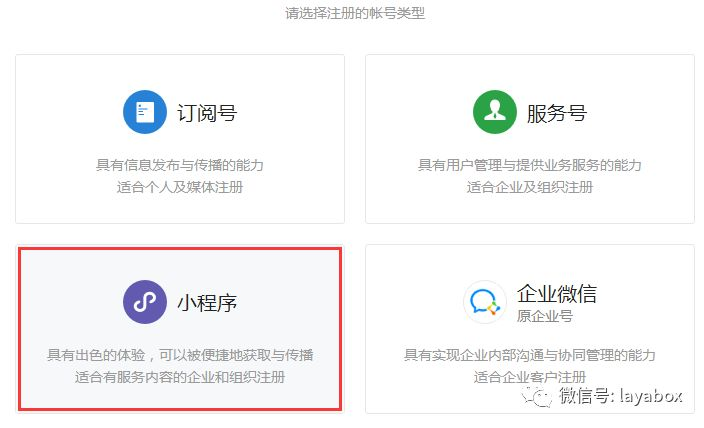
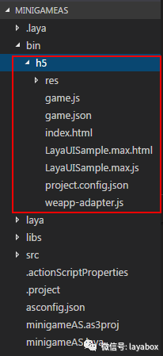
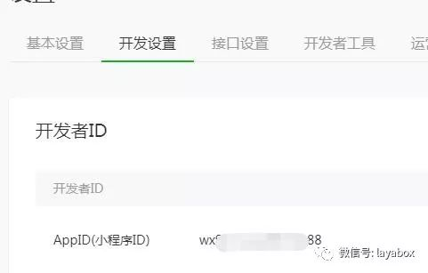

# 创建一个微信小游戏

### 一、准备好开发环境

#### 1、下载并安装LayaAirIDE集成开发环境

LayaAirIDE是LayaAir引擎的集成开发环境，集成了LayaAir引擎与示例项目，UI、动画等可视化编辑，项目代码编写与管理等开发工具。**开发者可以直接采用LayaAirIDE创建微信小游戏的示例项目。**

**官网下载地址** ：[http://ldc.layabox.com/layadownload/?type=layaairide](http://ldc.layabox.com/layadownload/?type=layaairide)

> Tips：LayaAirIDE 1.7.14版本才开始集成微信小游戏开发

#### 2、下载并安装微信小游戏开发工具

微信小游戏开发工具是小游戏开发与测试的环境，由于LayaAir引擎的开发者完全可以使用LayaAirIDE进行项目开发，那么安装这个小游戏开发工具主要是用于小游戏项目编译、预览、真机测试与调试、上传发布等。


在小游戏开发文档的首页里，通过导航链接前往开发者工具下载页面 ，去下载开发工具。

 

**开发工具下载地址**：
https://mp.weixin.qq.com/debug/wxagame/dev/devtools/download.html

#### 3、创建一个小程序开发者帐号，获得开发者ID(AppID)

尽管没有AppID也可以开发调试，但是功能会受到限制。所以在开发之前，最好先去创建一个小程序开发者帐号。

注册地址：https://mp.weixin.qq.com/cgi-bin/registermidpage?action=index&lang=zh_CN



### 

### 二、创建微信小游戏项目

#### 1、用LayaAirIDE创建小游戏示例项目

打开LayaAirIDE，新建项目。选择”微信小游戏示例“，设置项目名称、项目路径、开发语言类型、引擎版本。就可以创建小游戏项目了，如下图所示。


> Tips：本示例暂以ActionScript3开发语言为例，后面会讲一下TS和JS项目与AS3项目的区别。

#### 2、查看示例项目效果

创建完项目之后，我们可以直接点一下调试按钮（如下图所示）。就可以看到我们的示例什么样子。


> Tips：这一步除了编译js，主要为了让大家记住我们的示例什么样子，后面，如果小游戏效果也是这样的就没错了。

#### 3、简单了解项目的发布目录。



LayaAir开发者应该了解，项目目录/bin下级的h5目录才是运行目录。LayaAirIDE已经自动在示例项目内创建了小游戏的适配程序和项目文件，所以在开发阶段，创建小游戏项目的时候，直接将小游戏项目目录指向这个示例运行目录即可。（TS和JS项目与AS项目有所不同，另外，大型游戏项目正式发布的时候，据我们的经验来看，最好在小游戏开发工具内再另外建立一个用于正式发布的小游戏项目，具体的相关介绍，会放到进阶文档里细讲）

**特别提醒** ：

> 由于TS与JS目录下的引擎js文件是多个，没有合并。是不被微信小游戏支持的，如果是TS或JS项目，1.7.14 beta版本只能先采用第三方的JS合并工具（比如webPack）将JS合并，然后再复制到小游戏的项目目录运行。LayaAirIDE计划1.7.14正式版本开始集成微信小游戏自动合并发布的功能。在LayaAirIDE中实现任何语言版本都可以一键发布为小游戏项目的目标。

### 三、创建小游戏项目

#### 1、开发者帐号登录，选择项目类型

打开”微信web开发者工具“，用开发者的微信扫码登录。然后选择**小程序项目**点击进入项目设置。


#### 2、设置小程序项目

在小程序项目设置面板里，`项目目录`可以选择LayaAirIDE创建的小游戏示例项目的运行目录。（如果想另外创建目录，那么在小游戏调试与发布前，要将LayaAirIDE里的运行目录内容，手动复制到这个目录内）


AppID在小程序开发者帐号里获得（如下图所示）。如果没有，可以点击AppID输入框下的小游戏进行体验，但是功能会受到限制。

 


**需要特别注意**的是小游戏不支持个人注册，如果是个人开 发者，那输入AppID后只能进入小程序的开发，进不了小游戏的开发。所以个人开发者如果要体验，不要输入AppID，点击输入框下的小游戏进行体验。如果你看不到小游戏几个字，那你下的版本一定是错的，不支持小游戏。要重新按本文档中提供的地址重新下载。


#### 3、微信开发者工具的编译与调试

完成小游戏项目的创建后，点击编译，即可在工具内预览效果和调试，AS3项目的话，由于JS在编译时自动合并了，所以到这一步应该非常顺利，可以看到模式器中的效果与LayaAirIDE中的调试效果是一致的。

 

如果是TS或JS版本。如果不手动修改一定会报错。我们可以在调试器里看到报错信息，这块的调试就是chrome的调试方式，所以就不细讲了。

报错的原因基本上是由两个问题导致。

第一、TS与JS版本目前还没有集成小游戏的JS合并功能，所以多个JS文件会因为跨文件的执行域问题报错。

第二、同样是由于LayaAirIDE暂时还没有集成JS合并，所以小游戏的入口程序game.js里，引擎并未自动引入游戏的入口文件。所以不手动修改，肯定是找不到入口文件的。

**解决方案**：

第一、要使用第三方JS合并工具，将多个JS合并成为一个JS。然后修改入口程序game.js，将合并后的js引入即可。

修改后的game.js参考：

```javascript
require("./weapp-adapter.js");
require("./main.min.js");
```

第二、如果引擎JS不想合并到一起，也是可以的，只把项目JS合并到一起就行了。但是要在入口程序里将多个引擎JS引用进来。

修改后的game.js参考：

```javascript
require("./weapp-adapter.js");
require("./libs/min/laya.core.min.js");
require("./libs/min/laya.wxmini.min.js");
require("./libs/min/laya.webgl.min.js");
require("./libs/min/laya.ui.min.js");
require("./main.min.js");
```

第三、有没有不合并的解决方式呢，也是可以的，因为JS之间的执行域问题导致的报错，那么，我们将执行域设置为全局域，那就可以解决了。比如，我们的小游戏示例程序，通过调试器可以看出是找不到TestPageUI，那么我们在layaUI.max.all.js找到TestPageUI将其变为window.TestPageUI（如下图所示），然后再修改入口程序game.js，引用所有的JS就可以了。

 

修改后的game.js参考：

```javascript
require("./weapp-adapter.js");
require("./libs/min/laya.core.min.js");
require("./libs/min/laya.wxmini.min.js");
require("./libs/min/laya.webgl.min.js");
require("./libs/min/laya.ui.min.js");
require("./js/ui/layaUI.max.all.js");
require("./main.min.js");
```

需要提醒的，如果项目比较大，那改的地方就会比较多。**至少在当前，并不推荐这种方式**，因为IDE每次发布和更新项目时，又会被覆盖掉。建议采用JS合并的方式，将多个项目JS合并成为一个JS。

#### 4、真机测试与调试

除非是一些新手遇到的小游戏的兼容问题，由于LayaAirIDE里也可以调试项目效果，基本上两边的效果不会有不一一致的情况。所以这里最重要的是点击**预览**功能，通过手机微信扫码，在微信内进行真机测试与调试。

 

用微信扫码后，就启动了小程序项目，点击右上角的浮窗按钮，可以打开调试和打开性能监控面板。


开启真机调试与性能监控面板后，如下图所示。

 


至此，一个完整的小游戏开发流程就结束了。是不是很简单。采用LayaAirIDE开发的小游戏项目，基本上是无缝用于微信小游戏项目。