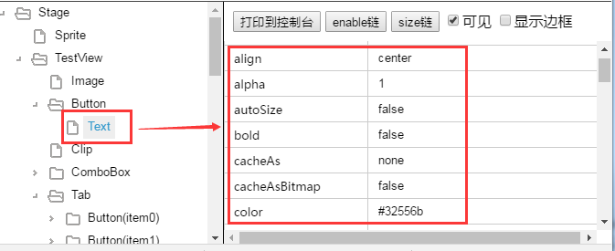

# LayaAir DebugPanel tool

### 1. Enable DebugPanel

The DebugPanel debug panel is a debug window based on Div. The `DebugPanel.init()` method of starting the debug panel is in the `laya.debug.DebugPanel` class, and can be added to any code that initializes the stage method `Laya.init()`, such as the code below:

Entry class Main.as

```java
package
{
	import laya.debug.DebugPanel;
	import laya.display.Sprite;
	
	public class Main
	{
		public function Main()
		{
			//初始化舞台
			Laya.init(1334,750);    
			//调用DebugPanel调试面板
			DebugPanel.init();
			//设置舞台背景色
			Laya.stage.bgColor  = "#ffffff";
			
			var Img:Sprite = new Sprite(); 			 
			//添加到舞台
			Laya.stage.addChild(Img);   
			Img.loadImage("res/img/monkey1.png",200); 	
		}
	}
}
```

The running effect is shown in Figure 1

 <br /> (Picture 1)


### 2. Refresh the display object node tree

By default, there is only `DebugInfoLayer`node in the display object node tree, and this node developer doesn't use it for engine developers. The object node in the product page needs to be refreshed to display it. Clicking on the `refresh` button on the  `debug panel` will display all the node tree structures on the page. As shown in figure 2.

 <br /> (Picture 2)


### 3. View the properties of the node object

Click the node in the node tree, you can view the selected node object properties on the right, as shown in Figure 3.

 <br /> (Picture 3)

**Tips**： By checking or modifying the node object property values in the debug panel, the judgment and debugging of the problem can be accelerated.


### 4. Review page elements

In addition to the node object, click the node object to view the property. By clicking on the `review element` button and clicking on the target content in the page, you can directly view the object property of the node in the right side of the debug panel. The effect is shown in figure 4.

 <br /> (Picture 4)


### 5. Modify the node object property in the debug panel

To avoid each debugging being modified in the code, compile the complex debugging process again. You can modify the attribute values directly in the DebugPanel debug panel. Then remove the attribute value input box to see the modification effect. Operation and effect are shown in figure 5.

 <br /> (Picture 5)


### 6. Node visible control

After selecting the node in the debug panel, you can **disable** the `visible click state` for that node, so it will  **not visible in the page**. Click again to `select` visible, will be re displayed, the effect shown in figure 6.

 <br /> (Picture 6)


### 7. Node red border display control

In the debug panel to the right of the `visible` is the `isplay border` control, and when checked, the node is highlighted in the page for **red border**. The effect is shown in Figure 7.

 <br /> (Picture 7)

**Tips**：*When the node's cacheAs attribute settings take effect, the display of the border check will not show a red border.*


### 8. Print the node object to the console

Click DebugPanel `Print to Console` button, the selected node object can be output to the browser's console  (*Console*), for further debugging operations in the console. The effect is shown in Figure 8.
 <br /> (Picture 8)


### 9. View the enable chain and the size chain in the console

Through the enable chain and the size chain button, you can output the enable property or size related property of the node object to the console. As shown in figure 9.

 <br /> (Picture 9)


### 10. Display and toggle large graph collection

In webgl mode, the resource engine less than `512*512`will be automatically merged into the large collection (including pictures and text information) for optimizing performance. The default upper limit of the LayaAir engine is 6 large collections, which can be optimized by looking at the amount and content of the large collection.

Check the `large picture collection` , you can see the current big picture collection, left upper solution will appear red `Atlas current number / Atlas total`, a total of two values. Uncheck and re-select, you can `switch` to the next big map collection. As shown in Figure 10.

 <br /> (Picture 10)

**Tips**：

The collection function is limited to webGL mode, this function button in Canvas mode has no effect.

The total width of a single large map collection is `2048*2048`。


### 11. Display the current cache repainting area and all the cache area

Setting a cache optimizes performance, but unreasonable cache settings can degrade performance. For example, frequent redrawing cache area, will reduce the performance.

By `displaying the current cache repaint` and `show all the cache area` can view the status of the cache statistics.

**Green is the current cache zone**, area color frame will stay for 3 seconds. The effect is shown in figure 11.

 <br /> (Picture 11)


**All cache areas are purple borders**, The regional color box shows finished immediately disappear, stay in the last cache area. The effect is shown in Figure 12.

 <br /> (Picture 12)


 

