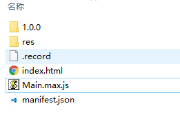

## Resource version management revision control system

​	After the project is on line, it is inevitable to update the resource version. However, the browser cache problem can cause pull resources not the latest version, inconsistent project version, resulting in abnormal operation. Therefore, reasonable management of resources, updating resources is particularly necessary. The resource version management tool provided by the LayaAir engine effectively solves this problem. Look at the specific usage below. **Note: The engine version number needs to be over 1.7.3**

​	Here we use the command line. See the next steps.

- Install nodejs, official website to download nodejs https://nodejs.org/en/。

- Install the layacmd tool. download link https://www.npmjs.com/package/layacmd。

 Here we demonstrate with the win system. Open the cmd console, enter the command line input : npm install layacmd -g

  The command line tool provides a number of functions including compiling, publishing, exporting resources, creating static servers, and so on. The tutorials are available for reference to the layacmd tutorial. Here we will take the function of resource management to illustrate.

- Create a new LayaAir project. Here we take the as language as an example.

  Then go to the H5 directory, new folder res, the resources are placed in the res directory, where we casually add a few resources. Here we add a sound folder, which contains a sound file A.mp3, the outer layer put a img folder, put a picture of 1.png picture.

  In the bin/h5 directory, open the command line, enter the `layacmd resourceVersion -i res -o . -n 1.0.0`. Here -i represents the resource path, -o . Represents the version resource output path as the current path, and of course, the developer can customize the output path, such as defining the path as a version folder, and so on. The -n 1.0.0 initialization version is 1.0.0. After entering the carriage, we saw several files and folders generated. As shown in fig. :

  

  1.0.0 Folder, which is the 1.0.0 version of the resources `.record` Document is the file MD5 information is deleted! With `manifest.json` , can have the version number of the resources recorded in the file.

  See below how to use in the program.

  ```java
  package
  {
      import laya.net.Loader;
      import laya.net.ResourceVersion;
      import laya.utils.Handler;
      
      public class Main
      {
          //设置资源配置文件的地址，我这里加了随机参数，保证每次加载的都是最新的。
          private var configUrl:String ="manifest.json?"+Math.random();
          public function Main()
          {
                Laya.init(500,500);
                ResourceVersion.enable(configUrl,Handler.create(this,this.completeHandler));
          }
          private function completeHandler(e:Object):void
          {
             Laya.loader.load([{"url":"res/sound/a.mp3","type":Loader.BUFFER}],Handler.create(this,loadSound));
          }
          private function loadSound():void
          {
              var obj:Object = Laya.loader.getRes("res/sound/a.mp3");
              
          }
          
      }
  }
  ```

  After initializing the engine, the first thing we need to do is load the `manifest.json`. The engine provides the appropriate method to enable version management.

` ResourceVersion.enable` is passed through the path of the manifest.json file, and the ResourceVersion class rewrites the URL.customFormat method. When the load resources, it will match the version number of the resources inside the manifest.json, loading. After loading the manifest.json file, start the formal logic of our project.

​	We load a sound file in the project logic. Compile and run the code above. Open the Google console. See the information about loading files. As shown in fig.:


​		You can see that the resources are loaded under the `1.0.0/res/sound/a.mp3` folder. We're adding a resource to create a new text file. It's calleddata.data. Add it to the res/data/data.data file. Loading code is as follows:

```java
package
{
    import laya.net.Loader;
    import laya.net.ResourceVersion;
    import laya.utils.Handler;
    
    public class Main
    {
        
        private var configUrl:String ="manifest.json?"+Math.random();;
        public function Main()
        {
              Laya.init(500,500);
              ResourceVersion.enable(configUrl,Handler.create(this,this.completeHandler));
              
        }
        private function completeHandler(e:Object):void
        {
           var obj:Object = Laya.loader.getRes(configUrl);
           var data:Array =[
               {"url":"res/sound/a.mp3","type":Loader.BUFFER},
               {"url":"res/data/data.data","type":Loader.TEXT}
           ]
           Laya.loader.load(data,Handler.create(this,resComplete));
        }
        private function resComplete():void
        {
            
        }
        
    }
}
```


​	Compile the code above and open the Google manager to see the loading path.


​	From what we see, in the development mode, we still put all the resources in the res directory, the official version of the release, we use the command line tool version management.

​	

​	Next, we input the command just before the command line, assuming we are still defined as the 1.0.0 version `layacmd resourceVersion -i res -o . -n 1.0.0` look at the refresh page:


​	Discover that the resources under the 1.0.0 folder have been loaded.

​	Talking about the increase of resources, if you modify the resources? So, when we release the version, add the next version number. For example, we modify the content of data.data. And then release it

`	layacmd resourceVersion -i res -o . -n 1.0.1` Under the command line. Then refresh the page to see the loading situation.


​	**At this point, you load the resources under the 1.0.1 folder, and the A.mp3 file is not modified. He will still load the resources under the 1.0.0 folder.**

​	summary:

​	So far, we've seen that we can modify the version number as long as we have the resources modified. This will go to the appropriate folder to load the resources. The version information recorded in the manifest.json file will change.
