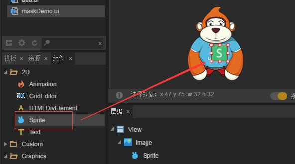
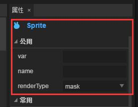
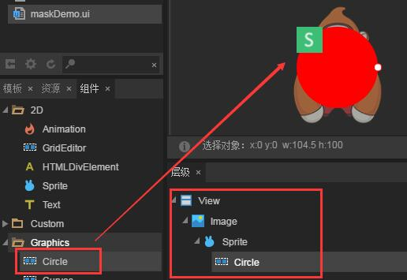
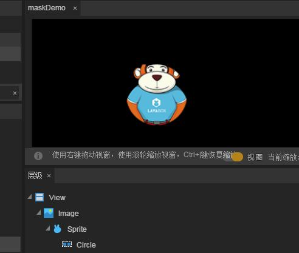
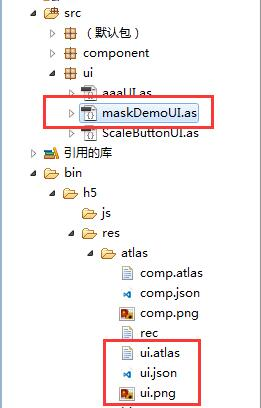

# Set Mask Properties

> Can set an object ( bitmap and vector diagram), and then apply the mask according to the object shape.
>


## A. Introduction to mask API

　　The mask attribute is located in the [laya.display.Sprite](http://layaair.ldc.layabox.com/api/index.html?category=Core&class=laya.display.Sprite#mask)  API, and the description of the property  is shown in Figure 1:

<br />(Picture 1)


## B. simple example of the mask

### 1. We first use LayaAir engine to display a bitmap

Create a MaskDemo.as entry class and set it as the default application (recommended with FlashBuilder), write the code as follows:

```java
package
{
	import laya.display.Sprite;
	import laya.resource.Texture;
	import laya.utils.Handler;
	
	public class MaskDemo
	{
		private var Res:String;
		private var img:Sprite;
      
		public function MaskDemo()
		{
			Laya.init(1136,640);
			// Set the stage background color
			Laya.stage.bgColor = "#ffffff"        
			// Resource path             
			Res = "res/img/monkey1.png";
			
			// First load the picture resource, when the image resources loaded successfully through the callback method, it is added to the stage and display the picture
			Laya.loader.load(Res,Handler.create(this,graphicsImg));          
		}
			
		private function graphicsImg():void
		{
			img = new Sprite();
			// Get picture resources and draw to canvas
			img.graphics.drawTexture(Laya.loader.getRes(Res),150,50);
			
			// Added to the stage
			Laya.stage.addChild(img);
		}	
	}
}
```

Compile operation results shown in Figure 2:

<br />(Picture 2)

### 2.2 Create a circular mask area

Creates a circular mask area through code. With the mask property, you can achieve display effects. Keep looking at the code and annotations, we will modify the 2.1  sample code to the following one :

```java
package
{
	import laya.display.Sprite;
	import laya.resource.Texture;
	import laya.utils.Handler;
	
	public class MaskDemo
	{
		private var Res:String;
		private var img:Sprite;
		
		public function MaskDemo()
		{
			Laya.init(1136,640);
			// Set the stage background color
			Laya.stage.bgColor = "#ffffff"      
			// Resource path
			Res = "res/img/monkey1.png";		
			
			//First load the picture resource, when the image resources loaded successfully through the callback method, it is added to the stage and display the picture
			Laya.loader.load(Res,Handler.create(this,graphicsImg));   
		}
		
		private function graphicsImg():void
		{
			img = new Sprite();
			// Get picture resources and draw to canvas
			img.graphics.drawTexture(Laya.loader.getRes(Res),150,50);
			
			// Added to the stage
			Laya.stage.addChild(img);
			
			
			// Create a mask object
			var cMask:Sprite = new Sprite();
			// Create a circle mask object
			cMask.graphics.drawCircle(80,80,50,"#ff0000");
          	// The location coordinates of the circle mask
			cMask.pos(120,50);
          
         	// Specify the mask effect of the img display objects
			img.mask = cMask;
			
		}
	}
}
```

Operational results shown in Figure 3:

 <br />(Picture 3)

By comparing the code, we found that the implementation mask is simple. Now we will assign the created display object cMask to mask object property of the img object.


## C. set the mask in LayaAirIDE

> In addition to setting the mask directly in the code, you can also easily set the mask for the object through LayaAirIDE. Here we follow the steps instructions.

1. Create a UI page `maskDemo.ui`, import the resource. *(for further details implementation, please refers to the IDE section in UI creation and resource import related documents)*


2. Drag a `Image` component into the scene editing area in the resource panel, as shown in Figure 4

 <br /> (Picture 4)


3.  double click into the Image component and then drag  component panel into the  Sprite component, as shown in figure 5.

 <br /> (Picture 5)


4. Select the `Sprite`component, in the right properties panel,set the common attribute `renderType` to `mask`, as shown in Figure 6.

 <br /> (Picture 6)


5. double-click into the `Sprite` component,  and then drag the component panel into a `Graphics` circular to adjust the location and size. The hierarchy is shown in figure 7.

 <br /> (Picture 7)


6. Double-click in any blank area of the editing to exit the `Image` component, you can see the effect of the mask, as shown in Figure 8.

 <br /> (Picture 8)


## D. Apply the mask of the LayaAirIDE settings in the project

### 1. release UI

　　In the IDE interface, press `F12` to publish the mask effect of the UI page, will be generated in the `src/ui`directory UI class, and `bin/h5/res/atlas` directory under the Atlas file, as shown in Figure 9.

 <br />(Picture 9)


### 4.2 use the IDE to generate the class and Atlas, to achieve mask effect

　　Create an entry class `Main.as`, encoded as follows:

```java
package
{
	import laya.net.Loader;
	import laya.utils.Handler;	
	import ui.maskDemoUI;
	
	public class Main
	{
		public function Main()
		{
			// Initialize the stage
			Laya.init(1136,640);
			// Set the stage background color
			Laya.stage.bgColor = "#ffffff"    
				
			// Load Atlas resources first，Draw the picture by the callback method and add it to the stage
			Laya.loader.load("res/atlas/ui.atlas",Handler.create(this,onLoaded));
			
		}
		
		private function onLoaded():void
		{
			var cMask:maskDemoUI = new maskDemoUI();
			Laya.stage.addChild(cMask);
		}
	}
}
```

Operational results shown in Figure 10, we quickly achieve the effect of the mask.

 <br /> (Picture 10)

