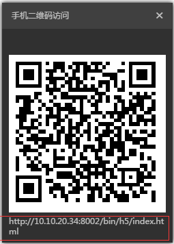

# JSONP reads data across domains

Web developers have basically used JSONP. So what is JSONP? Is it also a data format? What  relationship does it have to do with JSON? LayaAir doesn't support JSONP? Here are the answers to these questions one by one.


### 1. what is JSONP

JSONP (JSON with Padding) is a "use mode" of JSON, which allows web pages to obtain data from other domain names (websites), that is, cross domain reading of data. Why do we need a special technology (JSONP) to access data from different domains (sites)? This is because of the homologous strategy. Homology strategy, which is a well-known security policy proposed by Netscape, is now used by all browsers that support JavaScript.

As you can see from the definition, JSON is a data interchange format, and JSONP is a cross domain data interaction protocol. One is to describe the format of information, one is the method of mutual agreement between the two sides of information transmission, and it can be used to solve the problem of cross domain data access of mainstream browsers. The homologous strategy, generally located in the xxx.com and non xxx.com server page can not communicate, and the DOM element HTML is an exception, generally those with a SRC attribute DOM element from the cross domain restrictions.<script> The tag SRC, using this SRC page, allows you to get JSON information that is dynamically generated from other sources, and this usage pattern is called JSONP. The data captured with JSONP is not JSON, but arbitrary JavaScript data, executed with the JavaScript interpreter instead of using the JSON parser.


### 2. how to use?

1.In the client call, the URL Service that provides the JSONP support gets the JSONP format data.

Developer can visit http://www.layabox.com/?jsonp=callbackFunction

Suppose the client-side side expects to return the JSON data: [“data1”，data2]

Then really go back to the client-side with Script Tags:callbackFunction(["data1","data2"])

Therefore, the client-side can write this way:

Add the following labels to your HTML page:

```javascript
<script type = "text/javascript" src = ">
```

Callback method for your JavaScript file can be written like this:

```javascript
<script type = "text/javascript">
function callbackFunction(data1,data2)
{
  //Write your callback logic here
}
</script>
```

So how do you write and use it in LayaAir? In fact, it is very simple, we need to use a server here to see the effect. Server, we select nodejs to build a simple server, nodejs installation here no longer explain in detail. You can refer to nodejs's official website or your own search information.

After the installation of nodejs we write a simple js script can create a simple server. The code is as follows:

```javascript
var http = require("http");
var sever = http.createServer(function(req,res){
  res.end("LayaSample.onComplete()");
});
sever.listen(9090)
```

```javascript
res.end("LayaSample.onComplete()");
```

This means that the server returns to the client LayaSample.onComplete () and executes the function.

Through a few lines of code to create a simple server, and then open the command line, use nodejs to run the js file or script. You can see the server started.


Next, we write the front end logic. Open the LayaAir IDE, create an empty project, select the language AS3, and the specific code is as follows:

```java
package
{
	import laya.utils.Browser;

	public class LayaSample
	{
		public function LayaSample()
		{
			Laya.init(100,100);
			var script:* = Browser.createElement("script");
			Browser.document.body.appendChild(script);
			script.src = "http://localhost:9090/?a=1";
		}
		public static function onComplete():void{
			trace("JSONP is executed here");
		}
	}
}
```

```java
var script:* = Browser.createElement("script");//The meaning of this sentence is to create a script tag, where all native DOM elements can be created
```

```java
Browser.document.body.appendChild(script);// create the script tag to add to the body.
```

```java
script.src = "http://localhost:9090/?a=1";//Sets the remote access address for script. This sentence can be applied to the server we just created.  Use Google to open the QR code address generated by LayaAirIDE.
```

<br/>

Then F12 opens the Google console and finds the output "JSONP executes here"; that is, the function of our onComplete is executed. This completes the function of JSONP.
