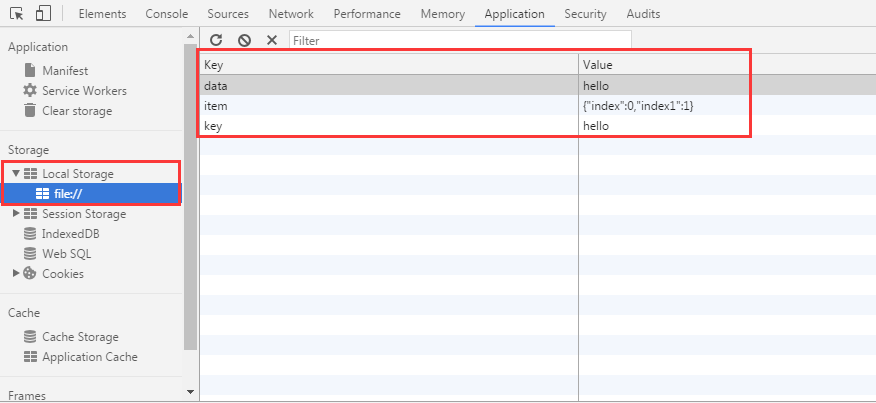

# Web Storage data storage

HTML5 provides two new ways to store data on the client side:

**localStorage - There is no explicit time limit for data storage**

**sessionStorage - Data storage for a session**

The data stored inside the sessionStorage is cleared at the end of the browser session (browsing session), i.e., when the browser is closed.

Before that, it was all done by cookie. However, the Cookie size is limited to 4K and is not suitable for storing large amounts of data, and they are passed by each request to the server, which makes Cookie very slow and inefficient. The role of Coolie is to interact with the server and exist as part of the HTTP specification, and Web Storage is just for storing data locally.

In HTML5, data is not passed by each server request, but is used only when data is  requested. It makes it possible to store large amounts of data without affecting the performance of the site.

For different sites, the data is stored in a different area, and a website can only access its own data. So we can use local data storage LocalStorage entirely. The LayaAir engine encapsulates LocalStorage, and the corresponding class is LocalStorage. Here's a simple example to see how it works.

```java
package
{
	import laya.net.LocalStorage;
	import laya.utils.Browser;

	public class LayaSample
	{
		public function LayaSample()
		{
			Laya.init(100,100);
			LocalStorage.setItem("key","hello");
			var data:Object = {"index":0,"index1":1};
			var str:String = JSON.stringify(data);
			LocalStorage.setItem("data","hello");
			LocalStorage.setItem("item",str);
		}
	}
}
```

After running in chrome, press the shortcut key F12, and the result is shown below:

<br/>

As you can see from the figure, all the data is stored

We'll erase the data below, as shown in the code below:

```java
LocalStorage.setItem("key","hello");
var data:Object = {"index":0,"index1":1};
var str:String = JSON.stringify(data);
LocalStorage.setItem("data","hello");
LocalStorage.setItem("item",str);
LocalStorage.removeItem("data");//清除数据
```

By adding the code LocalStorage.removeItem ("data"); key  value for the data to clear, and compile and run, found data data will be gone. As shown below:

<br/>

If we need to clean up all the data, add a line of code at the end of the original code:

```java
LocalStorage.clear();
```

After compiling, you will find all data stored in the name of the previous domain disappears, as shown in the following figure:

<br/>

sessionStorage in the LayaAir engine is not encapsulated, and can be used directly. The following shows how to use sessionStorage in the LayaAir. In following example is a page counter that counts the number of times a user visits a page in the current session:

Open LayaAirIDE to create an empty project. The specific code is as follows:

```java
package
{
	import laya.utils.Browser;

	public class Test
	{

		public function Test()
		{
			Laya.init(100,100);
			var sessionStorage:* = Browser.window.sessionStorage;
			if(sessionStorage.pagecount){
				sessionStorage.pagecount = parseInt(sessionStorage.pagecount)+1;
			}
			else{
				sessionStorage.pagecount = 1;
			}
			trace(sessionStorage.pagecount);
		}
	}
}
```

var sessionStorage:* = Browser.window.sessionStorage;这句话的意思就是获取当前页面中的sessionStorage会话对象。


The logic here is to determine whether the current session object has an pagecount property, which does not exist. For the first time, it opens to 1. If it exists, it is already open and accumulated.  And outputs the cumulative number of times. Compile this file, and then run with Google, F12 open console, found that the output is 1, and then we constantly refresh the page, found that the number of output is constantly accumulated and increase. Then we closed the Google browser, re opened the page, found that at this time the output is 1, constantly refresh the page, and the cumulative number is added. From this we can see that sessionStorage is a storage object at the session level. Closing the browser disappears/reset
