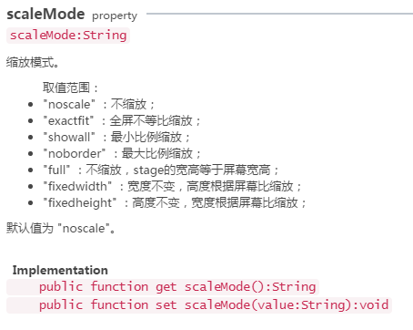
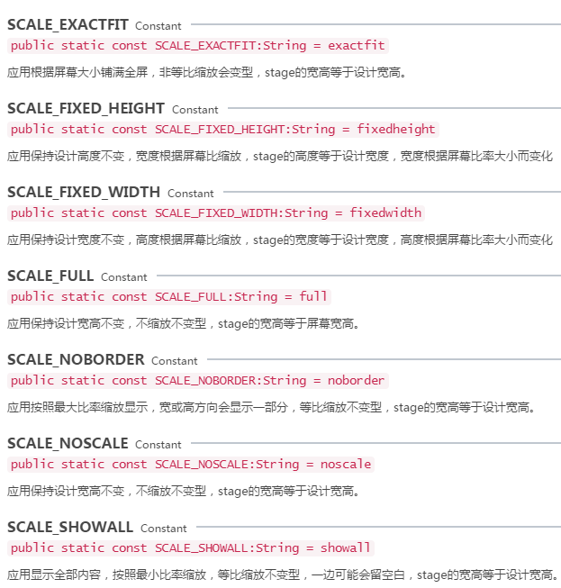
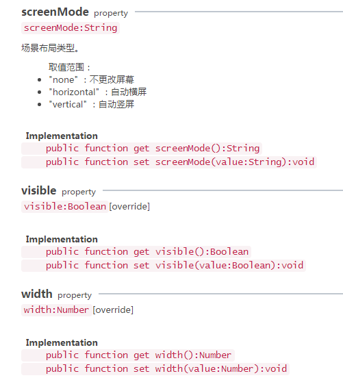

# Screen adaptation API overview

　　With the mobile device (cell phone, tablet, TV) increased, equipment fragmentation, the degree resolution of the screen is also increasing, and we want to explore now how the game display in a relatively large screen surface.

​	In order to get a better understanding of the screen adaptation, we start with the Iphone screen resolution development:

　　In previous mobile devices, the screen pixels are relatively low, such as Iphone3, whose resolution is 320 x 480, and on Iphone3, a pixel equals a screen physical pixel. Later with the device screen pixel density is more and more high, starting from iPhone4, Apple launched the Retina screen resolution to 640 * 960, doubled, but the screen size did not change, which means the same size on the screen, the pixel is doubled, the increase is devicePixelRatio, other Android mobile the equipment is also similar.

　　So we come up with a formula:    ` physical resolution = pixel resolution *devicePixelRatio`;

　　The engine encapsulates the above two resolutions.

　　Device pixel Resolution: Laya.Browser.clientWidth，Laya.Browser.clientHeight;

　　Device physical resolution: Laya.Browser.width，Laya.Browser.height;

　　Physical resolution of equipment: Laya.Browser.pixelRatio;

　　 The default clientWidth obtained from the browser is not the pixel resolution, but through the zoom resolution. In order to get the correct resolution, it need to set the html page viewport meta tag, set the value of content with "`width=device-width,initial-scale=1.0,minimum-scale=1.0,maximum-scale=1.0,user-scalable=no`"。

　　In the LayaAir engine, if the page has not set the viewport tag, the engine will automatically generate one to ensure that the correct width.

　　Screen adaptation is used for every game. On the mobile device, especially the phone screen adaptation, LayaAir engine handle how to achieve the right display, first look at the relevant API “`laya.display.stage`”.

## 1. On the screen adaptation of the zoom mode settings

Screen adaptation of scaling mode is divided into seven categories, related to Figure 1, Figure 2, Figure 3:

​		 
​		Figure (1) Screen adaptation of the scaling mode

​		 
​		Figure (2) Screen adaptation of the scaling mode

​		 
​		Figure (3) Screen adaptation of the scaling mode

## 2. On the alignment mode settings

 In align mode, there are conventional horizontal alignment and vertical alignment. The related API parameters are illustrated in Figure 4, figure 5 and figure 6:
​		  
​		Figure（4）Screen adaptation of the alignment mode

​		 
​		Figure（5）Screen adaptation of the alignment mode

​		 
​		Figure（6）screen orientation of the intelligent adaptation settings

## 3. Screen orientation of the intelligent adaptation settings

The LayaAir engine can automatically set the horizontal screen or vertical screen according to the proportion displayed by the browser, which is not affected by the lock screen of the system. The related API settings parameters are shown in Figure 7 and figure 8:

​		 
​		Figure（7）adaptation of screen orientation

​		 
​		Figure（8）adaptation of screen orientation

For more instructions on `laya.display.stage` API, go to the API document : http://layaair.ldc.layabox.com/api/index.html?category=Core&class=laya.display.Stage
