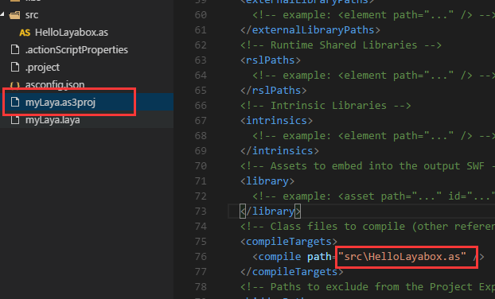
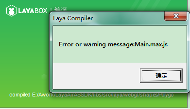

# Novice common problems encountered: error message or black screen


### 1. Wrong AS3 native reference caused error

**Problem case:**

​        After the new project in FB, configure the FB compilation environment, click environment after the application - run error, as shown in figure 1:

​        	<br/>
​        (picture 1)

**Solution :**

​         The error is due to the introduction of native Flash AS3 into the code and the inheritance of native AS3 Sprite API. The LayaAir engine supports the basic syntax of the Flash AS3 language but not native AS3 API ones with reference and inheritance.

​           <br/>
​        (picture 2)

**Suggestion :**

​        A. Right click into Project-> Properties -> build path -> delete the original flash native sdk. Verify that the Laya swc file has been introduced in the library path and is referenced in the source path into the Laya's engine library file. As shown in Figure 3, Figure 4, Figure 5.

​        B. Be familiar with the LayaAir engine API, with correct usage and development.

​           <br/>
​        (picture  3) remove original sdk

​        <br/>
​        (Picture 4) Into the LayaAir engine library compressed package with the playerglobal.swc, the path shown in picture below is use for reference only.


​        <br/>
​        (Picture 5) introduction of engine library, the path is for reference only


### 2. the document class (default program) is not set, resulting compiler error

**Problem case: **

​        <br/>
​        (Figure 6) Errors occurs in project compilation

**Solution : **

When a compile - time error occurs in Figure 6, it is certain that the document class (default program) has not been set.

**relative issues : **

​        <br/>
​        (Picture 7) In FlashBuilder, you need to set the entry program as the default application

​        <br/>
​        (Picture 8) In FlashDevelop, you need to set the entry main program as a document class

​            <br/>
​            (Picture 9) In LayaAiride, in .as3proj for the suffix of the project file to modify


### 3. Extra characters lead to error compilation

**Problem case:**

​        <br/>
​        (Picture 10)

​        After the error occurred in Figure 10, click OK and see the browser console reports error as shown in figure 11:

​        <br/>
​        (Picture 11)

**Solution : **

​        Most of these problems are caused by illegal characters.

**Suggestion :**

​        Recommended to use FlashBuilder development for  LayaAir engine AS3 language version, FlashBuilder automatic syntax check function is relatively advanced , will avoid some small inattention mistakes.


### 4. compile error due to unselected program file

**​Problem case: **

​        Click or use the shortcut keys to compile the error shown in Figure 12.

​        <br/>
​        (Picture 12)

**Solution :  **

​            Since there is no mouse, the program file is not selected, andrun directly to compile will lead to the error shown in figure 12.

**Suggestion :**

​            Select a valid program file or folder,k and recompile.


### 5.  cross-domain occurs a black screen display

**Problem case:**

​            After running the project, the browser displays a black screen, the console shown in Figure 13: 

​        <br/>
​        (Picture 13)

 

**原因：**
​              Browsers are not allowed to read files across files by default, and will involve cross-domain issues.

**Suggestion :**

​                1. local debugging solution:

​                In the Chrome browser shortcut - > right click to open the shortcut target attribute column - > added at the end of the `--allow-file-access-frome-files`

​                  2. server webServer issues:

​                   Need to modify the webServer configuration (usually most are apache, nginx, tomcat, etc.), in the request for cross domain identification to a specific domain name,  which nginx set as example :

```nginx
http {

  ......

  add_header Access-Control-Allow-Origin *;

  add_header Access-Control-Allow-Headers X-Requested-With;

  add_header Access-Control-Allow-Methods GET,POST,OPTIONS;

  ......

}

```


This will enable GET, POST, OPTIONS cross-domain request support

Can also  `add_header Access-Control-Allow-Origin http://www.layabox.com;` -- to specify the allowed url;

​                    3. If the data request cross-domain, need to modify the back-end language  to coordinate the changes, specify header request with server languages such as php. Refer to example below:

`header("Access-Control-Allow-Origin: *");` is not necessarily use`*`，`*` is to allow all hosts to cross-domain access, you can also write a specify host domain name under which have privilege to access
