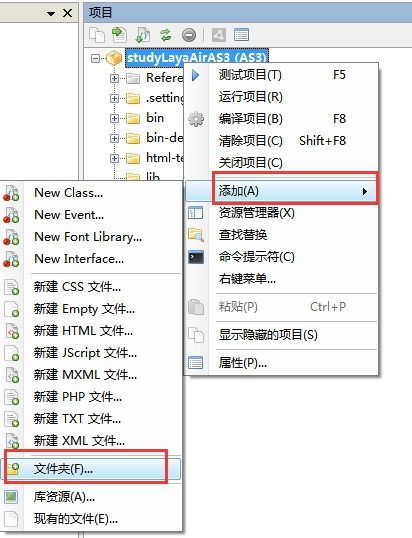
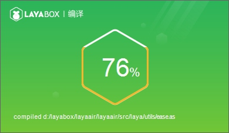
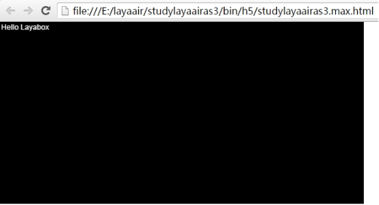

# FlashDevelop display first "Hello Layabox" program 

> ### This article uses the AS3 language to display "Hello Layabox" text in the FlashDevelop environment
> ​This is the first program tutorial with the LayaAir engine. Before you continue this article, be sure to read firstly: **FlashDevelop IDE configuration**
>
> Ensure you have read before "Create AS3 project with LayaAirIDE and directory structure explained" too.
>


## The first part is to build a new project through FlashDevelop

​    **Step 1**:  Open FlashDevelop. click "Project" in menu bar.

​    <br/>
​   (Picture 1)

​    **​Step 2** :  select "AS3 Project" type, enter the project name, choose the location path of the project, then click OK to complete the operation.

​    <br/>
​   (Picture 2)

  

## Second part is to configure the project

### 2.1 Reference engine library      

**A**. click the "Project Properties" button on the project panel to open the project properties configuration window.

​    <br/>
​   (Picture 3)

​    **B**.Click "Add Classpath", select the directory where the LayaAir engine is located, and then click "OK" to complete the reference to the LayaAir engine library.

<br/>
​   (Picture 4)

 

### 2.2 Include SWC to the library

​    When download engine archive,  we can see 3 SWC files. Located at the root path of the LayaAirFlash directory we have "playerglobal.swc" and "LayaAirFlash.swc", "glsl2agal.swc subdirectory". Playerglobal.swc is used during development by using the LayaAir engine API prompt. The other two SWC files are used for the release of the Flash version. If you don't consider publishing a Flash version, LayaAirFlash.swc and glsl2agal.swc is not necessary to include to library reference.

​    **A**.Add a libs folder under the new project studyLayaAirAS3.

​    <br/>
​   (Picture 5)

​    **B**. After extracted LayaAir archive, find in  root directory, "playerglobal.swc". Drag it through the mouse button to the newly created libs folder. Or copy and paste it under the libs folder. Right-click the SWC file, and then click left to add to "add to the library"

​    <br/>
​   (Picture 6)

 


## Third part is display text "Hello Layabox"

### 3.1 New class file HelloLayabox

​    **A**. right-click the "src directory" to add a new class. (hint: the class file added must be in the src directory, or referenced via the "Add Classpath", otherwise it cannot be compiled.)

​    <br/>
​   (Picture 7)

​    **B**. Set the class name to HelloLayabox

​    <br/>
​   (picture 8)

### 3.2 display "Hello Layabox" with HTML5

​    **A**. Set HelloLayabox.as as a document class.

​    <br/>
​   (picture 9)

​    **B**. Add a "Hello Layabox" text to the stage with code follows:

```java
package {
 import laya.display.Text;
  
 /** @author Charley */
  
 public class HelloLayabox {
  public function HelloLayabox() {
   // Create the stage with the default black background color 
   Laya.init(600, 300);
   var txt:Text = new Text();
    
   // Set text content
   txt.text = "Hello Layabox";
    
   // Set the text color to white, the default color to black
   txt.color = '#ffffff';
    
    // Add text content to the stage
   Laya.stage.addChild(txt);
  }
 }
}
```

​    **C**. When you've finished writing the code, use the compiler you configured from previous article, run code automatically with chrome with shortcut key(Alt+F5).

​    <br/>
​   picture (10)

​        Display result on Chrome :

​    <br/>
​   picture (11)

​    **D**. Although  this "Hello Layabox" has been successfully display, it is too simple. Let's add a better look with the following code :

```java
package {
 import laya.display.Text;
  
 /**
  * @author Charley
  */
 public class HelloLayabox {
  public function HelloLayabox() {
   //Create the stage with the default black background color 
   Laya.init(600, 300);
   var txt:Text = new Text();
   txt.text = "Hello Layabox";
    
    // Set the text color
   txt.color = '#FF0000';
   // Set the size of the text font in pixels
   txt.fontSize = 66;
    
   // Set the font stroke
   txt.stroke = 5;  // Set it at 5 pixels
   txt.strokeColor = '#FFFFFF';
    
   // Set bold type
   txt.bold = true;
    
   // Sets the coordinate X,Y display start point of the text.
   txt.pos(60, 100);
    
   // Set stage background color
   Laya.stage.bgColor = '#23238E';
    
   //Add text content to the stage 
   Laya.stage.addChild(txt);
   
  }
 }
}
```

​    The results are shown below:

​    <br/>
​   picture (12)


**At this point, if you can follow this tutorial, succesfully display your program so congratulations! We have completed the first HTML5 program developed by AS3 language in LayaAirIDE,  with correct environment configuration with LayaAir. 
For more LayaAir engine development API usage, please go to the official website Layabox Developer Center to view online API and online DEMO**
