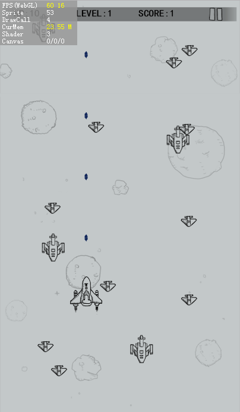

# 1.  demand analysis and resource preparation of the 《aircraft war》 project

>  This tutorial is different from the old version of 《WeChat aircraft war》 video tutorial. It has been developed by LayaAirIDE editor. It has increased the function and production tutorials of process UI, reduced the amount of code, and optimized the program structure. Developers who have studied video tutorials can also be reorganized and learned in this tutorial.

###preamble

​	Remember that wechat game 《aircraft war》 can be played directly in WeChat without downloading, and you can also share your own rankings. Countless people are crazy about it. This is the charm of HTML5 games and spread it easy.

​	In accordance with the ideal of paying tribute to the classics, the author will demonstrate how to use LayaAir to develop fast and reproduce classic games.  First statement: the game scenes and character resources all for the original developer, this case only for research purposes, source code and asset resources are not for commercial using.

**Game demo address**: [http://layabox.github.io/layaair-examples/](http://layabox.github.io/layaair-examples/)

Game source code：[https://github.com/layabox/layaair-doc/tree/master/project/AS3/AirWar](https://github.com/layabox/layaair-doc/tree/master/project/AS3/AirWar)

 （Picture 1） 

 （Picture 2）

 （Picture 3）

### 项目需求分析

​	At the beginning of all game projects, the analysis of project requirements occupies a larger proportion of time. After planning the needs of the project, experienced programmers will also build their own logical mind map, which will make the program structure more reasonable and have clearer development ideas.

​	Therefore, this tutorial provides a basic logical thinking map based on development requirements as a reference. It is suggested that developers develop the habit of project development planning.

 （Picture 4）

​	According to the above thinking map analysis, we get the following development ideas ：

1. The visualization of material production, is divided into two parts : First is the editor of UI, art production renderings, IDE output and naming rules, images, and then UI page editing. Second is the visual character animation, character animation production through the IDE timeline. We can see obviously that program called directly generated animation files can also reduce the amount of code.
2. Game process control, processing game start, game, game end interface process page, and the realization of its UI function.
3. The main logic functions of the game are developed step by step, game map, game role, game manipulation, game logic, game upgrading, and so on.

​        After the basic development idea, let's begin the game preparation work first!

### New LayaAir project

​	Open LayaAirIDE, create an empty project. As shown in Figure 5, the project name can be customized. This example is ActionScript 3 language version, and the other languages are the same. After clicking the Create button, the project directory will appear in the default "code mode" project manager of IDE.

 （Picture 5）

​	Project directory structure and how to create projects and environment configuration with LayaAirIDE, ”technical document 2D foundation chapter quick start“ has already talked about here is no longer talk about it. Students do not understand the proposal to take a look.

​       Edifice begins with a single step, everything must have a beginning, from simple to difficult, we start from the processing of fine arts resources.

 

### Game resource preparation

​	Open the generated project, click into the ”design mode“, and drag the picture resources made by the art to the ”resource manager“. Or the right button opens the directory and copies it into the directory ”...\AirWar\laya\assets“, after the copy is completed, the editor is refreshed (the shortcut key F5).

　　In the resource manager, each folder automatically generates a packaged atlas resource when the editor exports (shortcut F12). It is suggested that the size of the atlas do not exceed 1024x1024, if the single map is more than 512x512, it is suggested not to pack. Open menu ”**item set**“ panel (shortcut key F9) for the size limit of the automatic album atlas.

​	Game resource folder and resource size management are more important, well handled, loading speed will be faster and more efficient. For example,  making the game's resource material  (Figure 6) we divided into two folders, UI resource folder and character animation resource folder, and a background map of more than 512 is not packaged.

  （Picture 6）

　　In the game UI resource folder (Figure 7),bj.jpg background resource is smaller, you can zoom through the 9th gridsize zoom. The button text is separated from the btn_bg.png button background, and the button background can be repeatedly used to save resources.

   （Picture 7）
（Picture 6）

The gameRole folder contains only character animation resources (Figure 8) for animation in the IDE.

 （Picture 8）

### Game resource release

When the resource file is ready to try to release resources (shortcut key F12), generate the Atlas resource directory ：”...\AirWar\bin\h5\res\atlas“下（Picture 8）, corresponding image resources can be obtained by loading the.Atlas or.Json files in the game program.

 （Picture 8） 

Through the above steps we clearly clarify the idea of the project development, and prepare the game art material resources. Then began to formally enter the game production process, first from the visual UI and animation production.
