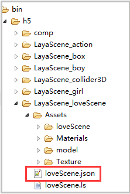

## LayaAir3D release resource


### Why should the release of resources

In LayaAir 3D game development, resource release is very important. 3D resources including models, textures, materials, animation and so on, in order to achieve a good picture effect, the file is much greater than 2D, while the 3D engine basically all resources will be calculated into GPU rendering, so take a lot of memory. Continuous loading when the points of the game, the game continues, more and more resources into the memory, if you do not release the resources, then the game will eventually collapse.

Unlike RAM memory, memory garbage collection mechanism, and memory is not the same, must be manually released, so the memory resource release must be taken seriously!

Observe the memory size in the statistics tool in Figure 1 and Figure 2

Figure 1 shows the first scene loaded after the game starts, with a face count of 30527 and memory usage of 85.2M.

<br>（Picture 1）

Figure 2 is the second game loading scene, the number is only 7455, but after the loading of memory resources but 118.91M. What is the reason for this? Face a few small scenes, texture is also in Figure 1 the scene a lot less, lightmap is much smaller, but the memory resources are greater!

This is because the first scene has not been released, its resource is still in memory, so the memory usage becomes large. If you do not manually clear, the game continues to switch to other scene, when reaching a certain amount, mobile phone memory will be depleted, the game stuck, flash back, fever phenomenon is frequent.

<br>（Picture 2）


### 加载资源时处理原则

通过上图的例子我们可以看到LayaAir3D引擎处理资源与显存的关系，为了达到游戏性能优化目的，在加载资源时也要注意一些原则。

1、加载资源时不要一次性把所有资源全部加载，只加载需要资源（分段加载模式）。3D资源加载完成后会根据资源后缀名称直接创建出3D显示对象，比如.ls会创建出Scene，.lh会创建Sprite3D对象等，创建好的对象资源哪怕是没有放到舞台上，也会直接放入显存当中，因此资源过多会占有大量显存。

2、合理管理显存，经常反复使用的资源在显存中不需要释放，而不反复使用的资源在使用完后立即释放以节省性能开销。比如主角资源，3D道具资源，玩家经常使用，可以一直存放在显存中，提取速度快；而一些大型场景，在切换时可以释放掉资源，场景关卡贴图、模型资源都较大，释放后能省几十上百兆大小的显存开销。


### Handles principles when loading resources

The release of memory resources in two ways, one is to release the memory resources through the object, but the object traversal resources too much trouble, this is not recommended, the other is to release the memory resource through address, from the resource management perspective, through the resource address method is more flexible and can be configured to manage JSON data table.

#### Transition interface for switching scene and releasing resources

When loading resources and switching scenes, we make a progress display interface for the transition in IDE, as shown in Figure 3

<br>（Picture 3）

After the IDE is published, a control class is written, and the logical code is referenced as follows:

```java
package view
{
	import ui.ProgressBarUI;
	
	public class AssetLoadView extends ProgressBarUI
	{
		/**资源加载进度***/
		private var progress:int=0;
		
		public function AssetLoadView()
		{
		}
		/**
		 * 初始化，进度计时
		 */	
		public function init():void
		{
			progress=0;
			//进度增加的帧循环
			Laya.timer.loop(20,this,onLoop);
		}
		/**
		 * 资源加载进度模拟（假进度）
		 */		
		private function onLoop():void
		{
			//进度增加
			progress++;
			//最高100%进度
			if(progress>100)
			{
				progress=100;
				this.tips.text="游戏加载完毕，即将进入游戏..."
				Laya.timer.clearAll();
				this.removeSelf();				
			}else
			{
				this.pro.value=progress/100;
				this.tips.text="游戏正在加载中，当前进度为："+progress+"%!"
			}
		}
	}
}
```


#### Address table memory resources by resource release

In the main class, we have to double click on the stage scene mode switching method using memory address resources, release resources, and loading a new scene.

Through the resource path list method is flexible, you can through configuration table, add delete resources is also very convenient. For example, when the art export scene, a new JSON table, the scene after the switch does not need the resource path is placed in the J table, useful resources into the table, the resources are not released, such as some public NPC, props, special effects and other game element resources.

Tips：resources include: scene light mapping lightmap, material .lmat, model .lm, various types of maps .png or.jpg, animation .lani, skeletal .lav and other resources

Here we introduce the resource table method, first in the export of the resource file directory to establish JSON file and edit the path resources to be released, form a json array, the name consistent with the .ls file, so that the logic call, in this case for  loveScene.json. (Picture 5, 6)

<br>（Picture 5）

<br>（Picture 6）

After the Json editing is completed, check tool checking format is correct. Then create the main class code as follows:

```java
package
{
	import laya.d3.core.Camera;
	import laya.d3.core.Sprite3D;
	import laya.d3.core.scene.Scene;
	import laya.d3.math.Vector3;
	import laya.display.Stage;
	import laya.events.Event;
	import laya.net.Loader;
	import laya.resource.Resource;
	import laya.utils.Handler;
	import laya.utils.Stat;
	
	import view.AssetLoadView;

	/**
	 * 资源释放示例
	 */	
	public class LayaAir3D_AssetsDespose
	{
		/***3D场景****/
		private var scene:Scene;
		/***3D摄像机****/
		private var camera:Camera;
		/***3D角色****/
		private var role:Sprite3D;
		/***2D加载进度界面（假）****/
		private	var progress:AssetLoadView
		
		public function LayaAir3D_AssetsDespose()
		{
			//初始化引擎
			Laya3D.init(1334, 750 ,true);
			//画布垂直居中对齐
			Laya.stage.alignV = Stage.ALIGN_MIDDLE;
			//画布水平居中对齐
			Laya.stage.alignH = Stage.ALIGN_CENTER;
			//等比缩放
			Laya.stage.scaleMode = Stage.SCALE_FIXED_AUTO;
			//自动横屏，游戏的水平方向始终与浏览器屏幕较短边保持垂直
			Laya.stage.screenMode = "horizontal";
			//开启统计信息
			Stat.show();
			
			//加载2D资源
			Laya.loader.load("res/atlas/comp.atlas",Handler.create(this,on2DComplete));
		}
		
		/**
		 * 加载2D资源完成回调
		 */	
		private function on2DComplete():void
		{
			//实例化加载进度页面
			progress=new AssetLoadView();
			progress.init();
			progress.loadTitle.text="资源加载与释放示例";
			Laya.stage.addChild(progress);
			
			//加载第一关场景角色3D资源(不能全部加载，否则太占显存)
			Laya.loader.create([{url:"LayaScene_loveScene/loveScene.ls"},
								{url:"LayaScene_girl/girl.lh"}],Handler.create(this,on3DComplete));
		}
		
		/**
		 * 加载3D资源完成回调 
		 */		
		private function on3DComplete():void
		{
			//实例化场景
			scene=Laya.loader.getRes("LayaScene_loveScene/loveScene.ls");
			Laya.stage.addChild(scene);
			Laya.stage.setChildIndex(scene,0);
			
			//实例化摄像机
			camera=new Camera();
			//移动摄像机位置
			camera.transform.translate(new Vector3(-1, 2, 15));
			//设置摄像机视野范围（角度） 
			camera.fieldOfView=25;	
			camera.transform.lookAt(new Vector3(-1,0,0),new Vector3(0,0,0));
			scene.addChild(camera);

			//实例化角色添加到场景
			role=Laya.loader.getRes("LayaScene_girl/girl.lh");
			scene.addChild(role);

			//双击游戏画面切换场景
			Laya.stage.on(Event.DOUBLE_CLICK,this,onChangeScene);
		}
		
		/**
		 * 加载第二关场景资源，切换场景 
		 */	
		private function onChangeScene():void
		{
			//去除双击事件监听
			Laya.stage.off(Event.DOUBLE_CLICK,this,onChangeScene);
			
			//切换场景加载界面
			progress.init();
			progress.loadTitle.text="正在切换场景，请稍后"
			Laya.stage.addChild(progress);
			
			//移除摄像机与角色
			scene.removeChild(camera);
			scene.removeChild(role);
			
			//列表释放显存资源方法（释放的资源配置表）
			assetsDispose("LayaScene_loveScene/loveScene.json");
			
			//销毁之前场景
			scene.destroy();
			
			//加载第二关场景资源到游戏中
			scene=Scene.load("LayaScene_scene02/scene02.ls");
			Laya.stage.addChild(scene);
			
			//摄像机的位置与对准目标
			camera.transform.position=new Vector3(-1, 1, 8);
			camera.transform.lookAt(new Vector3(-1.5,0.5,0),new Vector3(0,0,0));
			
			//添加摄像机与角色到新场景
			scene.addChild(camera);
			scene.addChild(role);
			role.transform.position=new Vector3(-1, 0, -3.5);
			
			//设置场景层级在最下层
			Laya.stage.setChildIndex(scene,0);
			
			//现有显存中的资源
			trace("现有显存中的资源:",Loader.loadedMap)
		}

		/**
		 * 列表释放显存资源方法(利用资源表方式，每个场景配置资源路径表)
		 * @param target3D 需要释放资源的对象资源表assetsUrl:String
		 */		
		private function assetsDispose(assetsUrl:String):void
		{
			//加载盘释放的资源配置表
			Laya.loader.load([{url:assetsUrl,type:Loader.JSON}],
                             Handler.create(this,onAssetsOK,[assetsUrl]));
		}
		
		/**加载资源释放表完成后**/		
		private function onAssetsOK(assetsUrl:String):void
		{
			//获取加载的数据（Json数组转化成数组）
			var arr:Array=Laya.loader.getRes(assetsUrl);
			for(var i:int=arr.length-1;i>-1;i--)
			{
				//根据资源路径获取资源（Resource为材质、贴图、网格等的基类）
				var resource:Resource=Laya.loader.getRes(arr[i].url);
				//资源释放
				resource.dispose();
			}
		}
	}
}
```

Observe the above code assetsDispose (assetsUrl:String) method, after loading the configuration table, we use Laya.loader.getRes (arr[i].url) method for direct access to resources of the object (created will produce different types of objects, according to the URL suffix getRes method can be directly read out), they are a subclass of Resource, so called dispose (object I can release resources) method.

After releasing the resources, you can also view the resources in the existing cache through the Loader.loadeMap attribute.

Compile and run the above code we can see in Figure 4, the release is completed and when loading a new scene, much less memory usage than before. Before the release of resources for 118.91M, after the release of memory accounted for only 56.11M.

<br>（Picture 4）
