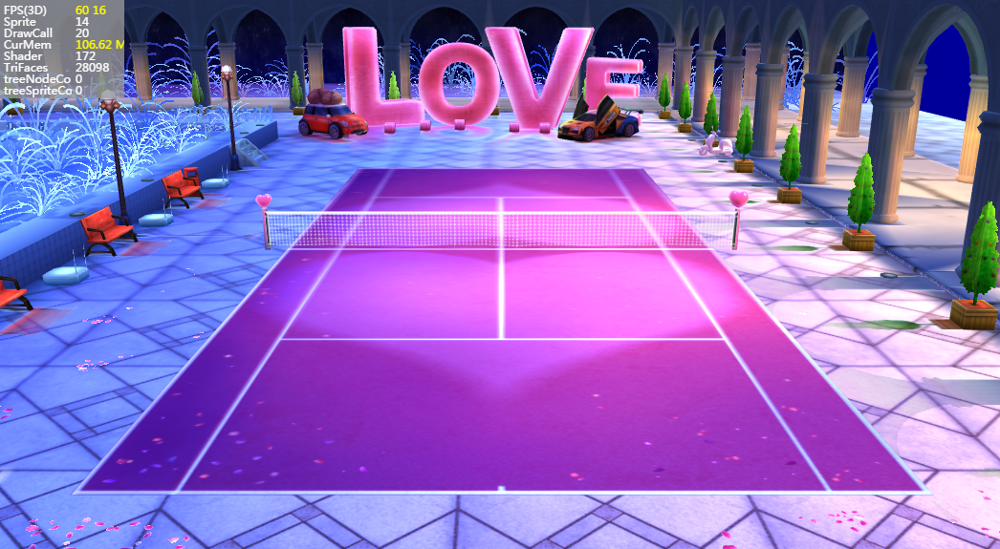
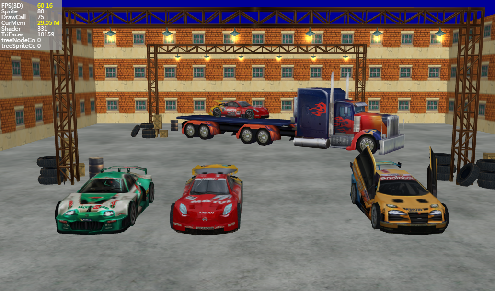

## LayaAir3D Scene

The scene is the 3D world container of the LayaAir engine, used to render the game's 3D screen and load  various 3D elements. The camera, light, characters, objects and so on. In the game need to be put into the scene to display the picture, which is equivalent to a game 3D player or 3D view.

Through the inheritance of Scene we can see that it is inherited from the Sprite class. So it's easy to treat it as a display object in 2D.

In the LayaAir engine, 3D and 2D can be mixed to create Scene 3D scenes and Sprite 2D containers or elements that can be loaded on the the stage simultaneously.

In the "quick start 3D" course, we built a basic 3D application and added the main components. In this lesson, we will introduce the fog function of the scene, and the scene file loading method generated by the LayaAir export tool in unity.


### Loading scene resources

The following code in the "LayaScene_01/loveScene.ls"  file is unity3D layaAir export plug-in select Export ”Scene“ category generated file extension .ls (understood as laya scene shorthand). Light maps for the scene are stored inside, multiple or single included model files, and more. Scene.load () method can be loaded directly into the scene and displayed.

```java
package {
	import laya.d3.core.Camera;
	import laya.d3.core.scene.Scene;
	import laya.d3.math.Vector3;
	import laya.display.Stage;
	import laya.utils.Stat;
	
	public class LayaAir3D {
		
		public function LayaAir3D() {
			
			//Initialization engine
			Laya3D.init(0, 0,true);
			Laya.stage.scaleMode = Stage.SCALE_FULL;
			Laya.stage.screenMode = Stage.SCREEN_NONE;
			Stat.show();
          
            //Load plug-in export scenarios.
			var scene:Scene=Scene.load("LayaScene_01/loveScene.ls");
          	Laya.stage.addChild(scene);
          
            //Create camera (horizontal to vertical ratio, close clipping, far distance clipping)
			var camera:Camera = new Camera( 0, 0.1, 1000);
			//Load to scene
			scene.addChild(camera);
			//Position of the camera position
			camera.transform.position=new Vector3(0, 5, 23);
			//Rotate the camera angle
			camera.transform.rotate(new Vector3( -17, 0, 0), true, false);
			//Set camera field of view (angle)
			camera.fieldOfView=35;
			//Set the background color
			camera.clearColor = new Vector4(0,0,0.6,1);			
			//Add camera motion control script
			camera.addComponent(CameraMoveScript);
			
			//Create directional light -------------------
			var light:DirectionLight = scene.addChild(new DirectionLight()) as DirectionLight;
			//Move the light position
			light.transform.translate(new Vector3(0,2,5));
			//Adjust the light direction
			light.direction = new Vector3(0, -.5, 1);
			//Set the light environment color
			light.ambientColor = new Vector3(2.5, 2.5, 2.5); 
			//Set the light diffuse color
			light.diffuseColor = new Vector3(0.3, 0.3, 0.3);
			//Set the highlight color
			light.specularColor = new Vector3(0, 0, 0);

		}		
	}
}
```

The compile and debug sample code shows a beautiful scene on the screen (Figure 1).

<br> （Picture 1）


### Scene resource preloading

The above example Scene.load () method is the asynchronous loading of resources, and sometimes 3D resources are relatively large, need to preload to enhance the experience of the first screen. At this point, we can preload the loader. 2D game resources are preloaded with the Laya.loader.load () method, and the 3D resource must use the Laya.loader.create () method, and refer to the relevant AP description.

```java
// Single resource
Laya.loader.create("res/Cube.ls",Handler.create(this,this.completeHandler));
// Bulk loading
Laya.loader.create(["res/Cube1.ls","res/Cube2.ls","res/Cube3.ls"],Handler.create(this,this.completeHandler));
// Bulk load and create different types;
Laya.loader.create([{url:"res/Cube1.ls"，"type":Scene},{url:"res/Cube2.lh","type":Sprite3D},{url:"res/Cube3.lm","type":MeshSprite3D}],Handler.create(this,this.completeHandler));
```
  In the project, generally we will adopt the loader way, you can have a good management of resources.

 Code is as follows:

  ```java
  package {
  	import laya.d3.core.Camera;
  	import laya.d3.core.scene.Scene;
  	import laya.d3.math.Vector3;
  	import laya.display.Stage;
  	import laya.utils.Handler;
  	import laya.utils.Stat;
  	
  	public class LayaAir3D {
  		
  		public function LayaAir3D() {
  			
  			//Initialization engine
  			Laya3D.init(0, 0,true);
  			Laya.stage.scaleMode = Stage.SCALE_FULL;
  			Laya.stage.screenMode = Stage.SCREEN_NONE;
  			Stat.show();
            //Because there's only one resource, so we pass in the string, and the queue can pass an array queue.
  			Laya.loader.create("LayaScene_01/loveScene.ls",
                               Handler.create(this,this.completeHandler),null,Scene);

  		}
  		private function completeHandler():void
  		{
        	// The first method captures the scene
  			// var scene:Scene=Scene.load("LayaScene_01/loveScene.ls");
          
  			// The second method is cache post loading
  			var scene:Scene = Laya.loader.getRes("LayaScene_01/loveScene.ls");
            Laya.stage.addChild(scene);
          
  			......
  		}
  	}
  }
  ```


### Foggy scene

Fog effect plays an important role in the project, is equivalent to the effect of atmosphere, it seems a kind of hazy feeling, so that the scene looks more real. LayaAir 3D engine can set the scene's fog effect visible distance (equivalent to concentration) and fog effect color. The proper use of fog can not only improve the performance of the game, but also can increase the game experience.

```java
//Open the fog effect
scene.enableFog = true;
//Set the foggy color
scene.fogColor = new Vector3(0,0,0.6);
//Set the initial position of the fog, relative to the distance of the camera
scene.fogStart = 10;
//Set the fog of the most concentrated distance.
scene.fogRange = 40;
```

Add the above logic code example, compile and run, found in the scene covered with a layer of blue fog effect (Figure 2), the farther away the thicker, to 40 meters away from the camera will be completely shrouded in fog.


<br> （Picture 2）


### Scene light map

The lightmap is the projection of the 3D model in the scene, the shadow transition, the light atmosphere, the color effects between the model material and the material, and so on.

There are very few 3D game scenes that are instantly rendered by light and model, producing projection and color effects. This is a very lossy way, especially for mobile games. The graphics capabilities of mobile phones are not powerful, and display all of them will become very jerky with instant light and shadow games.

Scene light map is to solve this problem, it is a way to simulate the game scene light and shade, reducing a lot of real-time computing.

Lightmap It is recommended to use the unity3D editor to render the lightmap and use it for export. When loading the scene, the engine will automatically load the lightmap to achieve a better effect. Figure 1 and Figure 2 use the unity export Light map.

If the unity does not render the light map, the export engine will not load error, but the game will greatly reduce the effect. Figure 3 is not used lightmap effect, figure 4 is the use of a light texture effect, we can see clearly which one is better. Light maps are also often used to simulate the sun, night scene, game atmosphere contrast effect, enhance the game experience.
  



<br> （Picture 3）


<br> （Picture 4）

The lighting map rendering method is not explained here, the mature 3D game designer will basically make the light map.

We open the resource tree directory derived from the example code above (Figure 5).

**The name loveScene folder for unity to create a light map according to the scene name generation, the resources for the scene illumination map, the original light maps for the EXR format, to be converted to a layaAir engine in JPG or PNG format, the best in the photoShop manual transformation, can be set to 8 bit color. And stored as PNG format, which can effectively reduce the size of resources, reduce the game resource loading time.**

If you did not create lightmaps in unity, no folders will be generated.

<br> （Picture 5）


If you need to use a smaller file jpg image format, converted to jpg format, you also need to modify the lls light pattern in the configuration file path, such as (Figure 6), open the scene derived data file  ”loveScene.ls" .exr format modified to .jpg, or compile the runtime engine will automatically find the png format image loading, rather than to load jpg format images.

<br> （Picture 6）


