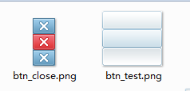

# Button component

## 1. Creating Button components

　　The button component is one of the most commonly used components that can display text labels, icons, or both. The button picture resource (button skin) in LayaAirIDE is usually prefixed with BTN, as shown in figure 1.

 （Picture 1）

### 1.1 Creating Button components directly with the engine

Using the LayaAir engine to create a Button component is relatively simple, usually only a few steps, the introduction of  `laya.ui.Button` package path, loading resources, create a Button instance, add Button to the stage, set the attributes of the Button component. Specific implementations refer to the following code and annotations.

**Create an entry class ComponentDemo.as, write the following code:**

```java
package
{
	import laya.ui.Button;
	import laya.utils.Handler;
	import laya.webgl.WebGL;
	
	public class ComponentDemo
	{
      	//按钮资源路径
		private var skin:String = "./res/img/btn_test.png";
		
		public function ComponentDemo()
		{
          	//初始化引擎，设置宽高并开启WebGL渲染模式
			Laya.init(1334,750, WebGL);
			//设置舞台背景颜色
			Laya.stage.bgColor = "#ffffff";
			//加载资源成功后，执行onLoaded回调方法			
			Laya.loader.load(skin, Handler.create(this, onLoaded));
		}
		
		private function onLoaded():void {
			
			//创建一个Button实例
			var btn:Button = new Button(skin);
			//将Button添加到舞台
			Laya.stage.addChild(btn);
			//设置Button相关的属性
			btn.width = 100;
			btn.height = 50; 
			btn.pos(100,100);
			btn.label = "按钮";
			
		}
	}
}
```

The action of the above code is shown in figure 2:

 <br/> (Picture 2)

**Tips:** Button Please refer to the property interface of component [Button API](http://layaair.ldc.layabox.com/api/index.html?category=Core&class=laya.ui.Button)。


### 1.2.Using LayaAirIDE to create Button

Using LayaAirIDE to create Button is more simple, through the visual operation of IDE, without the need of the program foundation, can realize the creation and layout of components, is also recommended to use the method of component creation. Next, we use LayaAirIDE to create the effect of a motion graph 1.

Step 1 ：create a UI page of DEMO, drag a button component resource into the scene editor in the explorer, as shown in figure 3.

 <br />(Picture 3)

Step 2 ：set the component properties, as shown in Figure 3

 <br />(Picture 4)

After setting up the two steps above, you can see the effect of moving graph 2 directly in IDE. In this process, no program code is required, and it can be submitted to art or planning. Thus reducing the communication cost with programmers, and speeding up the development efficiency of the game.


## 2. Introduction to the properties of Button components

The following document will focus on the basic properties of the Button component and the attributes that are difficult to understand through the text. But for the more easily understood attributes, this article will not mention, developers can put the mouse on the IDE property manager on the property name to stay, there will be attributes of the Tips Chinese explanation.

### 2.1 Button skin

　　The skin of the button is divided into three states, two states and a single state because of the different cutting methods. The state here refers to the state of the button skin.

　　The three state is the skin pictures in the vertical direction to the geometric segmentation form is divided into 3 parts, as shown in Figure 1, **From top to bottom**  followed by `bounce or leave the state` skin、 `Passing state` skin, `Press and select`（*hold pressed*）the state skin, three state, is commonly used in PC browsers.

　　On mobile devices, usually only two states are used, and the pictures are cut vertically into two parts in a vertical direction. The upper part is `bounce or leave state` skin, and the lower part is `passing and pressing, and the selected state`（*keep pressing*）skin.

　　The single button does not cut the picture, regardless of the state, the button's skin is only one, remain unchanged.

### 2.2 Specifies the cutting state of the button skin（stateNum）

　　The attribute value of stateNum determines the cutting mode of skin resource pictures. The default value is 3, that is to say, the default is cut by the 3 State button and divided into 3 parts. If it is a two state button, you need to set the attribute value of stateNum to 2, and cut it into 2 parts. The single button is set to 1, not cut.

　　What you need to pay attention to here is to specify the button state, which corresponds to the skin of the button. If it is the three state button skin, the stateNum is set to 2, and after cutting, as shown in Figure 5, it is wrong.

 <br />(Picture 5)


### 2.3 Specify button status (selected)

　　The selected attribute defaults to the unselected false state. Once we set the selected property to true. The button will always remain in the selected state (continue to press) without changing to other states (unless the state changes in the code).

### 2.4 Is the display status of the toggle button (toggle)

　　The toggle attribute defaults to the unselected false state. Once we set the toggle property to true. When you click the button component, the button will remain in the selected (continue pressed) state. Click again to restore.

### 2.5 According to the state of the stroke text color set Button (StrokeColor)

　　LabelStrokeColor can set up a uniform color for the text of the Button stroke (different states of the same color). Stroke text color and the StrokeColor attribute can according to the different state set Button.

　　The order of the StrokeColor colors is the format: upColor (bouncing or leaving the state of the color), overColor (after the state of color), downColor (press and select the color of the state), disableColor (forbidden to use color). As shown in figure 6.

 <br />(Picture 6)

*Tips: If you want to change a clearer sense of the color color, can be a stroke of labelStroke attribute value is set larger.*


