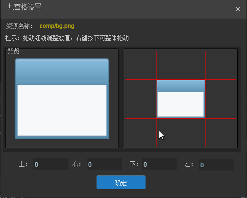
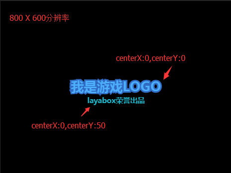
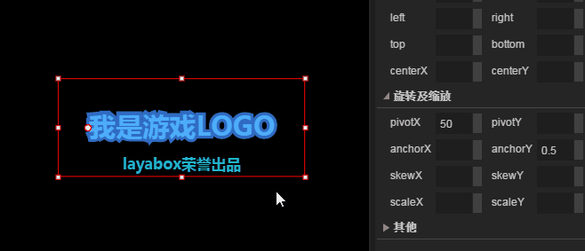
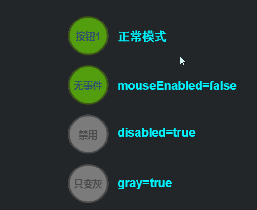

# Attribute setter

​         The attribute setter is the working area where we view and edit the component properties of the currently selected component. When you select components in the scene editor or the hierarchy manager, you will display the properties of the component in the attribute setter for query and edit.

Attribute setter panel shown in Figure 1, from top to bottom are usually: component or node name, **common** attributes, **commonly used**attributes, **width and height**, **location, rotation** , **scaling** and so on

  
​  (Figure 1) attribute panel grouping

## 1. Introduction of  `public` properties

Common attributes are usually `var`,`name`,`renderType`. As shown in Figure 2-1.

   (picture 2-1)

### 1.1 Set the global variable name

`Var` ：Creates a unique global variable name that is used to invoke this component in the code of the project.

### 1.2  Set the component identification name

`name`： the identity name of a component, which is usually used to distinguish other components in a hierarchical manager, and its parent container can also find this component by this name.

### 1.3 Set the node function type of the component

`renderType`：node function types, respectively, mask, hit, unHit, render, instance five kinds.

#### 1.3.1 Set as mask

　　When the component is set to `mask`, the component is masked, its **parent component** only mask mask area is visible, the effect shown in Figure 2-2.

　　   （Picture 2-2）

#### 1.3.2 Settings click area and non click area

　　When the component is set to `hit`, the parent component region in which the component is located can be clicked. When the component is set to `unHit`, the parent component area of the component is non-clicked area.**If the component of the point area hit is superimposed with the component of the non click area unHit**, the unHit priority is higher in the non clickable region. As shown in Figure 2-3, the non clickable region of the green circle (unHit), including a overlapping mouth area, can not be clicked. Only the red half moon area of the head can be clicked.

　　  (Picture 2-3)

#### 1.3.3  Set to List for render

　　When the component is set to `render`, the component can be rendered repeatedly for the production of List List. In the production of the list of ideas, the need to first select all components through ctrl + B Set to box container. And set the renderType property of the container to render. And then use ctrl + B to set the box as a List. As shown in Figure 2-4.

  (Picture 2-4)

#### 1.3.4 Set to single instance instance

　　When the component is set to `instance`, the component is a single instance component, and when multiple instances are reused, the singleton component will only be instantiated once. Save performance overhead.

　　

## 2. Introduction of `common` attributes

In the commonly used attributes, there are some operations are generic. Let's introduce them separately.

### 2.1 Scale grid operation (sizeGrid)

The UI is divided into 9 blocks by four straight lines. If there is a stretching operation for UI, the middle area for the calculation of the fill, and the rest of the region will maintain the original design, no matter how stretched UI will remain unchanged. It is a common function in game development.

The `sizeGrid`attribute in the commonly used attributes is the setting of the nine squares. By clicking the `grid`button on the right side of the attribute input column, you can enter the visual operation panel set up by the square lattice. As shown in figure 3-1.

   (Picture 3-1)

When you open the nine square settings, the left side is the effect preview area, the right side is the nine square visual operation area. Through the mouse drag and drop way to change the nine square filling area, immediately get preview effect, adjust click click ok. The operation is shown in figure 3-2.

   (Picture 3-2)

### 2.2 Skin Settings

`skin` property can be set to change the skin of the component. In addition to manually in the path attribute column enter the `skin`, also from the Explorer drive directly to the skin property of resource input field, fast switching of the `skin`. In addition, click the skin button on the right of the property input bar, which can quickly locate the current resource from a large number of resources. The operation is shown in figure 3-3.

   (Picture 3-3)

### 2.3 skin state cutting (stateNum)

Components such as buttons and checkBox, the skin resources of the component are composed of polymorphic vertical permutations, as shown in Figure 3-4.

   (Picture 3-4)

#### The way of skin cutting:

The three state is the skin pictures in the vertical direction to the geometric segmentation form is divided into 3 parts, as shown in Figure 3-4,**from top to bottom up** or `leave the state`of skin,  `, through the state`, ` press and select`（*Keep pressed*）state skin,  three state commonly used in the PC browser.

On mobile devices, usually by only two states, geometric picture was cut into two parts in the vertical direction, the upper part is `up or leave the state` of the skin,  the following part is  `after and press and select the state`（*press down*） skin

Single state without cutting the picture, no matter what state, the skin is only one, remain unchanged.

#### Specified skin with stateNum by several states:

For components that have status differences, the attribute values of stateNum determine the way to cut skin resources pictures. The default stateNum attribute value is 3, that is to say, the default is cut by the 3 State button, and the geometric segmentation is divided into 3 parts. If it is a two state button, you need to set the attribute value of stateNum to 2, and cut it into 2 parts. The single button is set to 1, not cut.
  

　It should be noted that, specify the button state, need to correspond to the button skin. If it is a tri-state button skin, stateNum is set to 2, as shown in Figure 3-5 after cutting, is wrong.

   (Picture 3-5)

### 2.4 Powerful runtime properties

`runtime`is a very powerful component extension in the Property Manager. By setting the logical class in the runtime property, the instance is no longer the visual class of the component, but the logical class specified in the runtime property. This attribute needs to specify the full path of the logical class, such as “game.user.player”。

### 2.5 Visualize color settings

The color property is set, you can manually enter the color value, can also click on the right side of the color settings button in the color settings specify the color panel, then click on the outer panel of arbitrary region can complete the visual color settings, such as shown in figure 3-6.

  （Picture 3-6）

### 2.6 Digital drag adjustment

If the attribute value is numeric, there is a drag adjustment panel on the edge of the input box. Many developers are not aware of this trick by adjusting panel click the left mouse button, and then drag up or down, you can fine tune the number of components corresponding to the scene editor will produce instant visual changes. As shown in figure 3-7.

   (Picture 3-7)

### 

## 3. Width, height and location attributes

The width, height and position attributes play an important role in UI production. Mainly used for adjustment of position and UI screen adaptation (Figure 4).

 （Picture 4）

### 3.1 x, y attribute

The X and Y attributes are axis coordinates of the component in the scene editor.

The top left corner of the scene editor is the coordinate origin `（0, 0）`. With the origin as the center, the X axis extends to the right coordinate and the Y axis increases to the normal coordinate.

After selecting the component in the `Scene editor`, holding the mouse, you can move the X and Y axis positions, and you can also set the fixed values in the property input box.

### 3.2  width, height wide and high attributes

Without changing the size of the component, the width of the component is automatically calculated, but it does not appear in the property panel. When the components are scaled and reset by the constraint frame or fixed value setting, the high and wide attributes will be displayed, and the digital drag adjustment can also be carried out.

When the component is not selected, the current width is wide and wide.

*Tips：some components only change the size of the constraint box, and the actual component does not zoom in, but the click area of the mouse will zoom to the size of the constraint box, such as CheckBox.*

### 3.3  UI adaptation property

`left、right、top、bottom` four attributes are mainly used for component and page edge distance location adaptation.

`centerX、centerY` are mainly used for the adaptation between the component and the page center.

In game development, it's impossible to take all screen resolutions into account, with high resolution and low resolution. If the game project code uses full screen adaptation, the component is fixed, and the UI component dislocation occurs under the screen with different resolutions. We need to adjust in the following way.

#### 3.3.1 margin location adaptation

**Design goal**：Put an avatar in the top right corner of the game, always keep the edge and right edge of the screen 50px.

**Wrong Achievements**：

If we set a fixed value of X and Y on the basis of a certain screen resolution, it will appear the effect of figure 5-1. Inconsistent with design objectives.

  
 (Picture 5-1) when the fixed values of the components X and y are set, different screen resolution effect.

**Correct implementation effect**：

`left、right、top、bottom` are based on the left edge, right edge, upper edge and lower edge of the parent container respectively. So to achieve the same right effect at different screen resolutions, you need to set the attribute values of right and top, and we set it to 50 pixels. The running effect after setting is shown in figure 5-2.

  (Picture 5-2)

**The effect of screen adaptation on margins setiings**：

It is particularly important to note that the properties of`left、right、top、bottom` are based on the edges of the parent container (page), rather than on the edges of the screen. The resolution of the parent container (page) must be the same as the resolution set by the Laya.init () in the project. If it is not set to the same, then the operation effect of Figure 5-2 can not be achieved.

#### 3.3.2 Stretch adaptation for margins

In addition to living in an edge of the adaptation role, while setting the left, right, top, bottom of the property value, but also according to the different components of the screen for tensile fit. For example, we will be left, right, top, bottom of the property value is set to 100, after running, as shown in Figure 5-3.

   (Picture 5-3)

*Tips：Stretch fit margin settings usually need to combine Jiugongge to achieve.*

#### 3.3.3 Center position adaptation

Center adaptation is often used in the middle of the screen based on the game start LOGO, pop-up prompt box and so on. We can centero, centerY center position, as shown in Figure 6-1,6-2.

 （Picture 6-1）

 （Picture 6-2）

## 4. Rotation and scaling properties

Rotation and scaling properties are often used in game UI, especially when IDE animation is made.

#### 4.1 Modify the pivot point

“Pivot point”：the center of rotation or scaling of the component, and the default position of the origin `（0,0）` in the component.

pivotX、pivotY、anchorX、anchorY are used to modify the location of the pivot point.

pivotX、pivotY (axis point) is to change the fixed point of the XY coordinates of the axis point of the component to modify the location of the axis point.

anchorX、anchorY (anchor point) calculate the axis point coordinate position by the percentage of the width or height of the component of X and Y axis. As shown in Figure 7, the coordinates calculated by the width and height of 50% are just the coordinates of the center point.

 （Picture 7）

**Tips**：*Through anchor point is a very convenient and quick way to set the axis point. However, the anchor point mode can only set the axis point for the UI component, and the axis point of the Graphics component and Sprite and other 2D basic components can only be achieved by setting `pivotX and pivotY`.*

#### 4.2 Modify the tilt angle

skewX, skewY is the center of the axis as the center of the horizontal, vertical angle tilt, modify the value of the property as shown in Figure 8.

 （Picture 8） 

#### 4.3 Modify component zoom size

scaleX, scaleY is the center of the axis as the center of the horizontal, vertical size scale.

The default is 1, not zoom; the larger the positive value, the larger the scaling size.

Zoom to 0, not visible;

`-1` is **mirror**, and the effect is shown in figure 9. The larger the negative value, the larger the scale after the mirror image.

 （Picture 9） 

**Tips**：*if the pivot point is in the center, it can mirrorthe original, for example, the two directions of the role can be implemented with the same resource.*

## 5. Introduction of other general attributes

LayaAirIDE provides a large number of components, which have some of the same generic properties as most of them inherit from the base class of the Component component. Here we introduce the general part of other attributes, the special properties of the component itself, which we'll explain when each individual component is introduced.

Common attributes include the following categories

Show related properties：alpha、visible

Cache related attributes：cacheAs、staticCache

Mouse operation related attributes：disabled、gray、htTestPrior、mouseEnabled、mouseThrough

label Related attributes：labelAlign、labelColors、labelBold、labelFont、labelPadding、labelSize、labelStroke、labelStrokeColor、strokeColor

### 5.1  Display relevant attributes

Displaying related properties is relatively easy to understand, and display objects have alpha and visible properties.

`alpha` adjusts the transparency of the object, the value is between 0-1, 0 is all transparent, 1 is opaque, and the interval belongs to different degrees of translucency.

**Tips**：display object alpha value no matter how much, if you add a mouse monitor, then it supports mouse events, even if the alpha is 0 case, the mouse event will occur.

`visible` Whether the component is displayed, the property is a Boolean value, the default value is true, the normal display. When the value is false, the component is not displayed, and the mouse event does not work.

*Tips：when visible is false, it doesn't display what the browser show. Setting false in IDE will not produce hidden changes immediately.*

### 5.2 Cache-related attributes

On the cache optimization of the attributes, cacheAs, staticCache suggested that a single component do not use, do not often change the complex pages when used.

**When there is a large amount of UI in the game and a UI has multiple nodes, we recommend the use of cacheAs (most of the UI can be used).**

For example, we use the LayaAirIDE software, a lot of panel in the software, such as property, resource management, project management, node of their children a lot, but not change very frequently, so we use the cacheAs cache, to improve the rendering efficiency.

**For frequently changing complex UI, the UI can be divided into two layers, the less variable one uses cacheAs, and the frequently changed layer does not.**For example, there are “countdown” display of UI, we can also be divided into the countdown part and other parts, the other part of the cacheAs, the countdown part does not cacheAs.

The use of cacheAs in development requires careful learning and understanding. The wrong understanding and the use of caching mechanisms will degrade performance. The following is a detailed description of the two main attributes:

**cacheAs：**

Whether cache components are cached as static images can improve performance reasonably. It has three values: "none"，"normal" and "bitmap".

**"none option"：** that does not make any cache.

**"normal options "：**

​	canvas mode canvas cache: it is equivalent to a number of sub-objects composed of the UI cache into a bitmap, the game rendering each frame, just render the renderbuffer  bitmap, rather than all the child objects all rendering once, so save Rendering overhead to improved performance.

​	webgl mode command cache: it is equivalent to only cache the sub-object traversal process and program command organization, not cached as a bitmap in the game every frame rendering, do not once again to traverse the sub-object, but directly to the sub-objects in accordance with Traverse the good level of graphics rendering, it will not reduce the drawcall, will not increase the memory loss, rendering performance medium.

**Tips**: *cacheAsBitmap attribute function equivalent cacheAs attribute normal mode, cacheAsBitmap attributes compatible with the old version of the IDE and the current if there is a relevant demand, it is recommended to use cacheAs normal settings.*

**"bitmap option"**：

​	canvas mode is still canvas cache.

​	webgl mode renderTarget cache: it is equivalent to a number of sub-objects composed of the UI cache into a bitmap and submitted to the graphics for each frame rendering, reducing the drawcall, rendering the highest performance. It should be noted that the cache bitmap will be an additional part of the memory overhead, the larger the cache bitmap, the greater the memory overhead. And the size of the cache bitmap can not exceed 2048.

**Tips**：*when cacheAs selects "normal" and "bitmap", the child object changes, automatically re cache, and also manually calls the reCache method to update the cache.* 

**staticCache：**

This value is valid when the cacheAs are set to "none". When staticCache = true, the child object does not automatically update the cache when it changes, and can only be refreshed manually by calling the reCache method.

For example, some data are UI, when UI opened at the time of reading data, update the UI may not stop, then you can set the staticCache to true, when the data is read, and then through the reCache method to read the data and refresh time.

For specific examples and data analysis, please refer to “technical documentation - 2D advanced chapter - cacheAs performance optimization.”

### 5.3 mouse operation related attributes

The mouse operation related attributes description and demonstration effect is as follows

| **Other attribute**     | **function description**                                 |
| ------------ | ---------------------------------------- |
| mouseEnabled | Whether to accept mouse events. The default is false, if the monitor mouse events, it will automatically set the object and the parent node properties mouseEnable value is true (if the parent node is set to false, it will not change). |
| disabled     | whether inactive or not, and does not receive mouse events.                     |
| gray         | Whether the gray is grayed out or grayed out can still accept the mouse event.                        |

 （Picture 10） 

**mouseThrough：**

Component mouseEnabled = true whether the mouse is available, whether it can penetrate. The default value is false. If set to true, clicking on an empty area can penetrate it, only for itself.

**hitTestPrior：**

Whether to preferentially detect yourself. The default is false, the mouse collision detection is the first detection of sub-objects, and then bubbling to the parent object, if hitTestPrior = true mouse collision priority detection of the pair

For example, a more complex Box, internal sub object, but we only need to listen to the Box itself, so you can set the hitTestPrior to true, when a mouse click, the process of eliminating the bubbles to the Box object, directly triggered mouse events, thereby improving performance.

*Tips:UI View component hitTestPrior default attribute value is true.*

### 5.4 label related attributes

Many components contain label tags, such as Button, CheckBox, Tab, and so on. They also have the same label attribute settings in other attributes. See the table below for functional instructions

| **Property name**          | **function description**                                 |
| ---------------- | ---------------------------------------- |
| labelAlign       | label alignment mode, the default is centered. Note: Invalid in the CheckBox            |
| labelColors      |  Indicates the color of the text in each state of the label. Format: "upColor,overColor,downColor,disableColor"The default is “blue, green”。 |
| labelBold        | indicates whether the tag text label is bold.                          |
| labelFont        | represents the font name of a text tag and is represented as a string. Optional in IDE.            |
| labelPadding     | Indicates the margin of the text label. Format: "top margin, right margin, bottom margin, left margin".         |
| labelSize        | Represents the font size of text labels.                             |
| labelStroke      | text strokes width (in pixels). The default value of 0, indicates  no stroke.              |
| labelStrokeColor | text color color, expressed as a string. The default value is "#000000"（black）;       |
| strokeColor      | represents the stroke color in each state. Format: "upColor,overColor,downColor,disableColor". |

*Tips：The above table attributes in the label component is not label, but the role of exactly the same, such as `labelAlign` attribute and `align` component attribute exactly the same*
