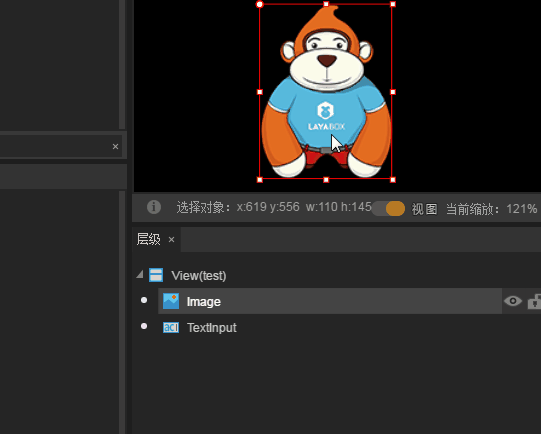

# LayaAir组件类与组件类型介绍

> 在LayaAirIDE的UI、动画等可视化设置中，组件几乎无处不在。  每个组件都有一组属于自己的属性、方法和事件。使用组件可以使程序设计与界面设计分离，提高代码的可复用性。深入理解组件才可以更好的提升IDE开发效率。

## 1、组件的继承关系

### 1.1 组件基类Component

LayaAirIDE的自带组件类都位于 laya.ui包中，**所有的组件直接或间接继承于 Component 类**（组件基类）。在LayaAir引擎的API文档中点击UI分类，如图1所示，找到[laya.ui.Component类](http://layaair.ldc.layabox.com/api/index.html?category=UI&class=laya.ui.Component)。可以查看相关的组件API说明。

   (图1)

### 1.2 组件类继承关系

Sprite 类是 LayaAir 引擎中最基础的显示对象容器类。Component 类继承自 Sprite 类，新增了组件的通用基础属性、方法和接口，规定了组件的生命周期等扩展功能。

作为组件的基类，Box, Button, Clip, ColorPicker, ComboBox, Image, Label, ProgressBar, ScrollBar, Slider, TipManager都是`laya.ui.Component`的子类。组件的继承结构如图2所示。

   (图2)

*Tips: 正如图2的继续关系所示，IDE中常用的UI页面Dialog类继承于View类，View类继续于Box类。其它的组件继承关系建议理解并记住*

## 2、组件的分类

根据组件自身的结构和功能，可以将 laya.ui 包下的组件分成三大类。 分别是视图组件、容器组件、基础组件。

### 2.1 基础组件

基础组件是页面编辑里最常用的组件。通过`资源管理器`或`组件库`里拖拽至场景编辑器中进行可视化操作。可以在`属性设置器`里设置其属性值，然后在场景编辑器中直接查看显示效果。

基础组件包括：Label、TextInput、TextArea、Button、Image、CheckBox、Radio、Clip、ProgressBar、Slider、HSlider、VSlider、ScrollBar、HScrollBar、VScrollBar、ComboBox。

*Tips：关于这些基础组件的详细介绍，可以参考IDE组件属性详解的文档。*

### 2.2 容器类组件

容器类组件是由一个或多个基础组件通过转化为容器的方式生成而来。在IDE里可以通过`Ctrl+B`快捷键将一个或多个基础组件转化为容器组件。如动图3所示。

   (动图3)

容器类组件包括：Box、List、Tab、RadioGroup、ViewStack、Panel、HBox、VBox、Tree、Sprite。

### 2.3 视图类组件

视图类组件是页面级显示对象容器。在 LayaAir IDE 的UI系统里，页面是用来承载显示所有的显示组件的，LayaAir的视图类组件只有`View`与`Dialog`。

### 